## 第四章：卷积神经网络（Convolutional Neural Network, CNN）

&emsp;&emsp;在第三章中，我们使用**两层全连接神经网络（Fully Connected Network, FCN）**，在 CIFAR-10 原始像素上取得了约 **49.84%** 的测试准确率，比线性 Softmax 的 **38.70%** 明显更好。但我们也发现：即使加入了非线性和隐藏层，这个 FCN 依然在动物类（猫、狗、鸟）上表现很差，却被 **Softmax + HOG 特征**（约 **53.60%**）反杀。

## 第一部分：CNN理论基础
&emsp;&emsp;这说明：**仅仅让网络“更深 / 更非线性”还不够**，真正的问题在于——**我们完全丢掉了图像的空间结构**。本章要介绍的**卷积神经网络（Convolutional Neural Network, CNN）**，就是专门为解决这一问题而设计的网络结构。


### 1.1 全连接网络的根本局限：扁平化打碎了空间结构

&emsp;&emsp;无论是 Softmax 还是两层 FCN，在处理图像时都做了同一件事：**把 32×32×3 的图像展平成一个 3072 维的向量**，再接到一个全连接层上。这一步叫做 **flatten（扁平化）**。

- 原图：$X \in \mathbb{R}^{32 \times 32 \times 3}$
- 扁平化：$\text{vec}(X) \in \mathbb{R}^{3072}$

&emsp;&emsp;扁平化的**坏处**在于：原来**相邻像素**（比如左眼和右眼附近的像素）在 2D 网格上有明确的空间关系；扁平化之后，它们只是高维向量里两个“没有空间含义”的维度，网络只能把它们当成 3072 个独立特征来处理。

&emsp;&emsp;结果是：FCN 完全不知道“左边这块和右边那块离得远还是近”，也不知道一个 3×3 小 patch 是“眼睛的一部分”还是“背景的一部分”。

<p align="center"><b>图 1：扁平化（flatten）打碎图像的空间结构</b></p>
<p align="center">
  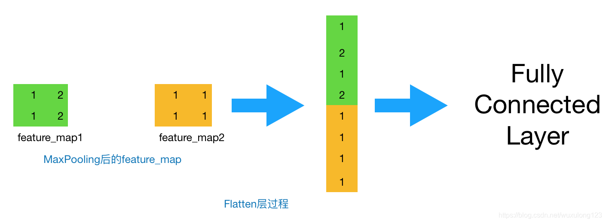
</p>


### 1.2 卷积的核心思想：局部感受野与参数共享

&emsp;&emsp;CNN 的设计背后有两个非常朴素但强大的假设：

1. **局部相关性（Locality）**：图像中的有用信息往往是“局部”的——边缘、角点、纹理、局部形状都只依赖于邻域内的一小块像素（比如 3×3 或 5×5）。
2. **平移不变性（Translation Invariance）**：同样的“模式”可能出现在图像的任意位置——比如一只猫不一定非要在中心；因此“检测猫耳朵”的方法应该在全图“复用”，而不是每个位置都学习一套新参数。

&emsp;&emsp;基于这两个假设，**卷积层（Convolutional Layer）**做了两件关键的事情：

- **局部感受野（Local Receptive Field）**：每个神经元只看输入中的一小块区域，而不是整张图。
- **参数共享（Parameter Sharing / Weight Sharing）**：在整张图上用**同一组卷积核参数**反复滑动，检测同一种局部模式（比如垂直边缘、水平边缘、某种纹理）。

&emsp;&emsp;下面这张示意图非常直观地展示了“**局部连接 + 参数共享**”的概念：左边（Layer 1）是一张特征图，中间（Layer 2）是一层卷积输出，右边（Layer 3）是更深一层。绿色和黄色的方块表示：**同一个高层神经元，在前几层对应到输入空间上是一整片区域（它的感受野），而且这片区域里的连接权重是共享的。**

<p align="center"><b>图 2(a)：卷积核在二维特征图上滑动与感受野扩大的示意图</b></p>
<p align="center">
  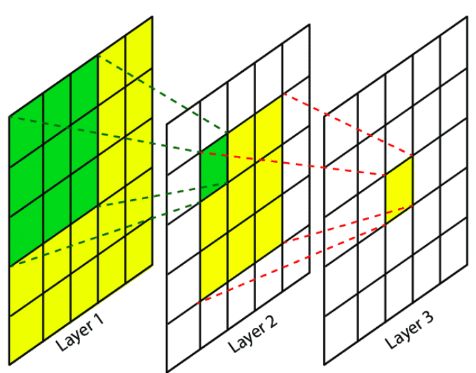
</p>

&emsp;&emsp;从**一维 toy 例子**看会更清楚。下面这张图中，底层是输入 $x_1, x_2, \dots, x_5$，上一层是输出 $s_1, s_2, \dots, s_5$。每个 $s_i$ 只与附近的几个 $x$ 相连（局部连接），并且连接的权重模式是相同的（平移一下就行），这就是**卷积核在一维上的“滑动 + 参数共享”**。

<p align="center"><b>图 2(b)：一维局部连接与参数共享的 toy 示例</b></p>
<p align="center">
  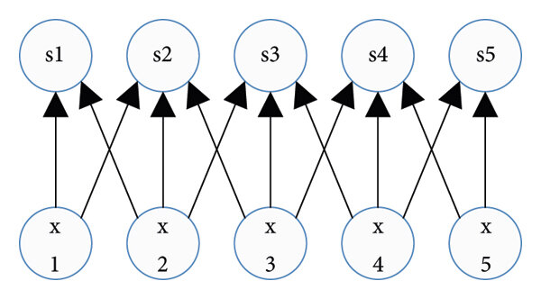
</p>

&emsp;&emsp;用数学式子表示，如果输入特征图为 $X$，第 $f$ 个卷积核为 $K^{(f)}$，偏置为 $b^{(f)}$，则输出特征图第 $f$ 个通道在位置 $(i,j)$ 的值为：

$$
Y^{(f)}(i, j) = \sigma\!\Bigg(
\sum_{c,u,v} K^{(f)}(u, v, c)\, X(i+u, j+v, c) + b^{(f)}
\Bigg)
$$

其中 $\sigma(\cdot)$ 是激活函数（通常是 ReLU）。**关键点在于：不同 $(i,j)$ 位置使用的是同一个 $K^{(f)}$ 和 $b^{(f)}$，这就是参数共享。**

&emsp;&emsp;从更“工程”的角度看，一整个 CNN 可以大致分成“**特征提取**”和“**分类器**”两个部分：前面若干个卷积 + 池化层负责在空间上提取越来越抽象的特征图；最后通过扁平化（Flatten）接到一两层全连接层上完成分类。

<p align="center"><b>图 2(c)：典型卷积神经网络的数据流动（卷积 + 池化 + 全连接）</b></p>
<p align="center">
  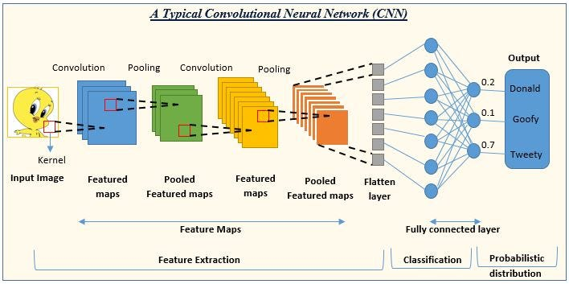
</p>

&emsp;&emsp;总结一下本小节：

- **局部感受野**让每个神经元只关注输入中的一小块区域，方便捕捉边缘、角点、纹理等局部模式；
- **参数共享**让同一个卷积核在整张图上复用，既带来平移不变性，又大幅减少参数量（这点在 1.7 节会有具体的参数量对比）；
- 多层卷积堆叠后，高层神经元对应到原图上的感受野会越来越大，从“局部特征”逐渐过渡到“整体结构”，这一点会在 1.8 节中配合感受野示意图进一步说明。


### 1.3 卷积层的数学形式：从 2D 到多通道

#### 1.3.1 单通道 2D 卷积

&emsp;&emsp;先看最简单的情况：输入是单通道图像 $X \in \mathbb{R}^{H \times W}$，卷积核（滤波器）是 $K \in \mathbb{R}^{k \times k}$，不考虑填充和步幅时，输出特征图 $Y$ 的某个位置 $(i, j)$ 定义为：

$$
Y(i, j) = \sum_{u=0}^{k-1} \sum_{v=0}^{k-1} K(u, v) \cdot X(i+u, j+v)
$$

&emsp;&emsp;每个 $Y(i,j)$ 都是输入图像中一个 $k \times k$ 小块与卷积核“加权求和”的结果。卷积核 $K$ 在整张图上滑动，每个位置使用**同一组权重**。

#### 1.3.2 多通道卷积（RGB 图像）

&emsp;&emsp;对于彩色图像 $X \in \mathbb{R}^{H \times W \times C}$（例如 $C=3$：RGB 三个通道），卷积核的形状变为：

$$
K \in \mathbb{R}^{k \times k \times C}
$$

&emsp;&emsp;输出位置 $(i, j)$ 计算为：

$$
Y(i, j) = \sum_{c=1}^{C} \sum_{u=0}^{k-1} \sum_{v=0}^{k-1} K(u, v, c) \cdot X(i+u, j+v, c)
$$

&emsp;&emsp;也就是说：先在每个通道内做局部加权，再在通道维度上求和。

#### 1.3.3 多个卷积核 = 多个特征图

&emsp;&emsp;在实践中，我们不会只用一个卷积核，而是一次性学习 $F$ 个卷积核：

$$
K^{(1)}, K^{(2)}, \dots, K^{(F)}, \quad K^{(f)} \in \mathbb{R}^{k \times k \times C}
$$

它们会生成 $F$ 个输出特征图：

$$
Y^{(f)}(i, j) = \sum_{c,u,v} K^{(f)}(u, v, c) \cdot X(i+u, j+v, c) + b^{(f)}
$$

这些 $Y^{(f)}$ 堆叠在一起构成新的张量：

$$
Y \in \mathbb{R}^{H' \times W' \times F}
$$

&emsp;&emsp;每个卷积核 $K^{(f)}$ 就是一个**特征检测器**，在整张图片上寻找某种局部模式；输出通道数 $F$ 就是**特征图的个数**。

<p align="center"><b>图 3：多通道卷积示意图（RGB 输入 → 4 个特征图）</b></p>
<p align="center">
  
</p>

### 1.4 步幅（Stride）、填充（Padding）与输出尺寸

&emsp;&emsp;卷积层有两个非常重要的“几何”超参数：**步幅（stride）**和**填充（padding）**。

#### 1.4.1 步幅（Stride）

&emsp;&emsp;步幅 $s$ 表示卷积核每次滑动的像素数。

- $s = 1$：相邻输出位置对应的感受野高度重叠，特征图更“细腻”；
- $s = 2$：相当于对特征图做了一次下采样，空间尺寸缩小一半。

&emsp;&emsp;在不考虑 padding 时，如果输入尺寸为 $H \times W$，卷积核为 $k \times k$，步幅为 $s$，输出大小为：

$$
H' = \left\lfloor \frac{H - k}{s} \right\rfloor + 1, \quad
W' = \left\lfloor \frac{W - k}{s} \right\rfloor + 1
$$

#### 1.4.2 填充（Padding）

&emsp;&emsp;卷积核在滑动时只能覆盖到“合法”的区域，因此边缘像素被访问的次数比中间少。为了减轻边缘信息损失，并方便控制输出尺寸，我们通常会在输入四周补零，这叫 **零填充（zero padding）**。

&emsp;&emsp;若使用 padding = $p$，输出尺寸变为：

$$
H' = \left\lfloor \frac{H - k + 2p}{s} \right\rfloor + 1, \quad
W' = \left\lfloor \frac{W - k + 2p}{s} \right\rfloor + 1
$$

&emsp;&emsp;常见选择：

- **same padding**：让 $H' \approx H, W' \approx W$；
- **valid padding**：不加 padding，输出尺寸变小。

<p align="center"><b>图 4：不同 stride 和 padding 对输出尺寸的影响</b></p>
<p align="center">
  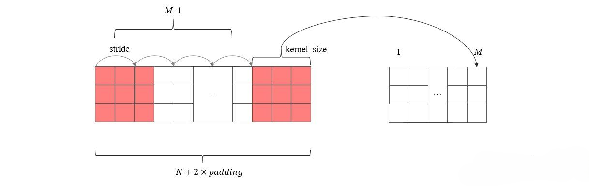
</p>


### 1.5 Conv + ReLU：卷积特征与非线性

&emsp;&emsp;卷积层本身是线性的。为了引入非线性，我们像第三章那样，在卷积后面接上 **ReLU 激活函数**：

$$
Z = \text{Conv}(X; K, b), \quad A = \text{ReLU}(Z) = \max(0, Z)
$$

- $Z$：卷积的线性输出（未激活特征图）；
- $A$：通过 ReLU 之后的非线性特征图。

&emsp;&emsp;在现代 CNN 中，“**Conv + ReLU**” 可以看成一个基本组合单元，负责从局部区域中提取非线性特征。对比两层 FCN：

- FCN 的第一层是 $XW_1 + b_1$，卷积层则是“局部 + 共享”的 $K * X$；
- ReLU 的作用完全一样：为网络引入非线性，使其能学习复杂的决策边界。


### 1.6 池化层（Pooling）：下采样与平移不变性

&emsp;&emsp;卷积层会生成**高分辨率的特征图**，如果层数堆得很深，空间尺寸 $H', W'$ 会一直很大，计算量和参数都难以控制。**池化层（Pooling）**就是为了解决这个问题——它通过对邻域做聚合运算，实现特征图的**空间下采样**。

#### 1.6.1 最大池化（Max Pooling）

&emsp;&emsp;最大池化是在每个局部窗口中取最大值。以 2×2 池化、步幅 2 为例：

$$
Y(i, j) = \max_{(u,v) \in \{0,1\}^2} X(2i + u, 2j + v)
$$

- 输入：$X \in \mathbb{R}^{H \times W \times C}$  
- 输出：$Y \in \mathbb{R}^{\frac{H}{2} \times \frac{W}{2} \times C}$（通道数不变，空间尺寸减半）

&emsp;&emsp;含义：保留一个小区域内**最强的响应**，对位置的微小平移具有一定容忍度（平移不变性）。

#### 1.6.2 平均池化（Average Pooling）

&emsp;&emsp;平均池化则是在窗口内取平均值：

$$
Y(i, j) = \frac{1}{k^2} \sum_{u,v} X(ki + u, kj + v)
$$

&emsp;&emsp;现在平均池化更多用于特殊结构（如 Global Average Pooling 代替全连接层），而在普通 CNN 中，**最大池化更常用**。

<p align="center"><b>图 5：2×2 最大池化示意图</b></p>
<p align="center">
  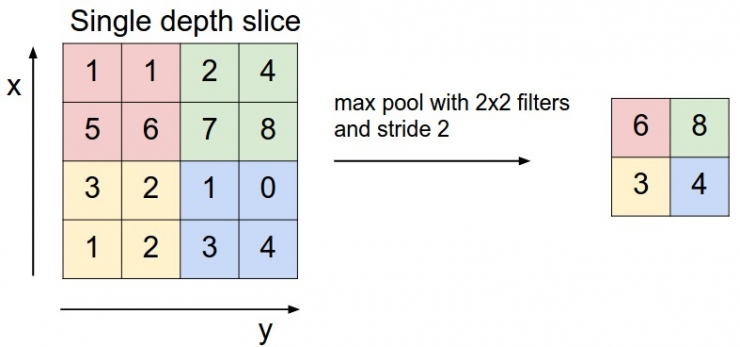
</p>


### 1.7 CNN vs 全连接网络：参数量对比

&emsp;&emsp;CNN 的一个巨大优势是：在保留空间结构的同时，**参数远少于 FCN**。我们用一个 CIFAR-10 场景中的具体例子来对比。

#### 1.7.1 全连接层参数量

&emsp;&emsp;假设：

- 输入：32×32×3 展平为 3072 维；
- 第一个隐藏层有 200 个神经元；

则第一层权重矩阵为 $W_1 \in \mathbb{R}^{3072 \times 200}$，参数量为：

$$
N_{\text{params}}^{\text{(FC)}} = 3072 \times 200 + 200 \approx 614{,}600
$$

&emsp;&emsp;仅仅一层就超过 60 万参数。

#### 1.7.2 卷积层参数量

&emsp;&emsp;在相同输入下，如果我们使用一个卷积层：

- 输入：32×32×3；
- 使用 32 个卷积核，每个大小为 5×5×3；

则卷积层的参数量为：

$$
\begin{aligned}
N_{\text{params}}^{\text{(Conv)}} 
&= (5 \times 5 \times 3 + 1) \times 32 \\
&= (75 + 1) \times 32 \\
&= 2{,}432
\end{aligned}
$$

&emsp;&emsp;对比结果非常夸张：

- 全连接层：约 614,600 个参数；
- 卷积层：约 2,432 个参数。

&emsp;&emsp;在保持“感受野大小”相近的情况下，卷积层的参数量只有全连接层的**约 1/250**。参数越少，一方面减轻过拟合，另一方面也明显降低了计算量。

<p align="center"><b>图 6：全连接层 vs 卷积层参数量对比</b></p>
<p align="center">
  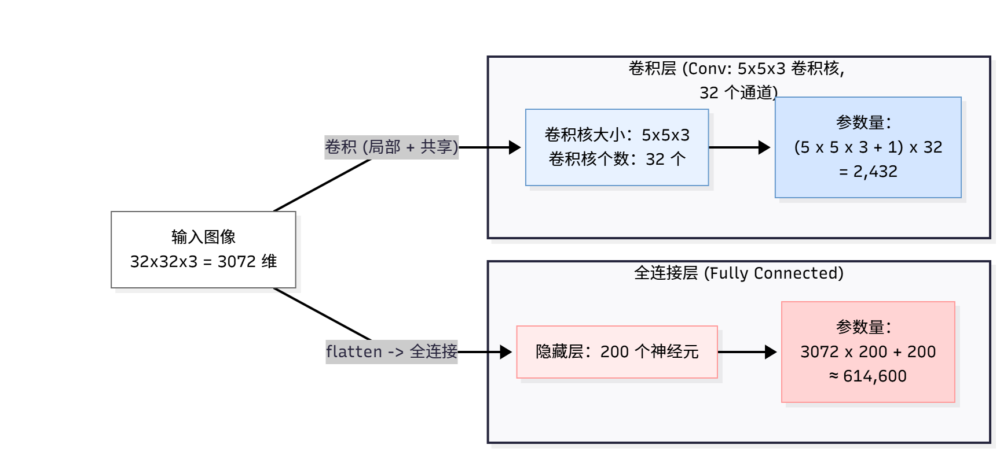
</p>


### 1.8 感受野（Receptive Field）：CNN 如何“看到”整张图

&emsp;&emsp;虽然每个卷积核只看一个小块（例如 3×3），但当我们堆叠多个卷积层和池化层时，**高层神经元的“有效视野”会越来越大**，最终可以覆盖整张图像。这就是所谓的**感受野扩大**。

&emsp;&emsp;举一个简单的例子（忽略 padding）：

- 第 1 层：3×3 卷积（stride = 1），感受野为 3×3；
- 第 2 层：再来一个 3×3 卷积，感受野扩大到 5×5；
- 第 3 层：继续一个 3×3 卷积，感受野变为 7×7；
- 如果中间插入一次 2×2 池化（stride = 2），后面的每一个卷积都会在原图上跨更大的区域，感受野“跳着”变大。

&emsp;&emsp;换句话说：**低层卷积核**在看“边缘、角点、纹理”等局部模式；**高层卷积核**在看“狗脸、轮船轮廓、汽车形状”等更抽象、更大尺度的结构。

<p align="center"><b>图 7：随网络层数加深感受野逐渐增大示意图</b></p>
<p align="center">
  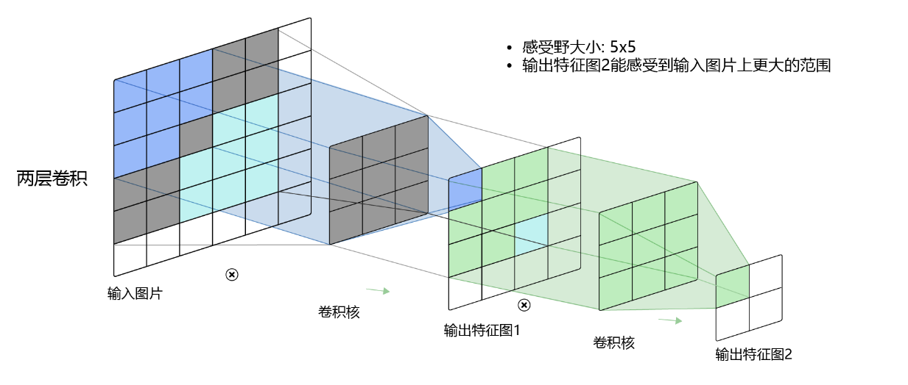
</p>


### 1.9 一个典型的 CIFAR-10 CNN 结构示例

&emsp;&emsp;在本次作业中，我们将实现一个适用于 CIFAR-10 的简单 CNN，它的结构可以概括为：

1. **输入层**：32×32×3 彩色图像；
2. **卷积块 1**：Conv(3×3, 32 通道) → ReLU → MaxPool(2×2)；
3. **卷积块 2**：Conv(3×3, 64 通道) → ReLU → MaxPool(2×2)；
4. **全连接层**：将卷积输出展平 → 全连接隐藏层 → ReLU → 全连接输出层（10 类）；
5. **输出层（Softmax）**：将 10 维得分转为概率，计算交叉熵损失。

&emsp;&emsp;用公式写成一个复合函数（这里用下标区分不同模块）：

$$
\begin{aligned}
X_0 &= \text{input image} \in \mathbb{R}^{32 \times 32 \times 3} \\
X_1 &= \text{MaxPool}_2\big(\text{ReLU}(\text{Conv}_1(X_0))\big) \\
X_2 &= \text{MaxPool}_2\big(\text{ReLU}(\text{Conv}_2(X_1))\big) \\
h   &= \text{Flatten}(X_2) \\
z   &= \text{ReLU}\big(h W_{\text{fc1}} + b_{\text{fc1}}\big) \\
s   &= z W_{\text{fc2}} + b_{\text{fc2}} \quad (\text{scores}) \\
P   &= \text{Softmax}(s)
\end{aligned}
$$

&emsp;&emsp;损失函数和第三章类似，使用**交叉熵 + L2 正则化**：

$$
L_{\text{total}} = -\frac{1}{N} \sum_{i=1}^N \log P_{i, y_i} + \lambda \sum_{\theta \in \mathcal{W}} \|\theta\|_2^2
$$

其中 $\mathcal{W}$ 包含所有可学习权重（卷积核和全连接层权重）。

<p align="center"><b>图 8：典型深层卷积神经网络结构示意（类似 VGG）</b></p>
<p align="center">
  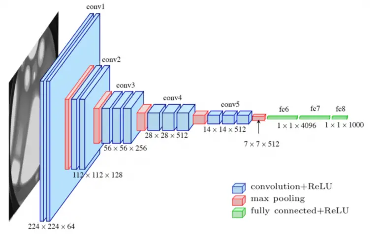
</p>


### 1.10 小结：从 FCN 到 CNN 的升级

&emsp;&emsp;本章我们从两层全连接网络的局限出发，引出了卷积神经网络，并系统地介绍了构成 CNN 的关键组件：

- **卷积层（Convolution）**：通过局部感受野和参数共享，保留空间结构、减少参数量；
- **激活函数（ReLU）**：为卷积特征引入非线性表达能力；
- **池化层（Pooling）**：进行空间下采样，提高平移不变性、降低计算复杂度；
- **感受野（Receptive Field）**：随着网络层数增加，高层神经元可以“看到”更大区域，捕捉高级语义结构。

&emsp;&emsp;与第三章的两层 FCN 相比，CNN 的关键优势在于：

- **更适合处理图像**：不会打碎空间结构；
- **参数更少，更不容易过拟合**；
- **能够自动学习“局部到整体”的层次化特征**：边缘 → 纹理 → 局部形状 → 整体物体。

&emsp;&emsp;在接下来的第二部分中，我们将用纯 Python / NumPy（或 PyTorch）一步步实现一个针对 CIFAR-10 的卷积神经网络，并通过实验验证：**CNN 能否超过两层 FCN 和 Softmax + HOG 的表现？**


## 第二部分：代码实现详解
&emsp;&emsp;理论上我们已经知道 CNN 是“局部连接 + 权重共享 + 池化”的组合体。接下来这一部分，我们从工程角度拆解 `cnn/` 目录下的几份核心代码，看看如何在**只使用 NumPy** 的前提下，手工搭起一个可以在 CIFAR-10 上跑出 70%+ 准确率的卷积神经网络。

目录结构回顾：

```text
cnn/
  ├── __init__.py
  ├── assets/                      # 本章插图（卷积、池化、感受野等）
  ├── data_utils.py                # CIFAR-10 加载与预处理
  ├── layers.py                    # 卷积 / 池化 / ReLU / 全连接等基础算子（含反向传播）
  ├── model.py                     # Cifar10SimpleConvNet 模型定义
  ├── trainer.py                   # 训练循环与优化器（SGD + Momentum）
  ├── experiment_cifar10_cnn.py    # 主实验脚本（训练 + 测试）
  ├── visualize_confusion_cnn.py   # 混淆矩阵可视化
  └── visualize_features_cnn.py    # 卷积核 & 特征图可视化
```

### 2.1 数据预处理：从原始 CIFAR-10 到 NCHW 张量

&emsp;&emsp;和前几章一样，我们首先需要在 `data_utils.py` 中把原始的 CIFAR-10 batch 文件读出来，并完成基本的预处理。核心目标是：**从原始的磁盘文件，得到一个可以直接喂给 CNN 的四维张量 `X ∈ ℝ^{N×C×H×W}`**。

典型的流程如下：

1. **读入原始数据**

```python
def load_cifar10(root: str):
    """
    从 `cifar-10-batches-py` 目录下读取所有 batch，
    返回 X_train, y_train, X_test, y_test，形状均为 (N, 32, 32, 3)。
    """
    # ... 使用 pickle.load 依次读入 data_batch_1~5 和 test_batch ...
    return X_train, y_train, X_test, y_test
```

2. **划分 train / val / test + 减均值 + 维度重排**

&emsp;&emsp;在 `experiment_cifar10_cnn.py` 里，我们大致按照如下方式对数据进行预处理：

```python
# 1. 加载原始数据 (N, 32, 32, 3)
X_train, y_train, X_test, y_test = load_cifar10(args.data_dir)

# 2. 划分训练 / 验证 / 测试
num_training = 49000
num_validation = 1000

X_val   = X_train[num_training:num_training+num_validation]
y_val   = y_train[num_training:num_training+num_validation]
X_train = X_train[:num_training]
y_train = y_train[:num_training]

# 3. 转成 float32 并减均值
X_train = X_train.astype(np.float32)
X_val   = X_val.astype(np.float32)
X_test  = X_test.astype(np.float32)

mean_image = np.mean(X_train, axis=0, keepdims=True)
X_train -= mean_image
X_val   -= mean_image
X_test  -= mean_image

# 4. 从 NHWC 变成 NCHW，符合我们 CNN 的实现
X_train = X_train.transpose(0, 3, 1, 2)
X_val   = X_val.transpose(0, 3, 1, 2)
X_test  = X_test.transpose(0, 3, 1, 2)
```

&emsp;&emsp;到此为止，我们得到了形状为 `(N, 3, 32, 32)` 的训练 / 验证 / 测试张量，这与 `Cifar10SimpleConvNet` 期望的 `input_dim=(3, 32, 32)` 完全对齐。

### 2.2 `layers.py`：卷积与池化的“积木”

&emsp;&emsp;`layers.py` 是整个项目中**最“手搓”的文件**。我们在这里实现了 CNN 所需的各种基础算子，包括：

* `conv_forward_fast / conv_backward_fast`：二维卷积的前向与反向；
* `max_pool_forward_fast / max_pool_backward_fast`：最大池化；
* `relu_forward / relu_backward`：ReLU 非线性；
* `affine_forward / affine_backward`：全连接层；
* 若干“组合层”包装，例如 `conv_relu_pool_forward`、`affine_relu_forward` 等。

#### 2.2.1 卷积前向：im2col + 矩阵乘法

&emsp;&emsp;朴素的卷积实现需要四重循环（batch、输出通道、高、宽），在 Python 里会慢到令人崩溃。为此，我们采用了经典的 **im2col 技巧**：把每个卷积核对应的局部 patch 展开成一列，然后用一次矩阵乘法同时算出所有位置的卷积结果。

&emsp;&emsp;核心代码简化如下（省略了 shape 检查和边界细节）：

```python
def conv_forward_fast(x, w, b, conv_param):
    """
    快速卷积前向：
    x: (N, C, H, W)
    w: (F, C, HH, WW)
    b: (F,)
    """
    stride = conv_param["stride"]
    pad    = conv_param["pad"]

    N, C, H, W = x.shape
    F, _, HH, WW = w.shape

    # 1. 先对输入做零填充
    x_padded = np.pad(x,
                      ((0, 0), (0, 0), (pad, pad), (pad, pad)),
                      mode="constant")

    # 2. 计算输出空间尺寸
    H_out = 1 + (H + 2 * pad - HH) // stride
    W_out = 1 + (W + 2 * pad - WW) // stride

    # 3. im2col：把每个 (C, HH, WW) patch 展成一列，得到 (C*HH*WW, N*H_out*W_out)
    x_cols = im2col_indices(x_padded, C, HH, WW, stride=stride, pad=0)

    # 4. 卷积核也展平为行
    w_row = w.reshape(F, -1)  # (F, C*HH*WW)

    # 5. 一次矩阵乘法算出所有位置的卷积结果
    out = w_row @ x_cols + b.reshape(-1, 1)  # (F, N*H_out*W_out)

    # 6. 再把结果 reshape 回 (N, F, H_out, W_out)
    out = out.reshape(F, N, H_out, W_out).transpose(1, 0, 2, 3)
    cache = (x, w, b, conv_param, x_cols)
    return out, cache
```

&emsp;&emsp;这种写法的本质是把“卷积”转成了一次 **大规模的矩阵乘法**，从而可以充分利用 BLAS 库的底层优化。在反向传播中，我们只需反向推回 `x_cols` 和 `w_row`，再用逆操作 `col2im_indices` 把梯度还原为 `(N, C, H, W)` 的形式即可。

#### 2.2.2 池化与 ReLU：形状不变 / 改变的灵活组合

&emsp;&emsp;最大池化和 ReLU 的实现相对直接，但需要格外注意**缓存中间结果**以便反向传播。

举例：ReLU 的前向和反向分别是：

```python
def relu_forward(x):
    out = np.maximum(0, x)
    cache = x
    return out, cache

def relu_backward(dout, cache):
    x = cache
    dx = dout * (x > 0)
    return dx
```

&emsp;&emsp;利用这些基础模块，我们还实现了简洁的“组合层”接口，例如：

```python
def conv_relu_pool_forward(x, w, b, conv_param, pool_param):
    a, conv_cache = conv_forward_fast(x, w, b, conv_param)
    s, relu_cache = relu_forward(a)
    out, pool_cache = max_pool_forward_fast(s, pool_param)
    cache = (conv_cache, relu_cache, pool_cache)
    return out, cache
```

&emsp;&emsp;对应地，在反向传播时可以一层层“拆开”：

```python
def conv_relu_pool_backward(dout, cache):
    conv_cache, relu_cache, pool_cache = cache
    ds = max_pool_backward_fast(dout, pool_cache)
    da = relu_backward(ds, relu_cache)
    dx, dw, db = conv_backward_fast(da, conv_cache)
    return dx, dw, db
```

&emsp;&emsp;这种“前向一次性封装 + 反向逐层拆解”的设计，使得在 `model.py` 中书写整个网络的 forward/backward 代码时，非常简洁清晰。

### 2.3 `model.py`：`Cifar10SimpleConvNet` 的前向与反向

&emsp;&emsp;有了 `layers.py` 里的积木后，我们就可以在 `model.py` 中组装出一个完整的卷积神经网络。核心类是：

```python
class Cifar10SimpleConvNet(object):
    """
    一个用于 CIFAR-10 的简单 CNN：
    [conv - relu - 2x2 pool] x 2 -> [affine - relu] -> [affine] -> softmax
    """
    def __init__(self,
                 input_dim=(3, 32, 32),
                 num_filters=32,
                 filter_size=3,
                 hidden_dim=100,
                 num_classes=10,
                 weight_scale=1e-3,
                 reg=1e-3):
        # 初始化权重 self.params["W1"], ["b1"], ..., ["W4"], ["b4"]
        # ...
        pass

    def loss(self, X, y=None):
        """
        如果 y is None：只做前向，返回 scores
        如果 y 不为 None：返回 (loss, grads)
        """
        # ...
        pass
```

#### 2.3.1 初始化：权重字典 `self.params`

&emsp;&emsp;在 `__init__` 中，我们使用一个字典 `self.params` 来统一存放所有可学习参数，类似于上一章的 FCN：

* 第一层卷积核：`W1 ∈ ℝ^{F1×C×HH×WW}, b1 ∈ ℝ^{F1}`
* 第二层卷积核：`W2 ∈ ℝ^{F2×F1×HH×WW}, b2 ∈ ℝ^{F2}`
* 第一层全连接：`W3 ∈ ℝ^{D_flat×hidden_dim}, b3 ∈ ℝ^{hidden_dim}`
* 输出层全连接：`W4 ∈ ℝ^{hidden_dim×10}, b4 ∈ ℝ^{10}`

&emsp;&emsp;所有权重均从 $\mathcal{N}\bigl(0, \text{weight\_scale}^2\bigr)$ 中随机初始化，偏置初始化为 0。`reg` 用于在 loss 中加入 L2 正则化项。

#### 2.3.2 前向传播：一条清晰的数据流

&emsp;&emsp;`loss` 函数的前向部分利用了前面提到的“组合层”，伪代码如下：

```python
def loss(self, X, y=None):
    W1, b1 = self.params["W1"], self.params["b1"]
    W2, b2 = self.params["W2"], self.params["b2"]
    W3, b3 = self.params["W3"], self.params["b3"]
    W4, b4 = self.params["W4"], self.params["b4"]

    # 超参数
    filter_size = W1.shape[2]
    conv_param = {"stride": 1, "pad": (filter_size - 1) // 2}
    pool_param = {"pool_height": 2, "pool_width": 2, "stride": 2}

    # conv - relu - pool
    out1, cache1 = conv_relu_pool_forward(X,  W1, b1, conv_param, pool_param)
    out2, cache2 = conv_relu_pool_forward(out1, W2, b2, conv_param, pool_param)

    # 展平
    N, F, H, W = out2.shape
    out2_flat = out2.reshape(N, -1)

    # affine - relu - affine
    out3, cache3 = affine_relu_forward(out2_flat, W3, b3)
    scores, cache4 = affine_forward(out3, W4, b4)

    # 若不提供标签，则直接返回 scores（用于可视化脚本）
    if y is None:
        return scores

    # ... 否则继续算损失和梯度 ...
```

&emsp;&emsp;这样写的好处是：网络结构与我们在 1.9 节中画出的“Conv → ReLU → Pool → Conv → ReLU → Pool → FC → ReLU → FC → Softmax” 一一对应，可读性极佳。

#### 2.3.3 反向传播：从 softmax 一路链式回去

&emsp;&emsp;当 `y` 不为 `None` 时，我们首先根据 softmax + 交叉熵计算损失，并加上 L2 正则项：

```python
# 交叉熵损失
shifted_logits = scores - np.max(scores, axis=1, keepdims=True)
Z = np.sum(np.exp(shifted_logits), axis=1, keepdims=True)
log_probs = shifted_logits - np.log(Z)
probs = np.exp(log_probs)
N = X.shape[0]

loss = -np.sum(log_probs[np.arange(N), y]) / N
loss += 0.5 * self.reg * (np.sum(W1*W1) + np.sum(W2*W2)
                          + np.sum(W3*W3) + np.sum(W4*W4))
```

&emsp;&emsp;接着，构造 softmax 的梯度，依次通过每一层的 backward 函数向前传递：

```python
# softmax 梯度
dscores = probs
dscores[np.arange(N), y] -= 1
dscores /= N

# affine backward
dx4, dW4, db4 = affine_backward(dscores, cache4)
dx3, dW3, db3 = affine_relu_backward(dx4, cache3)

# reshape 回 conv 输出形状
dx2 = dx3.reshape(out2.shape)

# 两个 conv-relu-pool 的反向
dx1, dW2, db2 = conv_relu_pool_backward(dx2, cache2)
dX,  dW1, db1 = conv_relu_pool_backward(dx1, cache1)

# 加上 L2 正则的梯度
dW4 += self.reg * W4
dW3 += self.reg * W3
dW2 += self.reg * W2
dW1 += self.reg * W1

grads = {
    "W1": dW1, "b1": db1,
    "W2": dW2, "b2": db2,
    "W3": dW3, "b3": db3,
    "W4": dW4, "b4": db4,
}
return loss, grads
```

&emsp;&emsp;至此，我们完成了一个**完全由 NumPy 手写、可参与训练的 CNN**。接下来，只需要把它交给训练器即可。

### 2.4 `trainer.py`：训练循环与优化算法

&emsp;&emsp;`trainer.py` 封装了一个小型的训练框架，用来驱动我们的 `Cifar10SimpleConvNet` 在 CIFAR-10 上进行迭代优化。核心思想是：

1. 在每个 mini-batch 上调用 `model.loss(X_batch, y_batch)`，得到 `(loss, grads)`；
2. 使用选定的优化算法（比如 SGD + Momentum）更新每一个参数；
3. 每个 epoch 结束后，在训练集和验证集上评估一次精度，记录历史并保存当前最优模型。

&emsp;&emsp;训练循环的伪代码如下：

```python
for epoch in range(num_epochs):
    # 1. 随机打乱训练集
    perm = np.random.permutation(num_train)
    X_train = X_train[perm]
    y_train = y_train[perm]

    for t in range(num_iters_per_epoch):
        X_batch = ...
        y_batch = ...

        loss, grads = model.loss(X_batch, y_batch)

        # SGD + Momentum 更新
        for p_name, w in model.params.items():
            dw = grads[p_name]
            v = self.velocity[p_name]
            v = mu * v - learning_rate * dw
            w += v
            self.velocity[p_name] = v

        # 每隔若干 iter 打印一次 loss（见终端输出）
        # ...

    # 2. 每个 epoch 结束：在 train/val 上评估一次
    train_acc = check_accuracy(...)
    val_acc   = check_accuracy(...)

    # 3. 若验证集表现更好，则保存 best model 参数
    if val_acc > best_val_acc:
        best_val_acc = val_acc
        best_params = copy.deepcopy(model.params)

    # 4. 学习率衰减
    learning_rate *= lr_decay
```

&emsp;&emsp;在 `experiment_cifar10_cnn.py` 中，我们正是通过这样一个训练器，跑完了 20 个 epoch，并且把验证集表现最好的那一版参数保存到了：

```text
./cnn/experiments/results/cnn_cifar10_best.npz
```

&emsp;&emsp;这一文件随后也被用于第三部分中的混淆矩阵与特征图可视化。

### 2.5 实验脚本与可视化脚本

&emsp;&emsp;围绕 `Cifar10SimpleConvNet`，我们准备了三个命令行脚本，分别对应训练、混淆矩阵和特征可视化。

1. **训练 CNN 模型（主实验）**

```bash
python -m cnn.experiment_cifar10_cnn \
    --data-dir ./data/cifar-10-batches-py \
    --num-epochs 20 \
    --batch-size 128 \
    --learning-rate 1e-2 \
    --update sgd_momentum
```

2. **可视化混淆矩阵**

```bash
python -m cnn.visualize_confusion_cnn \
    --data-dir ./data/cifar-10-batches-py \
    --model-path ./cnn/experiments/results/cnn_cifar10_best.npz \
    --results-dir ./cnn/experiments/results
```

3. **可视化卷积核和中间特征图**

```bash
python -m cnn.visualize_features_cnn \
    --data-dir ./data/cifar-10-batches-py \
    --model-path ./cnn/experiments/results/cnn_cifar10_best.npz \
    --results-dir ./cnn/experiments/results \
    --num-filters 32 \
    --num-samples 5
```

&emsp;&emsp;运行完上述脚本后，`cnn/experiments/results/` 目录中会生成若干用于第三部分分析的图片文件，例如：

* `cnn_cifar10_best.npz` —— 最优模型参数；
* `cnn_confusion_matrix_normalized.png` —— 归一化混淆矩阵；
* `cnn_conv1_filters.png` —— 第一层卷积核可视化；
* `cnn_feature_maps_sample_0.png` 等 —— 不同样本在 conv1 后的特征图。

## 第三部分：实验结果与分析

&emsp;&emsp;在本部分，我们基于上一节的代码实现，对 CIFAR-10 数据集进行了系统实验，并通过**混淆矩阵**、**卷积核可视化**和**特征图可视化**等手段，对 CNN 的行为进行了深入剖析。最后，我们会将结果与前两章的 Softmax + HOG、两层 FCN 进行对比，总结 CNN 带来的核心提升。

### 3.1 实验设置

#### 3.1.1 数据集与划分

* 数据集：CIFAR-10，50000 张训练图像 + 10000 张测试图像；
* 划分策略：

  * 训练集：49000 张
  * 验证集：1000 张（从原训练集中划出）
  * 测试集：10000 张（官方 test batch）；
* 预处理：

  * 转为 `float32`；
  * 对训练集计算均值图像，并从 train/val/test 中统一减去；
  * 把图像从 `(N, 32, 32, 3)` 转为 `(N, 3, 32, 32)` 格式。

#### 3.1.2 模型结构与超参数

  本次实验严格使用 1.9 节中给出的「简化版 CNN」结构：

$$
\begin{gathered}
\text{Conv}(3\times3, 32) \to \text{ReLU} \to \text{MaxPool}(2\times2) \to
\text{Conv}(3\times3, 64) \to \text{ReLU} \\
\downarrow \\
\text{MaxPool}(2\times2) \to
\text{FC}(100) \to \text{ReLU} \to \text{FC}(10) \to \text{Softmax}
\end{gathered}
$$

&emsp;&emsp;对应到代码中，即：

```text
input_dim   = (3, 32, 32)
num_filters = 32        # 第一层卷积核个数
filter_size = 3
hidden_dim  = 100       # 全连接隐藏层维度
num_classes = 10
weight_scale = 1e-3
reg          = 1e-3
```

优化与训练配置：

| 超参数           | 取值               |
| ------------- | ---------------- |
| 优化算法          | SGD + Momentum   |
| 初始学习率         | 1e-2             |
| 动量系数          | 0.9              |
| 学习率衰减         | 每个 epoch 乘以 0.95 |
| batch size    | 128              |
| 训练轮数 (epochs) | 20               |

### 3.2 训练过程与过拟合现象

&emsp;&emsp;在训练时，我们在终端打印了每 50 个 iteration 的瞬时 loss，以及每个 epoch 结束时的训练 / 验证损失和准确率。下面摘取部分关键日志（已略去 iter 级别输出）：

```text
Epoch [1/20] Train Loss: 1.8533 Acc: 0.5088 | Val Loss: 1.4021 Acc: 0.5280 | LR: 0.01000
Epoch [4/20] Train Loss: 0.9979 Acc: 0.7340 | Val Loss: 1.0475 Acc: 0.6730 | LR: 0.00857
Epoch [6/20] Train Loss: 0.7515 Acc: 0.8352 | Val Loss: 1.0484 Acc: 0.6960 | LR: 0.00774
Epoch [8/20] Train Loss: 0.5500 Acc: 0.9056 | Val Loss: 1.1302 Acc: 0.7020 | LR: 0.00698
Epoch [10/20] Train Loss: 0.3785 Acc: 0.9578 | Val Loss: 1.2676 Acc: 0.6910 | LR: 0.00630
Epoch [15/20] Train Loss: 0.1825 Acc: 0.9996 | Val Loss: 1.4749 Acc: 0.7170 | LR: 0.00488
Epoch [20/20] Train Loss: 0.1587 Acc: 0.9994 | Val Loss: 1.4934 Acc: 0.7090 | LR: 0.00377
```

&emsp;&emsp;从这些数字中可以清晰地看到几个现象：

1. **训练误差很快下降，且接近 0**

   * 从第 10 个 epoch 起，训练准确率已经超过 95%；
   * 到第 15 个 epoch 左右，训练准确率几乎达到 100%。

2. **验证准确率在 ~70% 左右“饱和”**

   * 在第 4–8 个 epoch 左右，验证准确率从 67% 稳步升至 70% 左右；
   * 此后即使继续训练，甚至把训练误差降到接近 0，验证准确率也没有明显提升，反而略有波动。

&emsp;&emsp;换句话说：**我们的 CNN 在训练集上已经严重“记住了”数据（过拟合），但在验证集上的表现却停留在 ~70% 左右**。这恰恰说明：

* 当前网络容量（两个卷积块 + 一个 100 维全连接层）对于 CIFAR-10 来说已经足够大；
* 若想进一步提升性能，需要**更强的正则化手段**（如 Dropout、数据增强、权重衰减调参等），而不是一味追求更深/更多参数。

### 3.3 最终测试集表现

&emsp;&emsp;使用在验证集上表现最好的那一版参数（自动保存在 `cnn_cifar10_best.npz`）在测试集上进行评估，得到的最终结果为：

\[
\text{Test accuracy} \approx \mathbf{70.52\%}
\]


&emsp;&emsp;这相较于前两章的基线有了非常明显的提升：

| 模型            | 特征类型     | CIFAR-10 测试准确率 |
| ------------- | -------- | -------------- |
| 线性 Softmax    | 原始像素     | 38.70%         |
| 两层 FCN        | 原始像素     | 49.84%         |
| Softmax + HOG | HOG 手工特征 | 53.60%         |
| **本章：手搓 CNN** | 原始像素     | **≈ 70.5%**    |

&emsp;&emsp;可以看到：**仅仅使用两个卷积块 + 一个中等规模的全连接层，就已经远远超过了基于 HOG 的传统方法**。这从工程实验证明了第一部分理论中的关键观点：**卷积结构能够自动学习到更适合图像的“层次化局部特征”，而无需手动设计特征算子。**

### 3.4 混淆矩阵分析：CNN 仍然“怕动物”

&emsp;&emsp;为了分析不同类别上的表现差异，我们利用 `visualize_confusion_cnn.py` 生成了测试集上的混淆矩阵（行是真实标签，列为预测标签）。下面展示的是**归一化版本**：

<p align="center"><b>图 9：CIFAR-10 CNN 归一化混淆矩阵</b></p>
<p align="center">
  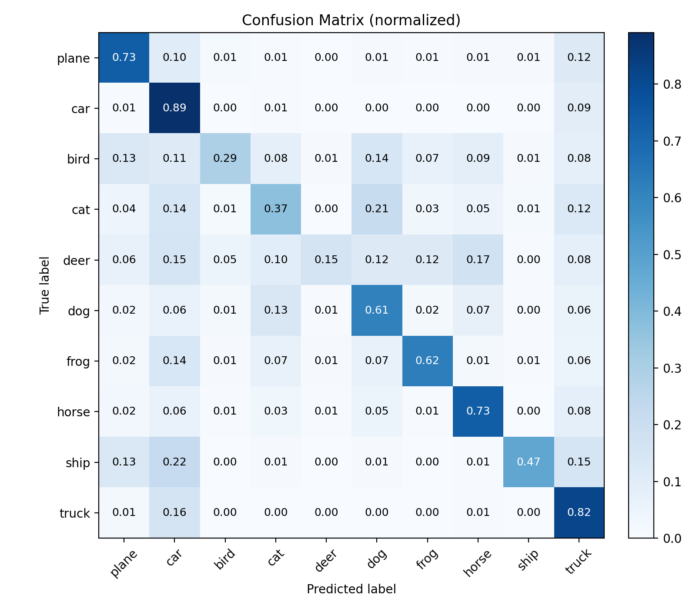
</p>

&emsp;&emsp;从图中可以观察到几个规律性的现象：

1. **车辆类（plane, car, truck, ship）识别效果最好**

   * 对角线对应的这些类别格子非常“亮”，说明 CNN 对刚体物体的纹理与轮廓特征把握得比较好；
   * 例如 `car` 往往能够以较高置信度被正确识别，误分较少。

2. **动物类（bird, cat, deer, dog 等）混淆明显**

   * `cat` 与 `dog`、`deer` 与 `horse` 之间有明显的互相误分；
   * 某些动物类别（例如 deer）整体准确率明显偏低，说明即使使用了卷积特征，在复杂背景、姿态变化较大的前提下，模型仍然难以区分它们。

3. **与前两章的模式高度一致**

   * 在线性 Softmax 和两层 FCN 中，我们就已经观察到“车辆好、动物难”的现象；
   * CNN 虽然整体准确率大幅提升，但这种类别间相对难度的 pattern 仍然存在，只是整体色谱更偏向高准确率区域。

&emsp;&emsp;值得一提的是：由于 `visualize_confusion_cnn.py` 中为了自包含，重新实现了一套简化的预处理流程，因此脚本复现出的**整体准确率略低于主实验脚本直接评估的 70.5%**，但在“哪些类别易、哪些类别难”这一模式上，它们是一致的。这里我们主要关注的是**相对差异和错误类型**，而非那几个百分点的绝对值。

### 3.5 卷积核与特征图：CNN 在看什么？

&emsp;&emsp;相比于 FCN 的“黑箱式大矩阵”，卷积网络的一个重要优点是：**前几层的卷积核和特征图非常适合被直接可视化**，可以让我们直观地理解网络到底学到了什么。

#### 3.5.1 第一层卷积核：从随机噪声到“边缘检测器”

&emsp;&emsp;使用 `visualize_features_cnn.py`，我们把训练好模型的第一层卷积核 `W1 ∈ ℝ^{32×3×3×3}` 进行了可视化。每个卷积核被视作一张小小的“3×3 彩色 patch”，整体排成网格：

<p align="center"><b>图 10：训练后第一层卷积核可视化</b></p>
<p align="center">
  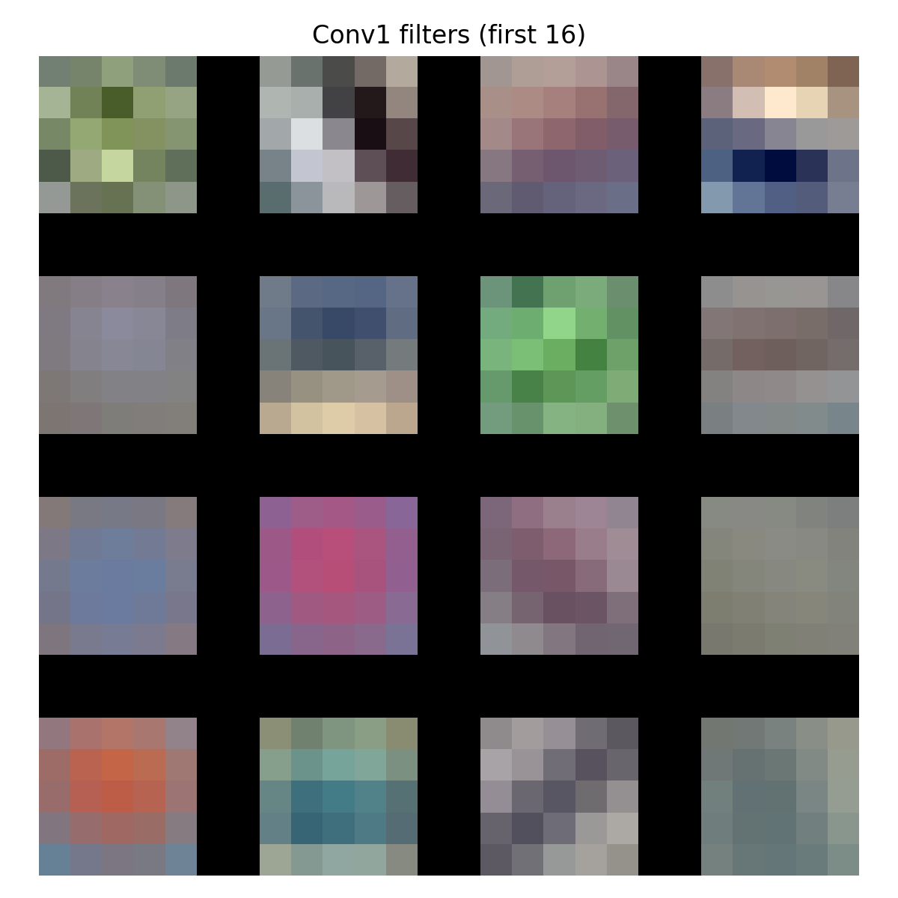
</p>

&emsp;&emsp;观察这些小 patch，可以看到：

* 很多卷积核呈现出明显的**方向性边缘**（水平边缘、斜边缘等）；
* 有些卷积核捕捉的是**颜色对比**（例如从蓝色到黄色的渐变）；
* 与初始化时的高斯噪声相比，卷积核的模式变得更加“干净、结构化”。

这与我们在 1.2 节中给出的直觉高度吻合：**第一层卷积主要在做“边缘检测 + 颜色/纹理检测”**。

#### 3.5.2 特征图：从原始像素到局部响应

&emsp;&emsp;我们还选取了若干测试集样本，送入第一层卷积 + ReLU 后，取出其对应的特征图，并排成网格。下面是一张典型样本的可视化：

<p align="center"><b>图 11：某测试样本在 conv1+ReLU 后的部分特征图</b></p>
<p align="center">
  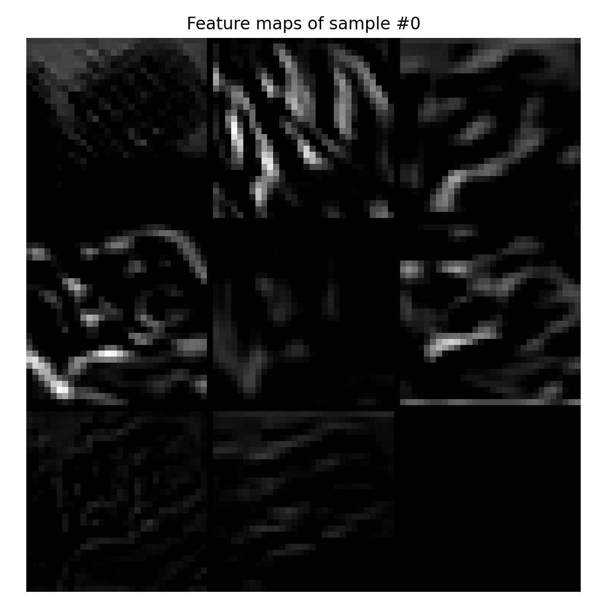
</p>

可以看到：

* 在物体的边缘处（例如飞机机翼、汽车轮廓、动物身体边缘），很多 feature map 上都出现了**强响应区域**；
* 背景区域（例如天空、草地的大块区域）则往往趋于“暗”，表示这些卷积核认为那里的局部模式“不那么重要”；
* 不同通道对不同的局部模式敏感：有的更偏向颜色，有的偏纹理，有的偏局部形状。

&emsp;&emsp;随着网络层数加深，这些局部特征会被不断组合，最终形成对“整只猫 / 整辆车 / 整艘船”的抽象表示——这正是 1.8 节中“感受野逐渐增大”的直观体现。

### 3.6 小结：从实验中验证 CNN 的优势与局限

&emsp;&emsp;通过这一章的代码与实验，我们可以得出几个重要结论：

1. **CNN 在 CIFAR-10 上显著优于 FCN 与传统特征**

   * 在完全不使用手工特征的前提下，简单两层卷积 + 一层全连接的 CNN 就达到了约 **70.5%** 的测试准确率；
   * 相比之下，两层 FCN 在原始像素上的表现仅为 **49.84%**，Softmax + HOG 也只有 **53.60%**。

2. **过拟合是现实而非 bug**

   * 训练集上接近 100% 的精度 + 验证集约 70% 的精度，并不意味着代码有错误，而是说明当前模型容量较大、正则化偏弱；
   * 这反而为后续章节探索 **Dropout、数据增强、更深网络结构** 提供了空间。

3. **卷积核与特征图可视化提高了模型可解释性**

   * 第一层卷积核确实学到了“边缘 + 颜色”这样的经典视觉基元；
   * 中间特征图揭示出网络如何在不同空间位置上关注物体的局部结构。

4. **复杂自然图像仍然很难**

   * 尽管整体性能大幅提升，但混淆矩阵显示动物类仍然存在大量混淆；
   * 这说明要真正攻克 CIFAR-10 甚至更大规模的数据集，还需要更深层次的架构设计（如 VGG/ResNet）、更激进的正则化以及更强的数据增强策略。

&emsp;&emsp;至此，我们已经完成了从 K-NN → Softmax → FCN → CNN 的第一轮“进化链”。在接下来的章节中，我们可以进一步探索：**更深的 CNN 结构、BatchNorm、残差连接，甚至转向 PyTorch 等框架，重构整个 pipeline**。不过在此之前，通过这一章的纯 NumPy 手搓 CNN，你已经从底层亲手经历了一遍卷积网络的完整“肌肉与骨骼”。
