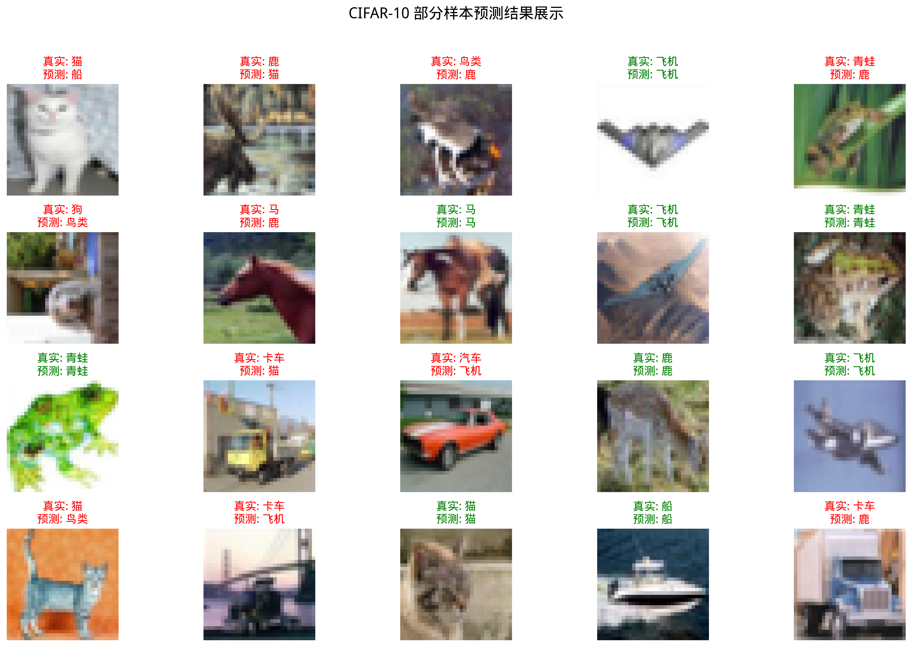

## 第一章：图像分类器 - K-近邻 (K-Nearest Neighbors, K-NN)

## 第一部分：KNN理论讲解
&emsp;&emsp;欢迎来到《用纯Python手搓经典计算机视觉算法》的第一站！在本章，我们将从一个极其生活化的思想出发，逐步揭开 K-近邻（K-NN）算法的神秘面纱。它不仅是机器学习领域最古老的算法之一，更是我们踏入图像分类世界最理想、最直观的向导。K-NN是一种“非参数”方法，这意味着它不对数据的内在分布做任何假设，这种灵活性使它成为一个绝佳的基准模型，帮助我们建立对“特征空间”中“距离”的核心直觉。

### 1.1 现实类比 - 从水果分类开始

&emsp;&emsp;想象一下，桌上有一个你从未见过的水果，你想知道它更可能是“苹果”还是“橙子”。一个最直观的方法是什么？你可能会观察它的大小、形状和颜色，然后和你脑海中已经认识的苹果和橙子进行比较。这个比较的过程，就是将未知水果的“特征”（颜色、大小、形状）与已知水果的特征进行匹配。

&emsp;&emsp;如果这个水果在“颜色”和“大小”这两个特征上，与 5 个你最熟悉的水果（K=5）中的 4 个苹果和 1 个橙子都非常相似，你大概率会判断它是一个苹果。在这个过程中，你实际上已经不自觉地完成了一次K-NN分类。这里的“未知水果”就是我们的**测试样本**，“已知的水果”就是**训练数据**，而“颜色”和“大小”等可供比较的属性，就是**特征向量**。

&emsp;&emsp;K-NN 算法的内核，就是基于这样一种简单、强大的“近朱者赤，近墨者黑”的思想。它通过衡量未知事物与已知事物之间的“距离”，来对未知事物进行分类。

### 1.2 计算机的视角：什么是图像分类？

&emsp;&emsp;在深入算法的核心三要素之前，我们必须先统一“语言”，理解计算机是如何“看”待这个世界的，以及它如何量化“相似度”。

&emsp;&emsp;对于人类，识别图像是天赋。但对于计算机，一张图片只是一个由像素值构成的巨大数字矩阵。例如，一张小小的 32x32 像素的彩色（RGB三通道）图片，在计算机看来就是一个 $32\times32 \times 3 = 3072$个数字组成的集合。

&emsp;&emsp;为了让算法能够处理，我们通常会把这个三维的像素矩阵“压平”（Flatten），变成一个长长的一维向量。对于上面的例子，我们就得到了一个3072维的向量。现在，我们的**图像分类任务**就可以被精确地定义为：

> **给定一个代表图像的高维向量，算法需要从一个预设的类别列表中（比如“猫”、“狗”、“飞机”），为这个向量分配合适的类别标签。**

&emsp;&emsp;我们将每张图片（即每个高维向量）看作是这个3072维“特征空间”中的一个点。那么，“相似”的图片（例如，两张不同角度拍摄的猫的照片）在空间中的位置也应该“相近”。这为我们使用“距离”来衡量相似度提供了理论基础。值得注意的是，“压平”操作会丢失像素点的空间结构信息（例如，哪些像素是相邻的），这是这类简单方法的局限性，也是后续更高级的卷积神经网络（CNN）着力解决的问题。
<p align="center"><b>图 1：图像的向量化（“Flatten”）过程</b></p>
<p align="center">

</p>
<p align="center" style="font-size: 14px; color: #6c757d; line-height: 1.5;">

> **说明：** 左侧是一个简化的$5 \times 5$单通道图像，其中红色代表前景（值为 1），灰色代表背景（值为 0）。
>经过“Flatten”操作后，它被转换为一个 25 维的一维行向量，算法将基于这个向量进行后续计算。


### 1.3 核心三要素

&emsp;&emsp;我们已经从生活例子中体会了 K-NN 的直觉思想：相似的对象往往有相似的属性。接下来，我们将从算法设计的角度，逐步把这种直觉形式化为可以计算的数学模型。要让这个简单的思想变成一个可以工作的算法，我们需要定义三个核心要素：

#### 1.3.1 距离度量 (Distance Metric)：如何定义“相似”？

&emsp;&emsp;“相似”是一个模糊的概念，在数学中，我们用“距离”来精确地衡量它。距离越近，代表相似度越高。在处理多维特征（比如一张图片的所有像素）时，最常用的两种距离计算方法是：

* **L2 距离 (欧氏距离, Euclidean Distance)**
  &emsp;&emsp;这可以想象成空间中两点间的直线距离，就像鸟的飞行路线，也是我们最熟悉、最直观的距离度量。例如，在二维空间中，点 A(1, 2) 和点 B(4, 6) 之间的 L2 距离是 $\sqrt{(4-1)^2 + (6-2)^2} = \sqrt{9+16} = 5$。因为 L2 距离计算了差值的平方，所以它对较大的差异（即异常值）非常敏感，一个维度上的巨大差异会显著影响整体距离。

* **L1 距离 (曼哈顿距离, Manhattan Distance)**
  &emsp;&emsp;这可以想象成在城市网格状的街道上，从一个十字路口走到另一个十字路口需要走过的街区总长度。它衡量的是两个点在标准坐标轴上的绝对轴距总和。对于同样的点 A(1, 2) 和 B(4, 6)，L1 距离是 $|4-1| + |6-2| = 3+4 = 7$。由于 L1 距离不进行平方操作，它对所有维度的差异都一视同仁，因此对异常值的鲁棒性比L2距离更好。

&emsp;&emsp;选择哪种距离度量，取决于数据的特征和具体的应用场景。对于图像像素这类同质化的特征，两者通常都可以取得不错的效果。

#### 1.3.2 K 值的选择：找多少个“邻居”？

&emsp;&emsp;K 值的选择，即邻居的数量，对模型的最终预测结果有决定性的影响。它是一个需要我们手动设置的“超参数”（Hyperparameter），直接关系到模型的复杂度和泛化能力。

* **K 值过小**：模型会变得非常敏感，容易受到噪声数据的影响。如果 K=1，模型仅仅依赖于最近的一个邻居。想象一个被错误标记的训练样本（一张猫的图片被标为“狗”），如果一个新的测试样本恰好离这个错误样本最近，1-NN分类器就会自信地做出错误判断。这会导致模型学习了训练集中的噪声和特例，而不是数据的整体规律，我们称之为**过拟合 (Overfitting)**。

* **K 值过大**：模型会变得非常“迟钝”，倾向于忽略数据中局部的、细微的特征。如果 K 值等于全体样本数量，那无论新样本是什么，预测结果都会是训练集中数量最多的那个类别，这显然不是我们想要的。过大的K值会使决策边界过于平滑，无法捕捉数据的复杂结构，我们称之为**欠拟合 (Underfitting)**。


&emsp;&emsp;选择一个合适的 K 值至关重要。在实际应用中，我们不能用测试集来选择K值（因为这相当于“作弊”），而是通常会采用一种叫做**交叉验证 (Cross-Validation)** 的方法：从训练集中分出一部分作为“验证集”，用剩余的训练数据训练模型，然后在验证集上评估不同K值的表现，最终选择表现最好的那个K值。为了避免投票时出现平局，K值通常被选为奇数。

<p align="center"><b>图 2：K 值对预测结果的影响（同一测试点）</b></p>

<div style="display: flex; justify-content: center; align-items: center; gap: 12px;">
  <figure style="text-align: center;">
    
    <figcaption>图 2 (a)：K = 3 时预测结果 B</figcaption>
  </figure>
  <figure style="text-align: center;">
    
    <figcaption>图 2 (b)：K = 5 时预测结果 A</figcaption>
  </figure>
</div>

> **说明：** 绿色星形为测试点；圆点为 Class A，叉号为 Class B；虚线圆表示到第 K 个邻居的距离。  
> K 越小，模型越“敏感”（可能过拟合）；K 越大，模型越“平滑”（可能欠拟合）。

### 1.3.3 分类决策规则 (Decision Rule)：如何根据邻居做决定？

&emsp;&emsp;找到了 K 个最相似的“邻居”后，我们就需要一个规则来做出最终的判断。

* **多数投票 (Majority Vote)**: 这是最常用、最简单的规则。在 K 个邻居中，分别统计每个类别的数量，数量最多的那个类别，就是我们对新样本的预测类别。每个邻居的“话语权”都是平等的。

* **距离加权投票 (Distance-weighted Voting)**: 一种更精细的策略。它认为，距离更近的邻居应该有更大的影响力。因此，每个邻居的投票权重可以设置为其距离的倒数（例如 $1/d$）。这样，即使在K个邻居中，某个类别的数量不占优，但如果属于该类别的邻居都离测试点非常近，它依然有可能胜出。这种方法可以有效减小K值选择对结果的影响。

### 1.4 算法的数学描述

&emsp;&emsp;现在，我们用更严谨的数学语言来统一描述 K-NN 的完整流程。

#### 1.4.1 距离度量公式

假设我们有两个 $n$ 维的样本点， $x = (x_1, x_2, ..., x_n)$ 和 $y = (y_1, y_2, ..., y_n)$；


* **L2 距离 (欧氏距离)** 的计算公式为：

$$
d_2(x, y) = \sqrt{\sum_{i=1}^{n} (x_i - y_i)^2}
$$

* **L1 距离 (曼哈顿距离)** 的计算公式为：

$$
d_1(x, y) = \sum_{i=1}^{n} |x_i - y_i|
$$

* **更一般地，Lp 距离 (闵可夫斯基距离) 的定义为**：

$$
d_p(x, y) = \left(\sum_{i=1}^{n} |x_i - y_i|^p\right)^{1/p}, \quad p \ge 1
$$

  其中，当 $p=1$ 时为曼哈顿距离，当 $p=2$ 时为欧氏距离。

<p align="center"><b>图 3：L1（曼哈顿）与 L2（欧氏）等距曲线对比</b></p>

<div style="display: flex; justify-content: center; align-items: center;">
  <figure style="text-align: center; width: 50%;">
    

  </figure>
</div>

> **说明：**  
> L2（欧氏距离）的等距曲线为**圆形**，表示在所有方向上距离权重相同；  
> L1（曼哈顿距离）的等距曲线为**菱形**，表示沿坐标轴方向的距离占主导。  
> 因此，不同的距离度量会改变“邻域”的形状，进而影响 $N_k(x)$ 的组成和最终分类结果。


#### 1.4.2 分类决策的数学表达

&emsp;&emsp;给定一个测试样本 $x_{test}$，以及包含 $N$ 个样本的训练集 $D = \{(x_1, y_1), ..., (x_N, y_N)\}$，其中 $y_i$ 是样本 $x_i$ 的类别标签。K-NN 的预测过程可以分为以下两步：

1. **寻找邻居**：在训练集 $D$ 中，找到距离 $x_{test}$ 最近的 $K$ 个样本点，构成邻居集合 $N_k(x_{test})$。

2. **投票决策**：通过多数投票法做出预测，选择邻居集合中出现次数最多的类别作为预测结果 $\hat{y}$：

$$
\hat{y} = \underset{c}{\text{argmax}} \sum_{x_i, y_i \in N_k(x_{\text{test}})} I(y_i = c)
$$


&emsp;&emsp;这个公式看起来复杂，但它的含义非常直白：“对于每一个可能的类别 `c`，我们去统计邻居集合 $N_k(x_{test})$ 中有多少样本的标签 $y_i$ 等于 `c`（ $I(\cdot)$ 是指示函数，条件成立时为 1，否则为 0）。最后，我们选择那个让总和最大的类别作为最终的预测结果 $\hat{y}$。”

### 1.5 算法实现流程

<p align="center"><b>K-NN 算法预测流程图</b></p>
<p align="center">
  
</p>

&emsp;&emsp;K-NN 分类器的预测过程可以形式化地描述为以下算法。该算法的输入为一个测试样本，输出为其预测的类别标签。

---
**算法 1：K-近邻分类算法**

**输入：**

* 测试样本 $x_{test}$

* 训练集 $D = \{(x_1, y_1), (x_2, y_2), ..., (x_N, y_N)\}$

* 邻居数 $K$

* 距离度量函数 $d(\cdot, \cdot)$

**输出：**

* 测试样本的预测类别 $\hat{y}$

**方法：**

1. **初始化距离集合**：创建一个空列表 $L$。

2. **计算距离**：对于 $i$ 从 $1$ 到 $N$，执行以下操作：
   a.  计算 $x_{test}$ 与训练样本 $x_i$ 之间的距离 $dist = d(x_{test}, x_i)$。这是预测阶段计算开销最大的部分，总时间复杂度为 $O(N \cdot D)$，其中 $D$ 是数据维度。
   b.  将序对 $(dist, y_i)$ 存入列表 $L$。

3. **排序**：根据距离 $dist$ 对列表 $L$ 进行升序排序。这一步的时间复杂度通常为 $O(N \log N)$。

4. **确定邻居**：选取排序后列表 $L$ 的前 $K$ 个元素，构成最近邻集合 $N_k$。

5. **投票决策**：在集合 $N_k$ 中，通过多数投票法（或加权投票法）确定出现次数最多的类别。

6. **返回结果**：将出现次数最多的类别作为预测结果 $\hat{y}$ 并返回。

*要对整个测试集进行预测，只需对测试集中的每一个样本* $x_{test}$ *独立执行以上算法即可。*

---

&emsp;&emsp;为了提高效率，可以不必对整个列表进行完整排序，而只需找到前 K 小的元素即可，这可以通过更高效的数据结构（如堆）将复杂度优化到 $O(N \log K)$。在更高级的应用中，还会使用KD树、球树等空间数据结构来加速第2步的邻居搜索过程。

### 1.6 优缺点分析

&emsp;&emsp;该算法具有简单直观的特点，其原理易于理解，实现过程简便且可解释性强。它属于“**懒惰学习**”(Lazy Learning)，在训练阶段仅需存储数据，无需进行耗时的计算。同时，它对数据分布没有特别假设，能很好地适应各种非线性可分的数据，并且天然支持多分类问题，无需任何修改便可直接应用于多分类场景。

&emsp;&emsp;此算法也存在一些不足。在预测阶段，它需要计算新样本与所有训练样本的距离，当训练集规模很大时，计算复杂度极高，非常耗时。它对**样本不平衡问题**较为敏感，若数据集中某个类别的样本数量远多于其他类别，模型往往会倾向于预测多数类。此外，在非常高维的空间中，由于所有点之间的距离可能趋向于相等，“距离”概念可能失去意义，即出现“**维度灾难**”，导致算法在高维数据中失效。而且，该算法对特征缩放敏感，若不同特征的数值范围差异巨大，数值范围大的特征会在距离计算中占据主-导，因此通常需要先对数据进行标准化处理。
### 1.7 小结与拓展

&emsp;&emsp;K-NN 算法通过“少数服从多数”的邻居投票策略，为我们提供了一种最直观、最简单的分类方法。理解 K-NN 不仅能帮助我们掌握一种实用的分类算法，更为后续学习更复杂的模型打下了坚实基础。

#### 拓展思考

1. **非参数模型的意义**：K-NN 是一个典型的非参数模型。它不对数据的内在分布做任何假设，模型复杂度会随着训练数据的增多而增加。它的“模型”就是全部训练数据本身。这与参数模型（如线性回归）形成对比，后者将数据的所有信息压缩到一组固定数量的参数（权重）中，无论数据量多大，模型大小不变。

2. **概率视角**：如果将邻居的投票比例视为对各类别的后验概率估计，K-NN 也可以被理解为一种基于经验分布的、非常直接的概率分类器。例如，若K=5的邻居中有3个是猫，2个是狗，我们可以认为该样本是猫的概率为60%，是狗的概率为40%。这为我们提供了预测的置信度。

3. **维度灾难的本质**：随着维度的增加，高维空间会变得极其稀疏，任意两点之间的距离差异会变得不明显（都很大），从而削弱了 K-NN 算法赖以生存的“邻近”概念的区分能力。应对维度灾难的常用方法包括特征选择（挑选最重要的特征）和特征提取/降回维（如使用主成分分析PCA等方法将高维数据投影到低维空间）。


## 第二部分：代码实现详解

&emsp;&emsp;理论是指导思想，而高质量的代码则是将思想变为现实的艺术。在本节中，我们将深入 `knn_classifier.py` 的内部，像剥洋葱一样，一层层地解析我们是如何用纯 NumPy 将 K-NN 算法的核心逻辑转化为健壮、高效的程序的。我们将重点关注几个体现了“工程智慧”的关键设计。

### 2.1 `KNNClassifier` 类设计：搭建算法的骨架

&emsp;&emsp;为了将算法封装成一个可复用、接口清晰的模块，我们首先设计了 `KNNClassifier` 这个类。它的核心设计遵循了“懒惰学习”的本质，将数据存储与计算预测分离。

&emsp;&emsp;我们先来看一下这个类的基本框架：

```python
class KNNClassifier:
    def __init__(self, p: float = 2.0) -> None:
        # ... 初始化 ...
        pass
    
    def fit(self, X: np.ndarray, y: np.ndarray) -> "KNNClassifier":
        # ... 存储数据 ...
        pass
        
    def predict(self, X: np.ndarray, k: int = 5, ...) -> np.ndarray:
        # ... 进行预测 ...
        pass
```

可以看到，整个类的结构由三个核心方法组成，每个方法职责分明：

* `def __init__(self, p: float = 2.0) -> None:`
    分类器在初始化时，只接收一个用于定义距离度量方式的参数 `p`（闵可夫斯基距离的阶数，默认为2，即欧氏距离）。此时，模型内部不包含任何数据，它只是一个定义了“如何测量距离”的空壳。

* `def fit(self, X: np.ndarray, y: np.ndarray) -> "KNNClassifier":`
    此方法完美体现了 K-NN 的“懒惰”特性。与需要耗时学习参数的复杂模型不同，这里的 `fit` 方法不进行任何计算。它的唯一职责就是接收训练数据 `X` 和训练标签 `y`，然后将它们“记住”（存为类的内部变量 `self._X` 和 `self._y`）。所有的“重活”都被推迟到了预测阶段。

* `def predict(self, X: np.ndarray, k: int = 5, ... ) -> np.ndarray:`
    这才是算法的核心计算所在。它接收新的测试数据 `X`，并要求在此时才指定邻居数量 `k`。这种设计提供了极大的灵活性，允许我们在不重新“训练”模型的情况下，轻松地用不同的 `k` 值进行多次实验，这对于超参数调优至关重要。


### 2.2 核心亮点 1：从循环到向量化的高效距离计算

&emsp;&emsp;K-NN 预测阶段最大的性能瓶颈在于计算一个测试样本与所有训练样本之间的距离。最朴素、最直观的方法，就是使用两层 for 循环，像这样：

```python
# 一种非常低效的实现方式 (两层循环)
# (此代码为教学示例，并未包含在最终的 knn_classifier.py 中)
num_test = X_test.shape[0]
num_train = self.X_train.shape[0]
dists = np.zeros((num_test, num_train))
for i in range(num_test):
    for j in range(num_train):
        dists[i, j] = np.sqrt(np.sum((X_test[i] - self.X_train[j])**2))
```

&emsp;&emsp;这种方法在处理大数据时效率极低。为了解决这个问题，我们利用了 NumPy 强大的能力，将循环操作转换为了高效的矩阵运算。对于最常用的 L2 (欧氏) 距离，其距离的平方可以利用线性代数公式展开：

$$
|A-B|^2 = |A|^2 + |B|^2 - 2A \cdot B^T
$$

&emsp;&emsp;这个公式的巧妙之处在于，它将一个涉及逐元素相减的复杂运算，拆解成了三个独立的、可以被高度优化的矩阵/向量运算。我们的 `_pairwise_minkowski` 函数正是基于此原理实现：

```python
# knn/knn_classifier.py (部分代码)

# ...
if p == 2:
    # 1. 计算 A 中每个向量的平方和 ||A||^2
    A2 = np.sum(A * A, axis=1, keepdims=True)  # 形状: (m,1)

    # 2. 计算 B 中每个向量的平方和 ||B||^2
    B2 = np.sum(B * B, axis=1, keepdims=True).T  # 形状: (1,n)

    # 3. 计算两个矩阵的点积 2A·B^T
    G = A @ B.T  # 形状: (m,n)

    # 4. 组合三部分得到距离的平方
    sq = A2 + B2 - 2.0 * G

    # 5. 最后开方得到最终的欧氏距离
    return np.sqrt(sq, dtype=A.dtype)
```

&emsp;&emsp;在这段代码中，`np.sum` 和 `@`（矩阵乘法）都可以调用底层高度优化的线性代数库（BLAS），其计算速度远非 Python 的 for 循环所能比拟。更重要的是，这个方法避免了在内存中创建一个巨大的、形状为 `(测试样本数, 训练样本数, 特征维度)` 的中间数组，从而极大地提升了计算效率和内存使用效率。


### 2.3 核心亮点 2：严谨的投票平局打破规则

&emsp;&emsp;在多数投票环节，一个常见但容易被忽略的问题是：如果多个类别的票数完全相同怎么办？例如，当 K=4 时，可能有 2 个邻居是“猫”，2 个是“狗”。一个健壮的算法必须能够在这种情况下，给出一个确定性的、不含糊的预测结果。

&emsp;&emsp;为此，我们设计了一个严谨的“三步平局打破规则”，并在 `_vote_with_tiebreak` 函数中实现。其逻辑如下：

1.  **多数票优先**：首先，通过 `np.unique` 统计所有邻居的标签，找到票数最多的那个类别。如果只有一个类别票数最高，那么它就是胜者。

```python
unique_labels, counts = np.unique(labels, return_counts=True)
max_count = np.max(counts)
candidates = unique_labels[counts == max_count]
if candidates.size == 1:
return candidates[0]
```

2.  **距离和次之**：如果存在多个票数并列的候选类别，代码会进入下一步。它会遍历这些候选者，并为每一个候选者计算其对应邻居的**距离总和**。我们优先选择那个距离总和更小的类别，因为这代表它在整体上离测试点更“近”。

```python
# (在 for 循环中)
mask = labels == lab
s = float(np.sum(dists[mask]))
if best_sum is None or s < best_sum:
best_sum = s
best_label = lab
```

3.  **标签值兜底**：在极小概率下，如果连距离总和都完全一样，代码会选择**数值上更小**的那个类别标签（例如，在“3”和“8”之间选择“3”）。这一步是最终的保障，确保无论输入如何，函数的输出总是唯一的、可复现的。

```python
# (在 for 循环的条件判断中)
... or (s == best_sum and lab < best_label):
best_sum = s
best_label = lab
```

&emsp;&emsp;通过这些精心设计的细节，我们的 `KNNClassifier` 不仅是一个能工作的模型，更是一个在效率和健壮性上都经过深思熟虑的工程实现。

## 第三部分：实验结果与分析

&emsp;&emsp;理论和代码最终都需要通过实验来检验。在本节中，我们将展示 `KNNClassifier` 在多个标准和自定义数据集上的表现，并对实验结果进行深入的分析与讨论。

### 3.1 实验总览与运行指南

&emsp;&emsp;为了全面地评估我们手搓的 K-NN 算法，我们设计并运行了 5 个独立的实验。所有实验脚本都位于 `knn/experiments/` 目录下，并且可以通过命令行灵活地调用。

&emsp;&emsp;在运行任何实验前，请确保您已处在项目根目录 (`cs-vision-homework/`) 下，并已激活 Python 虚拟环境 (`source venv/bin/activate`)。

| 实验脚本 | 数据集 | 核心功能与产出 | 示例运行指令 |
| :--- | :--- | :--- | :--- |
| `toy_dataset.py` | 2D 虚拟数据 | 可视化不同 K 值下的**决策边界**，直观理解过拟合与欠拟合。 | `python3 -m knn.experiments.toy_dataset --k 1` |
| `digits_experiment.py` | Digits (8x8) | 在低维手写数字上分类，生成**混淆矩阵**以评估模型在各类别上的表现。 | `python3 -m knn.experiments.digits_experiment --k 3` |
| `mnist_experiment.py` | MNIST (28x28) | 在更大型的手写数字集上分类，并检验模型在更大规模数据上的性能。 | `python3 -m knn.experiments.mnist_experiment --k 3` |
| `image_folder.py` | 自定义图片 | **通用性最强**的实验，可对任意按文件夹分类的图片进行分类，并支持自动下载。 | `python3 -m knn.experiments.image_folder --data-dir ./data/flower_photos --download-url <URL>` |
| `cifar10_experiment.py`| CIFAR-10 | 在复杂的彩色图像数据集上进行大规模实验，寻找最优 K 值。 | `python3 -m knn.experiments.cifar10_experiment` |

### 3.2 核心实验结果展示

&emsp;&emsp;我们将重点展示几个最具代表性的实验结果，以揭示 K-NN 算法的特性与能力边界。

#### 3.2.1 CIFAR-10 实验：寻找最优 K 值

&emsp;&emsp;我们在完整的 CIFAR-10 数据集（50000 训练样本，10000 测试样本）上，使用 L2 距离测试了一系列 K 值，实验结果如下：

| K 值 | 准确率 (Accuracy) |
| :--: | :---------------: |
|  1   |      0.3539       |
|  3   |      **0.3561** |
|  5   |      0.3547       |
|  8   |      0.3525       |
|  10  |      0.3490       |
|  12  |      0.3508       |
|  15  |      0.3487       |
|  20  |      0.3374       |

<p align="center"><b>图 4：CIFAR-10 实验部分预测结果 (K=3)</b></p>
<p align="center">

</p>

&emsp;&emsp;从结果中可以清晰地看到，K-NN 在这个复杂的彩色图像数据集上的表现并不理想，最佳准确率仅为 **35.61%**，出现在 **K=3** 时。

#### 3.2.2 Digits 与 MNIST 实验：在高对比度场景下的优异表现

&emsp;&emsp;与在 CIFAR-10 上的挣扎表现不同，当面对背景干净、目标居中、类内差异小的手写数字数据集时，我们的 K-NN 分类器展现出了惊人的性能。在 Digits (8x8) 数据集上，准确率轻松达到了 **98.89%**；在更大规模的 MNIST 数据集上，准确率也高达 **96.91%**。

<p align="center"><b>图 5：Digits (左) 与 MNIST (右) 数据集上的混淆矩阵</b></p>
<div style="display: flex; justify-content: center; align-items: center; gap: 12px;">
  <figure style="text-align: center;">
    
    <figcaption>图 5 (a)：Digits 混淆矩阵 (K=3, 准确率 98.89%)</figcaption>
  </figure>
  <figure style="text-align: center;">
    
    <figcaption>图 5 (b)：MNIST 混淆矩阵 (K=3, 准确率 96.91%)</figcaption>
  </figure>
</div>

&emsp;&emsp;两份混淆矩阵的对角线都非常“明亮”，表示绝大多数样本都被正确分类，证明了 K-NN 在处理这类结构化数据时的有效性。

#### 3.2.3 Toy Dataset 实验：决策边界的可视化

&emsp;&emsp;为了直观地理解 K 值对模型复杂度的影响，我们在二维虚拟数据集上绘制了决策边界。

<p align="center"><b>图 6：不同 K 值下的决策边界对比</b></p>
<div style="display: flex; justify-content: center; align-items: center; gap: 12px;">
  <figure style="text-align: center;">
    
    <figcaption>图 6 (a)：K=1 时，边界复杂，出现“半岛”，有过拟合倾向。</figcaption>
  </figure>
  <figure style="text-align: center;">
    
    <figcaption>图 6 (b)：K=15 时，边界变得平滑，泛化能力更强。</figcaption>
  </figure>
</div>

> **[提示]**：要生成 K=15 的图，你需要运行 `python3 -m knn.experiments.toy_dataset --k 15`。

### 3.3 结果分析与讨论：为何性能差异如此巨大？

&emsp;&emsp;实验结果提出了一个核心问题：**为什么我们手搓的 K-NN 模型，在 MNIST 和 Digits 数据集上能轻松达到 96% 以上的惊人准确率，而在更“真实”的 CIFAR-10 和 Flower Photos 数据集上却只有 30-35% 左右？**

&emsp;&emsp;答案深刻地揭示了 K-NN 这类基于“像素距离”的简单模型的**核心局限性**。

1.  **数据集的本质差异**
    * **MNIST/Digits**：这些数据集的图像具有高度的结构化特征：**黑白、居中、背景干净、类内差异小**（数字“7”的写法都差不多）。在这种理想条件下，两张图片像素值的 L2 距离，可以很好地近似它们在内容上的相似度。
    * **CIFAR-10/Flower Photos**：这是一个更接近现实世界的“野外”数据集。图片是**彩色**的（即使我们转成了灰度），物体的位置、姿态、光照、背景都千变万化，**类内差异巨大**（“狗”可以是任何品种，“玫瑰”可以有任何颜色）。在这种情况下，两张图片像素值的 L2 距离几乎完全失效。一张白狗在草地上的图片，可能在像素上离一张白猫在床上的图片更近，而不是离一张黑狗在沙滩上的图片更近。

2.  **“维度灾难”的体现**
    * CIFAR-10 的特征维度（ $32 \times 32 \times 3 = 3072$ ）远高于 MNIST（ $28 \times 28 = 784$ ）和 Digits（ $8 \times 8 = 64$ ）。
    * 正如我们在理论部分讨论的，随着维度的急剧增加，高维空间会变得异常“空旷”，所有点之间的距离都趋向于变得非常大且彼此相近。“邻居”这个概念本身变得模糊，算法的性能因此下降。

**结论**
&emsp;&emsp;这次丰富的实验有力地证明了，对于复杂的真实世界图像分类任务，直接在原始像素上应用 K-NN 算法效果有限。模型必须具备**学习“特征”**的能力——即从原始像素中提取出更高层、更抽象、对平移、旋转、光照等变化不敏感的信息——才能取得好的效果。


&emsp;&emsp;这个结论，完美地引出了我们下一个小作业——**Softmax 线性分类器**，以及后续的**神经网络**和 **CNN**。它们正是为了解决“特征学习”这个问题而诞生的。
