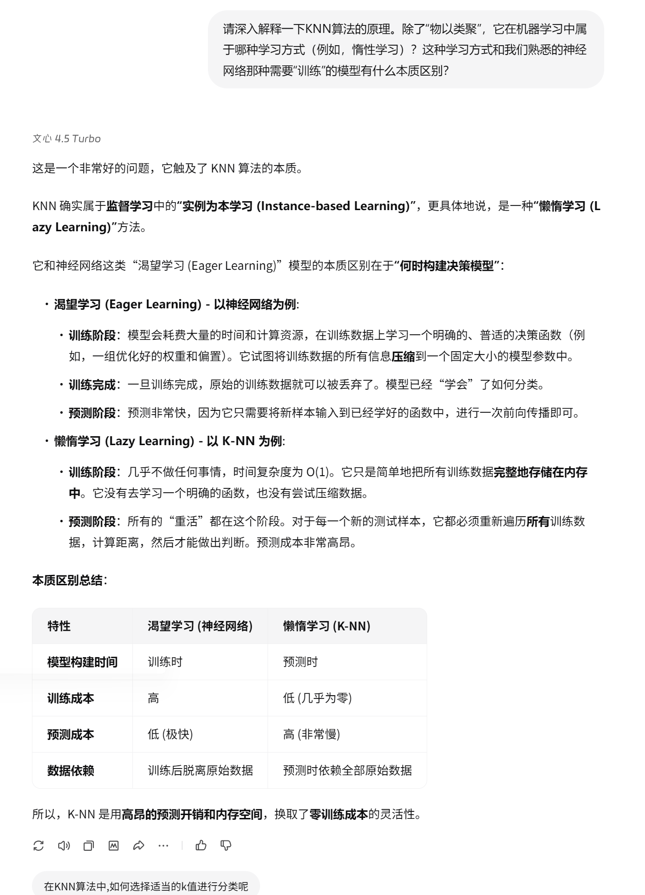
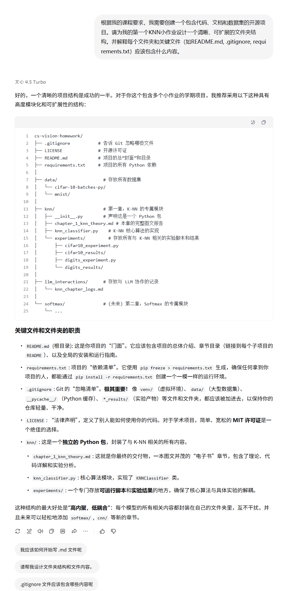

# 协作日志：与 LLM 共创 K-近邻分类器

**项目阶段**：小作业 1 - K-近邻 (K-Nearest Neighbors, K-NN)
**协作伙伴**：百度文心一言大模型

&emsp;&emsp;本文档记录了在《用纯Python手搓经典计算机视觉算法》项目的第一阶段，我们如何通过与大模型（LLM）协作，完成从理论学习、代码实现到项目规范建立的全过程。

---

### 第一部分：理论讲解

&emsp;&emsp;项目启动之初，我们首要的任务是借助 LLM 的知识库，深入理解算法的底层逻辑。

#### 探索点 1：理解核心原理与学习方式

> **我们提出的问题:**
> &emsp;&emsp;深入解释KNN算法的原理，特别是其“惰性学习”方式与传统模型的区别。
 

 

&emsp;&emsp;通过这次对话，我们明确了 KNN “训练”阶段仅存储数据，所有计算都发生在预测阶段的本质。这帮助我们从一开始就把握了算法的计算特性和效率瓶颈。

#### 探索点 2：明确算法定位与优劣势

> **我们提出的问题:**
> &emsp;&emsp;结合图像分类场景，分析KNN的优劣势，并理解其为何常被用作“基准线”模型。
 

 

&emsp;&emsp;我们将 KNN 定位为一个简单、可解释性强的基准模型。这为我们后续开发更复杂的模型提供了一个明确的性能参照标准。

#### 探索点 3：攻克理论难点——“维度灾难”

> **我们提出的问题:**
> &emsp;&emsp;详细解释“维度灾难”现象在处理高维图像数据时是如何发生的。
 

 

&emsp;&emsp;我们深入理解了在高维空间中，距离度量可能失效的根本原因。这警示我们在处理高维数据时，必须考虑特征降维或选择对高维不敏感的算法。

---

### 第二部分：核心代码开发

&emsp;&emsp;理论知识储备完毕后，我们开始在 LLM 的辅助下，将算法转化为实际代码。

#### 探索点 4：从零实现KNN核心代码

> **我们提出的问题:**
> &emsp;&emsp;请求LLM提供一个模块化的纯Numpy KNN分类器Python类，作为我们“手搓”的起点。
 

 

&emsp;&emsp;我们获得了一个结构清晰、注释详尽的代码框架。LLM 提供的这个基础版本，让我们能够在此之上进行迭代和优化，极大地加快了开发启动速度。

#### 探索点 5：代码性能向量化优化

> **我们提出的问题:**
> &emsp;&emsp;针对基础版代码中预测效率低下的问题，寻求利用Numpy广播机制进行向量化优化的方案。
 

 

&emsp;&emsp;我们学习到了如何用向量化运算替代显式循环，这是提升Numpy代码性能的关键技巧。这次优化是确保我们的分类器能处理更大数据集的重要一步。

---

### 第三部分：实验设计与分析

&emsp;&emsp;代码完成后，我们需要设计科学的实验来评估和调优模型。

#### 探索点 6：掌握超参数调优方法

> **我们提出的问题:**
> &emsp;&emsp;学习如何通过“K折交叉验证”来科学地选择最优超参数K。
 

 

&emsp;&emsp;我们掌握了交叉验证这一评估模型泛化能力的标准方法。这确保了我们对超参数的选择是客观且可靠的，而非基于偶然。

#### 探索点 7：学习多维度评估模型性能

> **我们提出的问题:**
> &emsp;&emsp;除了准确率，还有哪些评估指标？并理解为何在类别不均衡时需要关注它们。
 

 

&emsp;&emsp;我们认识到在真实场景下，特别是类别不均衡时，仅看准确率是片面的。我们决定在实验报告中加入混淆矩阵、精确率、召回率和F1分数，以更全面地评估模型。

#### 探索点 8：设计综合实验策略

> **我们提出的问题:**
> &emsp;&emsp;如何设计一个综合实验，来同时确定距离度量和投票策略这两个超参数的最佳组合？
 

 

&emsp;&emsp;LLM 建议我们将多个超参数组合在一起，使用网格搜索（Grid Search）配合交叉验证来寻找最优解。这为我们制定最终的实验方案提供了清晰的思路。

---

### 第四部分：项目工程规范

&emsp;&emsp;最后，为了保证项目的可维护性和可读性，我们向 LLM 寻求了软件工程最佳实践的指导。

#### 探索点 9：构建清晰的项目结构

> **我们提出的问题:**
> &emsp;&emsp;为我们的开源项目设计一个清晰、可扩展的文件夹结构。
 

 

&emsp;&emsp;我们采纳了模块化的项目结构建议，为每一章（模型）创建独立文件夹。这使得项目结构一目了然，非常利于未来的扩展和团队协作。

#### 探索点 10：提升代码质量与文档规范

> **我们提出的问题:**
> &emsp;&emsp;学习如何编写符合Google风格的Docstring，并遵循PEP 8代码规范。
 

 

&emsp;&emsp;我们认识到高质量的代码不仅在于能运行，更在于其可读性和可维护性。我们决定将代码规范和清晰的文档作为项目的硬性标准，这是对开源社区贡献者最基本的尊重。