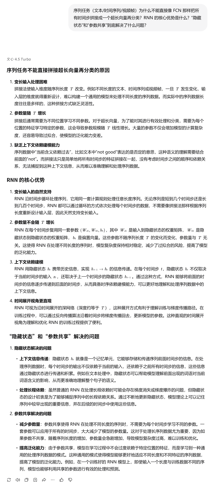
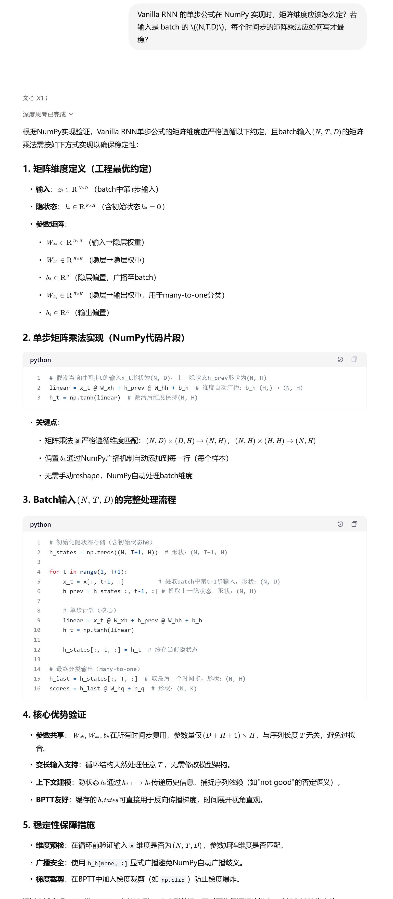
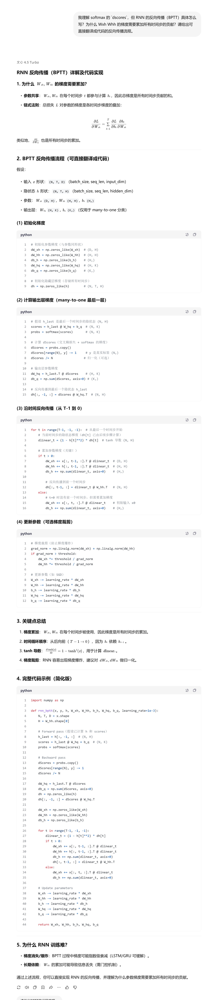
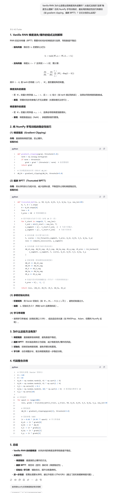
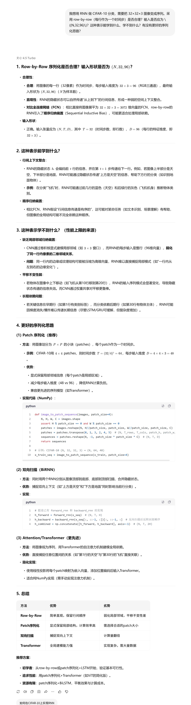

---
# 协作日志：与 LLM 共创循环神经网络（RNN）

**项目阶段**：小作业 5 - 循环神经网络 (Recurrent Neural Network, RNN)  
**协作伙伴**：大语言模型（LLM）

&emsp;&emsp;本文档记录了在《用纯Python手搓经典计算机视觉算法》项目的第五阶段，我们如何通过与大模型（LLM）协作，从“空间建模”的 CNN 过渡到“时序建模”的 RNN，梳理 RNN 的核心思想、BPTT 反向传播与工程稳定性技巧，并最终完成 CIFAR-10 的序列化分类实验（row-by-row baseline）。

---

## 第一部分：从“空间结构”到“时间结构”的理论跨越

### 探索点 1：为什么需要 RNN？序列任务为什么不直接拼接后用 FCN？

> **我们提出的问题：**  
> &emsp;&emsp;序列任务（文本/时间序列/视频帧）为什么不能直接像 FCN 那样把所有时间步拼接成一个超长向量再分类？RNN 的核心优势是什么？“隐藏状态”和“参数共享”到底解决了什么问题？

  

**LLM 的关键回答（摘要）：**
1. RNN 天然支持变长输入：不需要因为序列长度 \(T\) 变化就修改输入层。  
2. 参数共享：同一套参数在所有时间步复用，参数量不随 \(T\) 增长。  
3. 隐藏状态 \(h_t\) 充当“记忆”：通过 \(h_{t-1}\rightarrow h_t\) 携带历史上下文，建模时序依赖。

---

### 探索点 2：RNN 单步 forward 如何落到 NumPy？维度如何不出错？

> **我们提出的问题：**  
> &emsp;&emsp;Vanilla RNN 的单步公式 \(h_t=\tanh(W_{xh}x_t + W_{hh}h_{t-1} + b_h)\) 在 NumPy 实现时，矩阵维度应该怎么定？若输入是 batch 的 \((N,T,D)\)，每个时间步的矩阵乘法应如何写才最稳？

  

**LLM 的关键回答（摘要）：**
1. 推荐工程维度约定：\(x_t\in\mathbb{R}^{N\times D}\), \(h_t\in\mathbb{R}^{N\times H}\)，\(W_{xh}\in\mathbb{R}^{D\times H}\), \(W_{hh}\in\mathbb{R}^{H\times H}\)。  
2. 单步实现：`linear = x_t @ W_xh + h_prev @ W_hh + b_h`，再 `h_next = tanh(linear)`。  
3. many-to-one 分类：取最后状态 \(h_T\) 计算 `scores = h_T @ W_hq + b_q`。  
4. BPTT 需要缓存所有时间步的隐藏状态（以及必要的中间量）。

---

## 第二部分：训练与反向传播（BPTT）核心机制

### 探索点 3：BPTT 怎么推？为什么梯度要“沿时间累加”？

> **我们提出的问题：**  
> &emsp;&emsp;我理解 softmax 的 `dscores`，但 RNN 的反向传播（BPTT）具体怎么写？为什么 \(W_{xh}, W_{hh}\) 的梯度需要累加所有时间步的贡献？请给出可直接翻译成代码的反向传播流程。

  

**LLM 的关键回答（摘要）：**
1. 输出层：`dscores` 由 softmax+交叉熵得到，再计算 \(dW_{hq}, db_q\)，并回传到最后隐藏层 \(dh_T\)。  
2. 沿时间反向循环 \(t=T-1\rightarrow 0\)：用 tanh 导数 \((1-h_t^2)\) 计算每步梯度。  
3. 参数共享导致每个时间步都使用同一参数，所以 \(dW_{xh}, dW_{hh}, db_h\) 要对所有时间步贡献求和（累加）。

---

### 探索点 4：梯度消失/爆炸怎么来的？工程上如何稳定训练？

> **我们提出的问题：**  
> &emsp;&emsp;Vanilla RNN 为什么容易出现梯度消失或爆炸？从链式法则的“连乘”角度怎么理解？在纯 NumPy 手写训练时，最实用的稳定性技巧有哪些（如 gradient clipping、截断 BPTT）？它们分别怎么实现？

  

**LLM 的关键回答（摘要）：**
1. 长链梯度连乘：反向传播跨越多个时间步不断乘以 \(W_{hh}^\top\) 与激活导数，易指数衰减或爆炸。  
2. 梯度裁剪（最常用）：如逐元素 `np.clip(grad, -5, 5)` 或按范数裁剪，显著提升训练稳定性。  
3. 截断 BPTT：把长序列切片分段训练，隐藏状态跨段传递，但梯度在边界处截断（detach/stop gradient），降低长链不稳定。

---

## 第三部分：把 CIFAR-10 当作序列的工程设计

### 探索点 5：CIFAR-10 如何序列化输入 RNN？row-by-row 的利弊是什么？

> **我们提出的问题：**  
> &emsp;&emsp;我想用 RNN 做 CIFAR-10 分类，需要把 32×32×3 图像变成序列。采用 row-by-row（每行作为一个时间步）是否合理？输入是否应为 \((N,32,96)\)？这种表示能学到什么、学不到什么？有没有更好的序列化思路？

  

**LLM 的关键回答（摘要）：**
1. row-by-row baseline 合理：\(T=32\)（每行一个时间步），每步维度 \(D=32\times 3=96\)，因此输入为 \((N,32,96)\)。  
2. 能学到：跨行上下文（“上一行信息”通过隐藏状态影响“下一行”），形成弱空间整合。  
3. 学不到：缺少 CNN 的局部邻域归纳偏置与平移不变性，二维局部结构被弱化，性能存在上限。  
4. 可扩展方向：patch 序列化、双向 RNN、Attention/Transformer 等。

---

## 小结

&emsp;&emsp;通过与 LLM 的协作，我们完成了 RNN 的关键知识闭环：  
- 理论上：理解了“参数共享 + 隐藏状态”如何处理变长序列与上下文依赖；  
- 推导上：掌握了 BPTT 的梯度累加机制；  
- 工程上：用梯度裁剪与（可选的）截断 BPTT 提升训练稳定性；  
- 实验上：明确了 row-by-row 将图像视作序列的收益与局限，为后续 LSTM/GRU/Attention 的升级铺路。
