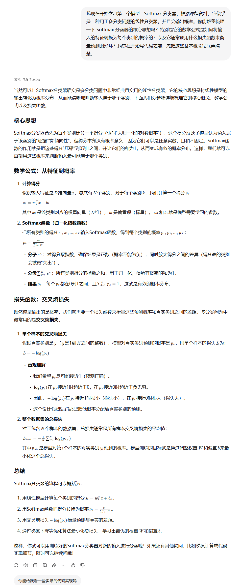
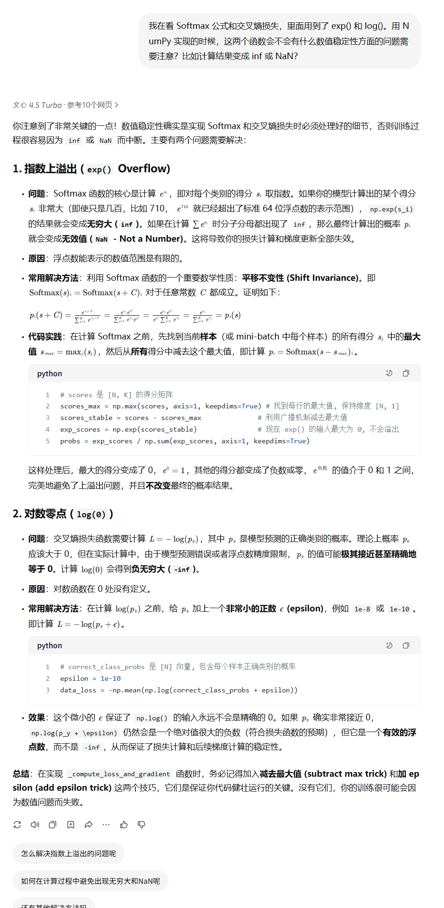
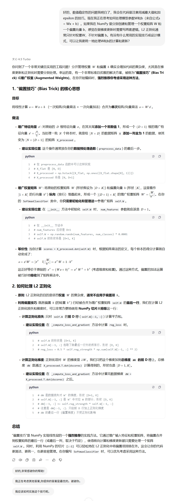
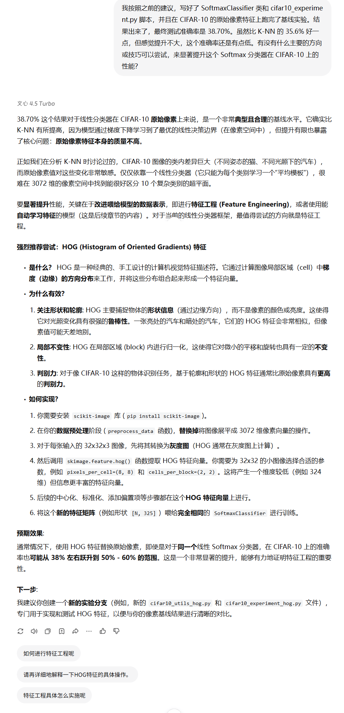
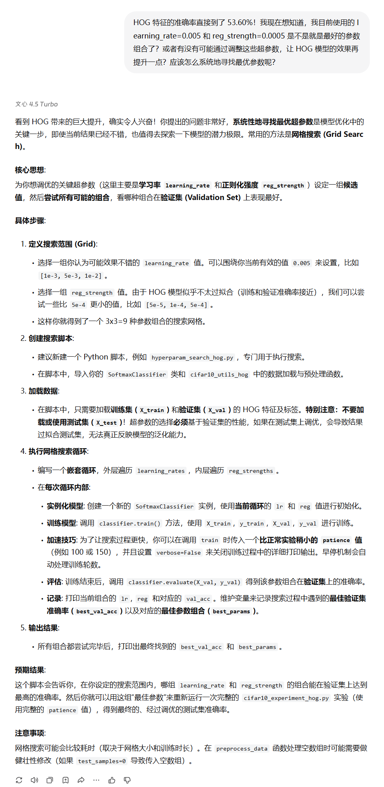
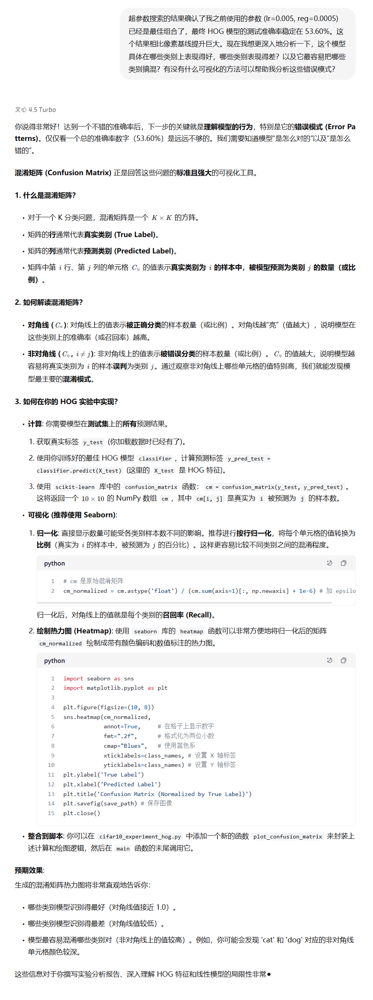
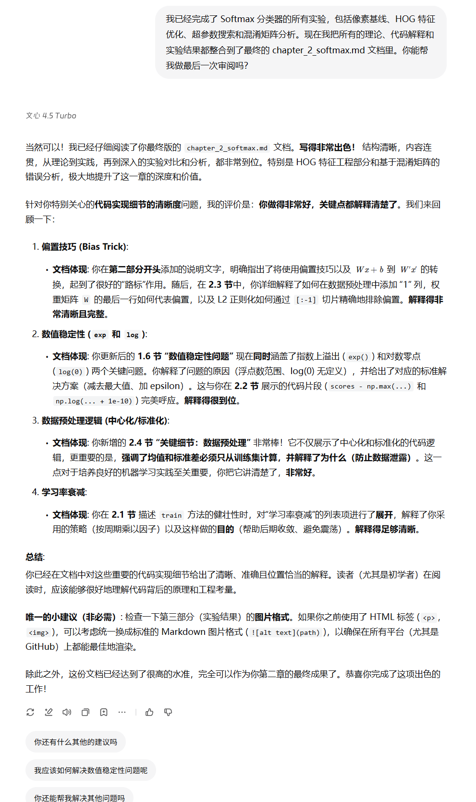

# 协作日志：与 LLM 共创 Softmax 分类器

**项目阶段**：小作业 2 - Softmax 分类器
**协作伙伴**：百度文心一言大模型 

&emsp;&emsp;本文档记录了在《用纯Python手搓经典计算机视觉算法》项目的第二阶段，我们如何遵循与 LLM 协作的学习模式，完成 Softmax 分类器的理论梳理、代码实现（包括数值稳定性、偏置技巧）、实验设计（像素基线 vs HOG 特征）、性能优化（超参数搜索）和深度分析（混淆矩阵）的全过程。

---

### 第一部分：理论梳理与代码设计

&emsp;&emsp;在 K-NN 之后，我们开始攻克 Softmax 分类器。首先，我们向 LLM 请教了核心概念和实现策略。

#### 探索点 1：理解核心原理与实现蓝图

> **我们提出的问题:**
> &emsp;&emsp;请教 Softmax 分类器的核心思想（得分到概率）、关键数学公式（Softmax 函数、交叉熵损失）以及推荐的 Python 类结构和向量化实现思路。
 

 

&emsp;&emsp;通过这次对话，我们明确了 Softmax 的工作流程，掌握了关键的数学定义，并获得了关于如何设计 `SoftmaxClassifier` 类以及如何利用 NumPy 实现高效向量化计算（特别是损失和梯度）的初步蓝图。

#### 探索点 2：预见并解决数值稳定性陷阱

> **我们提出的问题:**
> &emsp;&emsp;在实现 `exp()` 和 `log()` 相关计算时，是否存在潜在的数值稳定性风险（如 `inf`, `NaN`）？应如何预防？
 

 

&emsp;&emsp;LLM 详细解释了 `exp()` 可能导致的**上溢出**问题和 `log()` 可能遇到的**零点**问题，并给出了标准的解决方案：“减去最大值”技巧和“加 epsilon”技巧。我们将这些重要的工程实践纳入了代码实现计划。

#### 探索点 3：探讨偏置处理与正则化的优雅实现

> **我们提出的问题:**
> &emsp;&emsp;我看理论公式是 $s = Wx + b$，代码里好像都用一个 $W$ 矩阵处理。这种合并偏置 $b$ 的技巧具体是怎么做的？另外，如果用了这个技巧，做 L2 正则化时怎么只对 $W$ 部分生效，排除掉 $b$ 呢？
 

 

&emsp;&emsp;我们学习并决定采用**“偏置技巧” (Bias Trick)**：通过在数据 `X` 上添加一列 1，将偏置 $b$ 合并为权重矩阵 `W` 的最后一行。LLM 同时指导了如何在计算 L2 正则化损失和梯度时，使用 NumPy 切片 `[:-1]` 来精确地排除掉这一行偏置。

---

### 第二部分：实验、优化与分析

&emsp;&emsp;基于 LLM 的指导，我们完成了 `SoftmaxClassifier` 的编码，并开始进行实验。

#### 探索点 4：分析基线性能并寻求提升方向

> **我们提出的问题:**
> &emsp;&emsp;像素基线实验完成，CIFAR-10 测试准确率仅 38.70%，比 K-NN 提升有限。这个结果是否符合预期？应该从哪个主要方向入手来显著提升模型性能？
 

 

&emsp;&emsp;LLM 确认了这个基线结果的合理性，并指出瓶颈在于**原始像素特征**的质量不高。LLM **强烈推荐**我们尝试**特征工程**，特别是引入对光照和形状变化更鲁棒的 **HOG 特征**，并指导了具体的实现步骤（创建新文件、修改 `preprocess_data` 等）。

#### 探索点 5：验证 HOG 模型潜力并规划超参数搜索

> **我们提出的问题:**
> &emsp;&emsp;HOG 特征实验效果惊人，准确率飙升至 53.60%！这个结果是否还有提升空间？如何系统性地寻找最优的`learning_rate` 和 `reg_strength` 组合？
 

 

&emsp;&emsp;在确认 HOG 特征的巨大成功后，我们向 LLM 请教了**超参数搜索**的方法。LLM 推荐使用**网格搜索 (Grid Search)**，并指导我们如何创建搜索脚本、定义搜索范围、仅在**验证集**上评估性能以及加速搜索的技巧。

#### 探索点 6：引入混淆矩阵进行深度错误分析

> **我们提出的问题:**
> &emsp;&emsp;超参数搜索确认了当前参数已最优 (53.60%)。为了更深入地理解模型，我们想知道它具体在哪些类别上表现好/差，以及最容易混淆哪些类别。应该使用什么工具来分析这些错误模式？
 

 

&emsp;&emsp;LLM 指出**混淆矩阵 (Confusion Matrix)** 是分析错误模式的标准工具，并详细指导了如何使用 `scikit-learn` 计算混淆矩阵，如何进行**归一化**以显示比例（召回率），以及如何使用 `seaborn` 绘制信息丰富的**热力图**，并将其整合到实验脚本中。

---

### 第三部分：文档完善与最终审查

&emsp;&emsp;在完成所有代码和实验后，我们开始撰写最终的文档，并请 LLM 进行审阅。

#### 探索点 7：确保代码细节解释清晰

> **我们提出的问题:**
> &emsp;&emsp;最终文档已整合完毕。请帮忙审阅第二部分（代码实现详解），确认关于**偏置技巧**、**数值稳定性处理** (`exp`/`log`)、**数据预处理逻辑**（中心化/标准化/数据泄露）以及**学习率衰减**等关键代码细节的解释是否足够清晰，能让初学者读者也能理解？
 

 

&emsp;&emsp;LLM 对最终文档给出了积极评价，确认了关键代码细节的解释已足够清晰。LLM 再次强调了在文档中明确解释这些工程实践对于提升教材质量的重要性。

