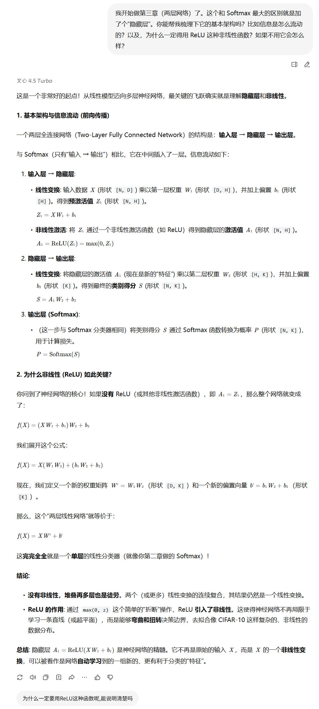
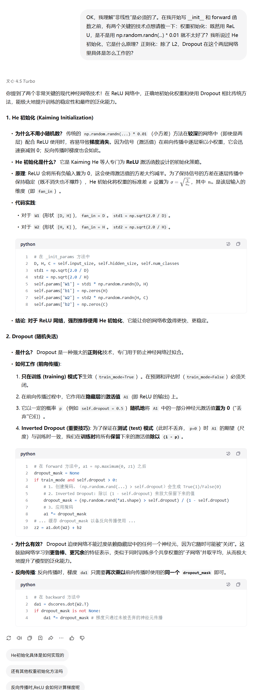
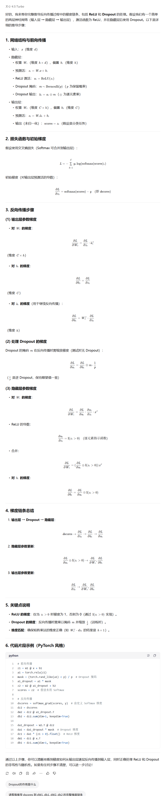
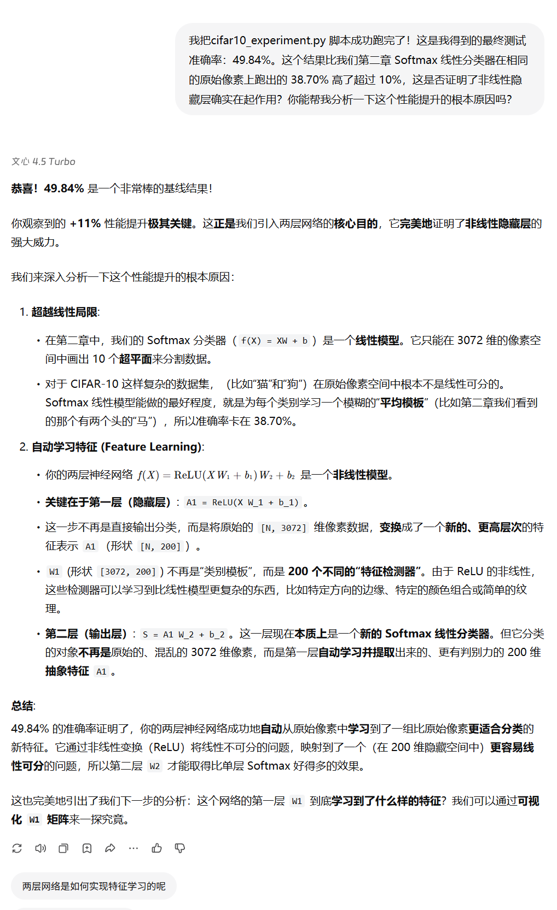
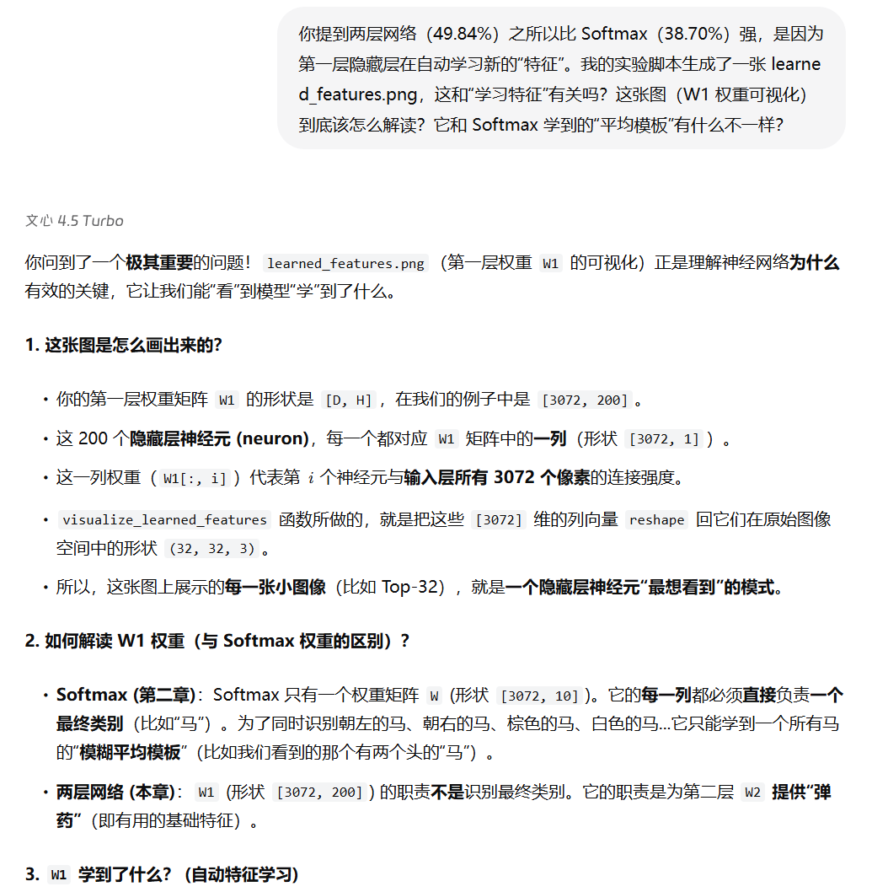

# 协作日志：与 LLM 共创两层全连接神经网络（Two-Layer Network）

**项目阶段**：小作业 3 - 两层全连接神经网络 (Two-Layer Fully Connected Network)  
**协作伙伴**：百度文心一言大模型  

&emsp;&emsp;本文档记录了在《用纯Python手搓经典计算机视觉算法》项目的第三阶段，我们如何通过与大模型（LLM）协作，完成从理论推导、代码实现到实验分析的全过程。

---

### 第一部分：理论理解与模型构建

&emsp;&emsp;本阶段的目标是从线性模型（Softmax 分类器）出发，理解神经网络如何通过“非线性”与“隐藏层”实现更强的特征学习能力。

#### 探索点 1：从线性到非线性 —— 为什么要有隐藏层？

> **我们提出的问题：**  
> &emsp;&emsp;Softmax 分类器只能学习线性决策边界，而两层网络为何能突破这一限制？隐藏层在信息流中起什么作用？  

 

 

&emsp;&emsp;LLM 帮助我们从数学上证明了“没有非线性激活函数时，多层网络仍等价于单层线性变换”，从而说明 **ReLU 的引入是网络表达能力的关键**。我们第一次明确理解到：隐藏层的本质，是将输入空间重新映射为一个新的特征空间。

---

### 第二部分：关键技术与代码实现

&emsp;&emsp;在理解了“非线性”的必要性后，我们进一步学习如何在代码层面实现可训练的两层神经网络。

#### 探索点 2：He 初始化与 Dropout 正则化的机制

> **我们提出的问题：**  
> &emsp;&emsp;在 ReLU 网络中，为什么传统的随机小权重初始化会导致训练不稳定？He 初始化是如何保持激活方差稳定的？Dropout 在两层网络中如何工作？  

 

 

&emsp;&emsp;通过 LLM 的讲解，我们掌握了 **He 初始化**（$\sqrt{2/n_{in}}$）的数学推导原理，并理解了 Dropout 的“反向掩码机制 (Inverted Dropout)”如何保证训练和测试阶段输出期望一致。LLM 提供的伪代码段清晰地展示了实现细节。

---

### 第三部分：前向传播与反向传播推导

&emsp;&emsp;在掌握核心技术后，我们希望能够完整地推导出两层神经网络的前向传播和反向传播公式。

#### 探索点 3：链式法则下的梯度流动

> **我们提出的问题：**  
> &emsp;&emsp;请详细推导两层网络从输出层到输入层的反向传播梯度，包括 ReLU 与 Dropout 的梯度处理。  

 

 

&emsp;&emsp;LLM 为我们展示了完整的推导过程，从输出层的 Softmax 损失梯度，到隐藏层的 ReLU 梯度传播，最后汇总出对 $W_1, b_1, W_2, b_2$ 的所有偏导公式。我们终于从数学角度理解了网络如何“学会”更新权重。

---

### 第四部分：实验结果分析与可视化

&emsp;&emsp;代码实现完成后，我们在 CIFAR-10 数据集上运行实验，得到了显著的性能提升。

#### 探索点 4：性能提升的根本原因分析

> **我们提出的问题：**  
> &emsp;&emsp;Softmax 的测试准确率约为 38.7%，而两层网络达到了 49.8%。这 10% 的提升来自哪里？  

 

 

&emsp;&emsp;LLM 指出，性能提升源自 **非线性特征学习能力**。第一层（隐藏层）将原始像素转换为 200 维的高层特征，类似于“边缘检测器”或“颜色模式提取器”；第二层再基于这些抽象特征完成分类。这是我们第一次真正理解“神经网络在自动学习特征”。

---

### 第五部分：特征可视化与解释

&emsp;&emsp;为了验证隐藏层确实学到了有意义的特征，我们通过可视化第一层权重矩阵 $W_1$ 来探索网络的“学习内容”。

#### 探索点 5：从权重可视化看网络“学到了什么”

> **我们提出的问题：**  
> &emsp;&emsp;`learned_features.png` 展示了第一层权重的可视化结果，它与 Softmax 权重有何不同？能说明什么？  

 

 

&emsp;&emsp;LLM 帮助我们理解：Softmax 权重更像是“每个类别的平均模板”，而两层网络的第一层权重则是“特征检测器”。这些检测器分别响应于不同的方向、颜色或纹理特征，验证了网络确实学会了基础视觉模式。例如，一些神经元表现为水平或垂直边缘检测器，而另一些则专注于特定颜色或纹理区域。这使我们能够“看到”网络的学习过程，从数据到抽象特征的逐层演化。

---

### 第六部分：局限性与下一步（通向 CNN）

&emsp;&emsp;尽管两层网络显著超越了线性分类器，但在图像任务上仍然有明显限制。

#### 探索点 6：全连接网络的局限性与卷积的启示

> **我们提出的问题：**  
> &emsp;&emsp;为什么两层全连接网络在 CIFAR-10 上依然无法匹敌 Softmax + HOG？这种结构上的限制是什么？  

 

 

&emsp;&emsp;LLM 指出，全连接网络在展平图像时丢失了空间结构（Loss of Spatial Structure）。这意味着模型无法捕捉像素间的局部关系。LLM 引出了 **卷积神经网络（CNN）** 的核心思想：局部感受野与权重共享，从而保留空间信息并减少参数。

---

### 第七部分：协作成果总结

| 阶段 | 关键成果 |
|------|------------|
| 理论推导 | 理解了非线性激活函数的必要性与隐藏层的数学意义 |
| 技术实现 | 掌握了 He 初始化、Dropout、ReLU 等核心模块 |
| 数学推导 | 独立推导了前向传播与反向传播的梯度公式 |
| 实验分析 | 复现实验结果：测试准确率 49.84%，显著超越线性模型 |
| 可视化验证 | 确认隐藏层学习到边缘、颜色等基础特征 |
| 局限性反思 | 明确 FCN 的空间结构缺陷，引出下一章 CNN |

---

**总结：**  
&emsp;&emsp;通过与 LLM 的多轮协作，我们完成了从“线性分类”到“非线性特征学习”的关键跨越。  LLM 不仅帮助我们建立了完整的数学与实现框架，还引导我们思考模型结构的设计哲学——  即 **从自动学习特征到保持空间结构**，这为第四章的卷积神经网络 (CNN) 奠定了坚实基础。

