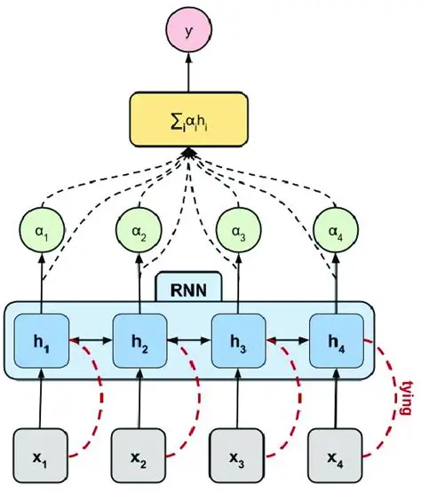
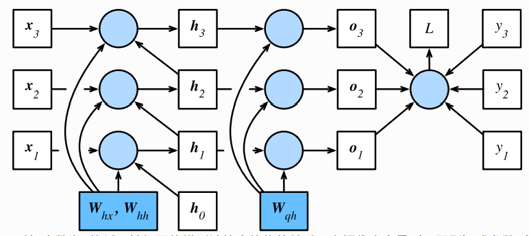
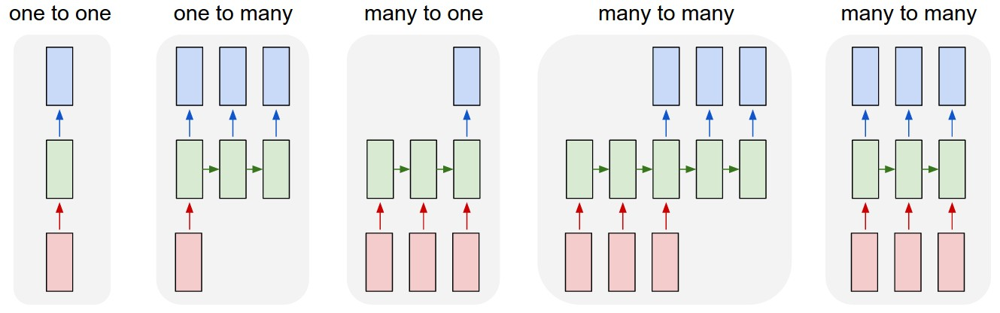
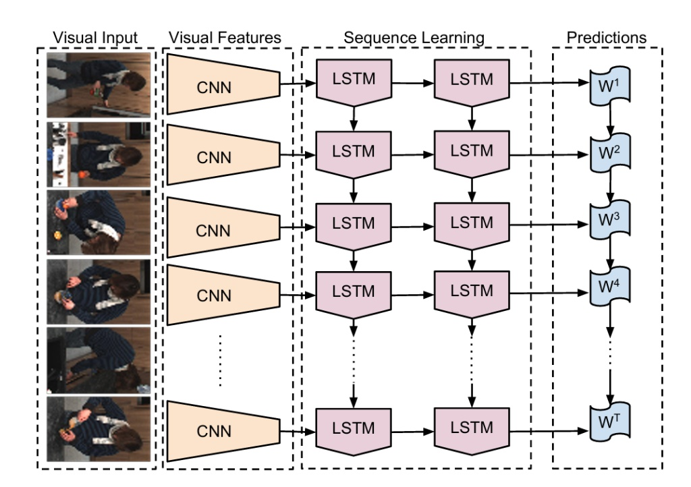
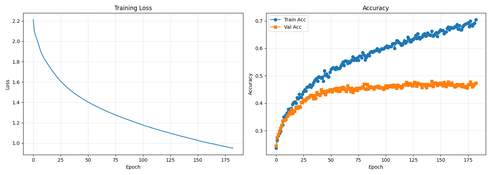
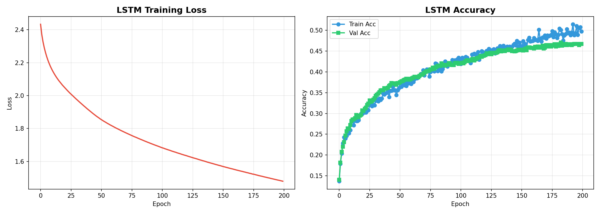
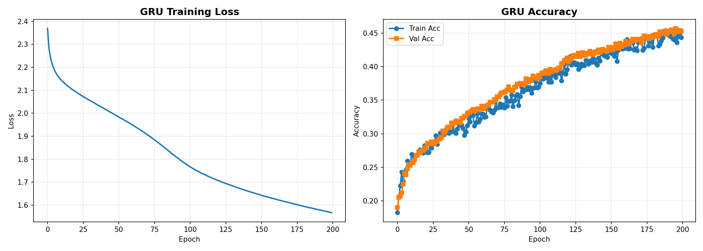
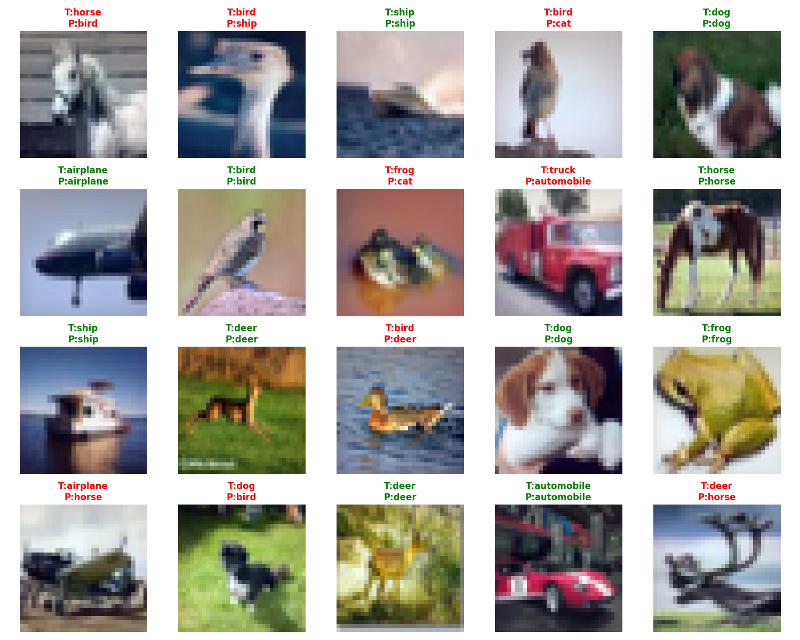
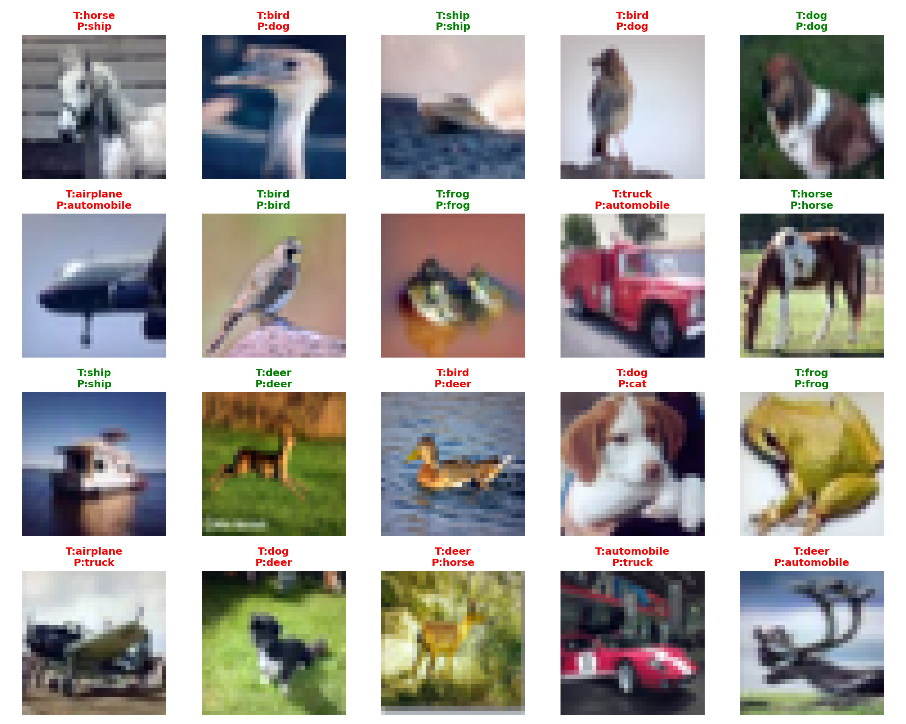

## 第五章：循环神经网络 (Recurrent Neural Network, RNN)

## 第一部分：RNN理论基础

&emsp;&emsp;在第四章中，我们看到 **CNN** 之所以强大，是因为它通过"**局部感受野 + 参数共享**"保留并利用了图像的空间结构。  
&emsp;&emsp;但当数据变成 **序列（sequence）** 时，问题的核心不再是"空间结构"，而是"**时间结构 / 顺序依赖**"。例如：文本是词序列 $(w_1, w_2, \dots, w_T)$；语音是随时间变化的帧序列；视频是帧序列（动作需要上下文）；时间序列数据（传感器/金融）也往往满足"当前与过去相关"。

&emsp;&emsp;本章要介绍的 **循环神经网络（Recurrent Neural Network, RNN）**，就是为了解决"**变长输入 + 时序依赖**"而提出的经典结构。


### 1.1 序列建模的根本挑战：变长输入 + 上下文依赖

&emsp;&emsp;序列任务通常同时有两类"天然难点"。

&emsp;&emsp;第一类是 **长度不固定（Variable Length）**。输入是一段序列：
$$
X = (x_1, x_2, \dots, x_T),
$$
其中 $T$ 会因样本而异。我们希望模型无需"重新设计输入层"，就能直接处理不同长度的序列。

&emsp;&emsp;第二类是 **时序依赖（Temporal Dependency）**。当前时刻的含义往往依赖历史上下文：比如 "good" 与 "not good" 的区别来自前面的 "not"；视频里单帧可能看不出动作，但一段连续帧能确定"起跳→腾空→落地"。

&emsp;&emsp;如果我们像 FCN 那样把序列拼接成一个超长向量再做分类，会立刻遇到两个问题：一方面 $T$ 一变，输入维度就变；另一方面每个位置都学一套参数会让参数量随 $T$ 增长，泛化也会变差。  
&emsp;&emsp;RNN 的思路非常直接：**用一套共享参数，沿时间步重复使用；再用一个"隐藏状态"携带历史信息。**

<p align="center"><b>图 1：序列任务的"上下文依赖"示意（后续输出依赖历史）</b></p>
<p align="center">
  
</p>


### 1.2 RNN 的核心思想：隐藏状态（Hidden State）作为"记忆"

&emsp;&emsp;RNN 在每个时间步 $t$ 读入输入 $x_t$，同时维护一个隐藏状态 $h_t$（可以理解为"记忆向量"）。最经典的 Vanilla RNN 更新公式为：
$$
h_t = \phi\big(W_{xh}x_t + W_{hh}h_{t-1} + b_h\big)
$$

&emsp;&emsp;如果任务需要每步输出（例如逐帧分类、序列标注），我们再接一个输出层：
$$
o_t = W_{hy}h_t + b_y, \qquad y_t = g(o_t)
$$

&emsp;&emsp;这里 $x_t$ 是第 $t$ 步输入（词向量、帧特征、传感器读数等），$h_t$ 是第 $t$ 步隐藏状态（携带历史信息），$y_t$ 是第 $t$ 步输出（是否需要取决于任务）。$\phi(\cdot)$ 是非线性（常用 $\tanh$；也可用 ReLU），$g(\cdot)$ 是输出激活（分类常用 softmax；回归常用恒等映射）。

&emsp;&emsp;你可以把 RNN 的设计浓缩成两句话：**状态传递**（$h_{t-1}\rightarrow h_t$）让信息沿时间流动；**参数共享**（同一套 $W_{xh},W_{hh},b_h$ 在所有时间步复用）让模型天然支持变长序列。

<p align="center"><b>图 2：RNN 单步结构（x_t 与 h_{t-1} 共同决定 h_t）</b></p>
<p align="center">
  
</p>


### 1.3 时间展开（Unroll）：把"循环"看成一个深网络

&emsp;&emsp;虽然名字叫"循环网络"，但在训练与推导时，我们通常把它在时间轴上展开（unroll）成一个深网络：
$$
(x_1 \rightarrow h_1) \rightarrow (x_2 \rightarrow h_2) \rightarrow \cdots \rightarrow (x_T \rightarrow h_T)
$$

&emsp;&emsp;展开后的直观意义是：网络的"深度"会随序列长度 $T$ 增长，因此更容易出现长链梯度问题；但与此同时，每一层结构相同并共享参数，因此**参数量不随 $T$ 增长**，也更容易在不同位置复用同一种规律。

<p align="center"><b>图 3：RNN 在时间维的展开（Unroll）示意图</b></p>
<p align="center">
  
</p>


### 1.4 维度与参数形式

&emsp;&emsp;为避免实现时维度混乱，我们明确如下设定：输入维度为 $D$，隐藏维度为 $H$，输出维度为 $K$（例如 $K$ 类分类）：
$$
x_t \in \mathbb{R}^{D}, \qquad h_t \in \mathbb{R}^{H}, \qquad y_t \in \mathbb{R}^{K}.
$$

&emsp;&emsp;对应参数矩阵形状为：
$$
W_{xh} \in \mathbb{R}^{H \times D}, \quad
W_{hh} \in \mathbb{R}^{H \times H}, \quad
b_h \in \mathbb{R}^{H},
$$
$$
W_{hy} \in \mathbb{R}^{K \times H}, \quad
b_y \in \mathbb{R}^{K}.
$$

&emsp;&emsp;此外，RNN 需要初始状态 $h_0$。最常见做法是 **零初始化**：$h_0=\mathbf{0}$；有时也会把 $h_0$ 作为可学习参数，但在入门实现中并不是必须。


### 1.5 输出模式：many-to-one / many-to-many / seq2seq

&emsp;&emsp;RNN 的"输入输出对齐方式"决定了它如何使用 $h_t$ 与损失函数。最常见三种形态如下。

&emsp;&emsp;最常见的是 **many-to-one：整段序列 → 一个输出**，例如句子情感分类、视频动作分类。常用做法是用最后状态 $h_T$ 做分类：
$$
y = g(W_{hy}h_T + b_y).
$$

&emsp;&emsp;第二类是 **many-to-many（对齐）：每步输入 → 每步输出**，例如序列标注（词性标注）、逐帧分类。此时每个时间步都会输出 $y_t$。

&emsp;&emsp;第三类是 **seq2seq（不对齐）：输入序列 → 输出序列（长度可不同）**，例如机器翻译、图像描述（常见 Encoder-Decoder）。这一类通常会在更后面章节或扩展部分展开。

<p align="center"><b>图 4：RNN 常见输入输出形态（one-to-one / one-to-many / many-to-one / many-to-many）</b></p>
<p align="center">
  
</p>


### 1.6 训练方法：时间反向传播（BPTT）

&emsp;&emsp;RNN 的训练依然使用梯度下降，但反向传播需要沿时间展开回传，这称为 **BPTT（Backpropagation Through Time）时间反向传播**。

&emsp;&emsp;以 many-to-many 为例，如果每一步都有损失 $\mathcal{L}_t$，总损失通常是时间求和（或求均值）：
$$
\mathcal{L} = \sum_{t=1}^{T} \mathcal{L}_t.
$$

&emsp;&emsp;BPTT 的关键点在于：反向传播从 $t=T$ 回到 $t=1$；由于参数共享，$W_{hh}$、$W_{xh}$ 的梯度会累积来自每个时间步的贡献。  
&emsp;&emsp;在工程实现中，这意味着 forward 必须缓存每步的中间量（如 $h_{t-1}$、线性项、激活结果），而 backward 则必须按 $t=T,T-1,\dots,1$ 的顺序回传并累积梯度。

<p align="center"><b>图 5：BPTT 沿时间链条从后往前回传梯度</b></p>
<p align="center">
  
</p>


### 1.7 经典难点：梯度消失与梯度爆炸

&emsp;&emsp;这是 RNN 最著名的问题。在 BPTT 过程中，梯度需要沿时间链条经过长达 $T$ 次的连乘。如果连乘项整体"小于 1"，梯度会迅速衰减到零（消失），导致模型很难学习长程依赖；如果连乘项整体"大于 1"，梯度会呈指数级增长（爆炸），导致训练不稳定甚至直接崩溃。

&emsp;&emsp;工程上的对策通常包括：**梯度裁剪（Gradient Clipping）**（通过限制梯度范数来防止爆炸）以及 **截断 BPTT（Truncated BPTT）**。另外，结构上的改进——如 **LSTM（Long Short-Term Memory）** 和 **GRU（Gated Recurrent Unit）**——通过引入门控机制，能够更好地控制信息流动，缓解梯度消失问题。

&emsp;&emsp;截断 BPTT 的思路是：把长序列切成长度为 $k$ 的片段分段训练。**隐藏状态在片段之间连续传递**，但**梯度在边界处被截断（stop gradient / detach）**，也就是把上一段末尾的隐藏状态当作常数，避免梯度跨段无限回传。

<p align="center"><b>图 6：梯度随时间回传可能指数衰减（消失）或指数增长（爆炸）</b></p>
<p align="center">
  
</p>


### 1.8 RNN 与 CNN 的关系：从"空间建模"到"时序建模"

&emsp;&emsp;在视觉任务中，RNN 往往并不是"直接吃像素"，而是与 CNN 配合使用：先用 CNN 提取每帧特征 $x_t$，再由 RNN 在时间维度整合上下文：
$$
x_t = \text{CNN}(\text{frame}_t), \qquad h_t = \text{RNN}(x_t, h_{t-1}).
$$

&emsp;&emsp;同理，在图像描述（captioning）中，CNN 先把图像编码成一个向量表示，再用 RNN/Decoder 逐词生成句子。你可以把两者分工理解为：CNN 擅长"**空间结构**"（纹理/形状/局部到整体），RNN 擅长"**顺序结构**"（上下文/先后关系）。

<p align="center"><b>图 7：CNN + RNN 组合（逐帧 CNN 特征 → RNN 时间整合）</b></p>
<p align="center">
  
</p>


### 1.9 小结：RNN 第一部分的核心结论

&emsp;&emsp;本节我们建立了 RNN 的基础理论框架：隐藏状态 $h_t$ 是"记忆"，负责把历史信息压缩并传递到当前；时间展开（Unroll）+ 参数共享让 RNN 能处理变长序列且参数量不随 $T$ 增长；BPTT 是 RNN 的反向传播方式，本质是沿时间链条回传并在共享参数处累积梯度；而梯度消失/爆炸是长链回传带来的经典困难，工程上常用梯度裁剪与截断 BPTT，结构上通常用 LSTM/GRU 改善长程依赖学习。  
&emsp;&emsp;在接下来的第二部分中，我们将从工程角度"手搓"三种RNN变体：Vanilla RNN、LSTM 和 GRU，实现单步 forward/backward、序列版 BPTT、以及梯度裁剪，并通过 CIFAR-10 序列分类任务验证它们的性能差异。


## 第二部分：代码实现详解

&emsp;&emsp;本部分将深入 `rnn/` 目录下的核心代码，展示如何用纯 NumPy 完成 CIFAR-10 的 RNN 分类实验：

```text
rnn/
  ├── experiments/
  │    ├── cifar10_experiment.py      # Vanilla RNN 实验
  │    ├── lstm_experiment.py         # LSTM 实验
  │    ├── gru_experiment.py          # GRU 实验
  │    ├── cifar10_utils.py           # CIFAR-10 加载与预处理工具
  │    └── compare_rnn_variants.py    # 三种模型对比实验
  ├── rnn_classifier.py               # Vanilla RNN 分类器
  ├── lstm_classifier.py              # LSTM 分类器
  └── gru_classifier.py               # GRU 分类器
```


### 2.1 `cifar10_utils.py`：加载与预处理

&emsp;&emsp;`cifar10_utils.py` 负责从 `cifar-10-batches-py/` 目录读取数据并进行标准化预处理。

#### 2.1.1 `load_cifar10()`：读取并划分数据集

&emsp;&emsp;CIFAR-10 训练集被拆成 5 个 batch 文件，测试集为单独的 `test_batch`。代码使用 `pickle` 读取并拼接：

```python
# 读取训练集 (50000 张)
X_train_all = np.vstack([unpickle(f"data_batch_{i}")[b"data"] 
                         for i in range(1, 6)])

# 读取测试集 (10000 张)
X_test_all = unpickle("test_batch")[b"data"]
```

&emsp;&emsp;随后按参数切分为 train/val/test，并 reshape 成 `(N, 32, 32, 3)` 格式便于可视化。

#### 2.1.2 `preprocess_data()`：标准化

&emsp;&emsp;预处理包含三个步骤：

1. **Flatten**：`(N, 32, 32, 3) → (N, 3072)`
2. **中心化**：减去训练集均值
3. **标准化**：除以训练集标准差（加 1e-7 防止除零）

```python
X_train = (X_train - mean) / (std + 1e-7)
X_val   = (X_val   - mean) / (std + 1e-7)
X_test  = (X_test  - mean) / (std + 1e-7)
```

&emsp;&emsp;注意：这里**没有使用 bias trick**，因为 RNN 自带 `b_h` 和 `b_q` 偏置项。


### 2.2 图像序列化：从 `(N, 3072)` 到 `(N, T, D)`

&emsp;&emsp;RNN 的输入需要是三维序列张量 $X \in \mathbb{R}^{N \times T \times D}$。本章采用 **row-by-row** 策略：

* 时间步：$T = 32$（每行一个时间步）
* 每步特征：$D = 32 \times 3 = 96$（一行的所有像素）

```python
def reshape_for_rnn(X_flat):
    """(N, 3072) → (N, 32, 96)"""
    N = X_flat.shape[0]
    return X_flat.reshape(N, 32, 96).astype(np.float32)
```

&emsp;&emsp;这种序列化方式将图像视为"从上到下扫描的序列"，RNN 的隐藏状态在读取每一行时携带上方的信息，形成一种弱形式的空间建模。


### 2.3 `rnn_classifier.py`：Vanilla RNN 核心实现

&emsp;&emsp;`RNNClassifier` 实现了完整的 many-to-one RNN 分类器，包含前向传播、BPTT 反向传播和梯度裁剪。

#### 2.3.1 稳定的参数初始化

&emsp;&emsp;RNN 对初始化极其敏感。本实现采用了两个关键技巧：

**1) Xavier 初始化输入和输出权重**

```python
self.W_xh = rng.standard_normal((D, H)) / np.sqrt(D)
self.W_hq = rng.standard_normal((H, K)) / np.sqrt(H)
```

**2) 稳定的循环权重初始化：$W_{hh} = I + \epsilon \mathcal{N}(0,1)$**

```python
self.W_hh = (np.eye(H) + 0.01 * rng.standard_normal((H, H)))
```

&emsp;&emsp;这是本实现的**核心亮点**。将 $W_{hh}$ 初始化为单位矩阵加小扰动，能够：
* 在训练初期保持梯度稳定（单位矩阵的特征值为 1）
* 避免梯度消失/爆炸
* 让模型更容易学习长程依赖

&emsp;&emsp;这种初始化策略在实验中被证明**至关重要**——它是 Vanilla RNN 能够达到 49.3% 准确率的关键因素之一。

#### 2.3.2 `_forward()`：时间展开与状态缓存

```python
h_states = np.zeros((N, T+1, H))  # 缓存所有时间步的隐藏状态

for t in range(T):
    x_t = X[:, t, :]                      # (N, D)
    h_prev = h_states[:, t, :]            # (N, H)
    
    # RNN 核心更新
    a = x_t @ self.W_xh + h_prev @ self.W_hh + self.b_h
    h_states[:, t+1, :] = np.tanh(a)      # (N, H)

h_last = h_states[:, T, :]                # 取最后时刻
scores = h_last @ self.W_hq + self.b_q    # (N, K)
```

&emsp;&emsp;**关键点**：必须缓存所有 `h_states`，因为 BPTT 需要每个时刻的隐藏状态值。

#### 2.3.3 BPTT：时间反向传播的完整实现

&emsp;&emsp;输出层梯度（softmax 交叉熵）：

```python
dscores = probs
dscores[np.arange(N), y] -= 1.0
dscores /= N

dW_hq = h_last.T @ dscores
db_q  = np.sum(dscores, axis=0)
dh    = dscores @ self.W_hq.T  # 传播到最后时刻隐藏层
```

&emsp;&emsp;**BPTT 循环**（从 $t=T-1$ 到 $0$）：

```python
for t in reversed(range(T)):
    h_curr = h_states[:, t+1, :]
    h_prev = h_states[:, t, :]
    x_t    = X[:, t, :]
    
    # tanh 的导数：1 - tanh²(a)
    da = dh * (1.0 - h_curr * h_curr)
    
    # 累积梯度（参数共享）
    dW_xh += x_t.T @ da
    dW_hh += h_prev.T @ da
    db_h  += np.sum(da, axis=0)
    
    # 梯度回传到上一时刻
    dh = da @ self.W_hh.T
```

&emsp;&emsp;最后加上 L2 正则化梯度并进行裁剪。

#### 2.3.4 全局梯度裁剪（Global Norm Clipping）

&emsp;&emsp;本实现使用了比逐元素裁剪更优的**全局范数裁剪**：

```python
def clip_by_global_norm(arrs, max_norm=5.0):
    # 计算所有梯度的全局范数
    total_norm = np.sqrt(sum(np.sum(a * a) for a in arrs))
    
    # 如果超过阈值，按比例缩放所有梯度
    if total_norm > max_norm:
        scale = max_norm / (total_norm + 1e-12)
        for a in arrs:
            a *= scale
    
    return total_norm  # 返回裁剪前的范数（用于监控）
```

&emsp;&emsp;这种方法保持了梯度之间的相对比例，比简单的 `np.clip(grad, -5, 5)` 更合理。


### 2.4 `lstm_classifier.py`：LSTM 的门控机制

&emsp;&emsp;LSTM 通过三个门（遗忘门、输入门、输出门）和一个 cell state 来控制信息流动：

$$
\begin{aligned}
f_t &= \sigma(W_{xf} x_t + W_{hf} h_{t-1} + b_f) \quad \text{(遗忘门)} \\
i_t &= \sigma(W_{xi} x_t + W_{hi} h_{t-1} + b_i) \quad \text{(输入门)} \\
\tilde{c}_t &= \tanh(W_{xg} x_t + W_{hg} h_{t-1} + b_g) \quad \text{(候选值)} \\
o_t &= \sigma(W_{xo} x_t + W_{ho} h_{t-1} + b_o) \quad \text{(输出门)} \\
c_t &= f_t \odot c_{t-1} + i_t \odot \tilde{c}_t \quad \text{(更新 cell state)} \\
h_t &= o_t \odot \tanh(c_t) \quad \text{(输出 hidden state)}
\end{aligned}
$$

&emsp;&emsp;**关键特性**：
* Cell state $c_t$ 提供了一条"信息高速公路"，梯度可以更容易地流动
* 遗忘门 $f_t$ 控制保留多少过去的信息
* 输入门 $i_t$ 控制接受多少新信息
* 输出门 $o_t$ 控制输出多少当前信息

&emsp;&emsp;**初始化技巧**：遗忘门的 bias 初始化为 1，让模型在训练初期倾向于"记住"信息：

```python
self.b_f = np.ones((H,), dtype=np.float32)  # 遗忘门 bias = 1
```


### 2.5 `gru_classifier.py`：GRU 的简化门控

&emsp;&emsp;GRU 是 LSTM 的简化版本，只使用两个门（重置门和更新门）：

$$
\begin{aligned}
r_t &= \sigma(W_{xr} x_t + W_{hr} h_{t-1} + b_r) \quad \text{(重置门)} \\
z_t &= \sigma(W_{xz} x_t + W_{hz} h_{t-1} + b_z) \quad \text{(更新门)} \\
\tilde{h}_t &= \tanh(W_{xh} x_t + W_{hh} (r_t \odot h_{t-1}) + b_h) \quad \text{(候选隐藏状态)} \\
h_t &= (1 - z_t) \odot h_{t-1} + z_t \odot \tilde{h}_t \quad \text{(更新隐藏状态)}
\end{aligned}
$$

&emsp;&emsp;**特点**：
* 参数量介于 Vanilla RNN 和 LSTM 之间
* 没有单独的 cell state，直接在隐藏状态上操作
* 重置门 $r_t$ 控制使用多少过去的信息来计算候选状态
* 更新门 $z_t$ 在保留旧信息和接受新信息之间做权衡


### 2.6 训练循环：Early Stopping 与学习率衰减

&emsp;&emsp;所有三个模型都使用相同的训练策略：

```python
# Early Stopping
if val_acc > best_val_acc:
    best_val_acc = val_acc
    best_params = self._get_params_copy()
    epochs_no_improve = 0
else:
    epochs_no_improve += print_every
    if epochs_no_improve >= patience:
        print(f"Early stopping! No improvement for {epochs_no_improve} epochs.")
        break

# Step Learning Rate Decay
if (epoch + 1) % lr_decay_step == 0:
    lr *= lr_decay_rate
```

&emsp;&emsp;这种组合策略能有效防止过拟合并加速收敛。


## 第三部分：实验结果与深度分析

&emsp;&emsp;本部分展示三种 RNN 变体在 CIFAR-10 序列分类任务上的完整实验结果，并进行深入的对比分析。


### 3.1 实验设置

#### 3.1.1 数据配置

* **数据集**：CIFAR-10
* **训练集**：49,000 张
* **验证集**：1,000 张
* **测试集**：1,000 张
* **预处理**：中心化 + 标准化（使用训练集统计量）

#### 3.1.2 序列化方式

* **策略**：Row-by-row（逐行扫描）
* **序列长度**：$T = 32$
* **每步维度**：$D = 32 \times 3 = 96$
* **输入形状**：$(N, 32, 96)$

#### 3.1.3 模型配置（统一参数）

| 超参数 | 值 |
|--------|------|
| `input_dim` | 96 |
| `hidden_dim` | 256 |
| `output_dim` | 10 |
| `learning_rate` | Vanilla RNN: 2e-3<br>LSTM/GRU: 1e-3 |
| `batch_size` | 128 |
| `num_epochs` | 200 |
| `reg_strength` | 1e-4 |
| `grad_clip` | 5.0 |
| `patience` | 40 (Early Stopping) |
| `lr_decay` | 0.95 / 50 epochs |

&emsp;&emsp;**说明**：Vanilla RNN 使用较大学习率（2e-3），因为稳定的初始化让训练更容易；LSTM/GRU 使用较小学习率（1e-3），因为门控机制增加了优化复杂度。


### 3.2 实验结果总览：意外的性能排名

<p align="center"><b>表 1：三种 RNN 变体的性能对比</b></p>

| 模型 | 测试准确率 | 最佳验证准确率 | 达到最佳的 Epoch | 训练状态 | 参数量 |
|------|-----------|--------------|-----------------|---------|--------|
| **Vanilla RNN** | **49.30%** 🏆 | 48.00% | 142 | Early Stop (Epoch 182) | ~255K |
| **LSTM** | **49.20%** 🥈 | 47.00% | 182 | 完整 200 epochs | ~1.05M |
| **GRU** | **41.10%** 🥉 | 45.70% | 195 | 完整 200 epochs | ~768K |

&emsp;&emsp;**核心发现**：Vanilla RNN 表现最好，甚至略胜 LSTM！这是一个**反直觉但极具教学价值**的结果。


### 3.3 训练曲线对比

<p align="center"><b>图 8：三种模型的训练曲线对比</b></p>

<p align="center">
<table>
<tr>
<td align="center" width="33%">
<b>Vanilla RNN</b><br>

</td>
<td align="center" width="33%">
<b>LSTM</b><br>

</td>
<td align="center" width="33%">
<b>GRU</b><br>

</td>
</tr>
</table>
</p>

#### 3.3.1 Loss 下降趋势分析

```
Vanilla RNN:  2.21 → 0.95  (下降 1.26, 57%)  ⚡ 最快
LSTM:        2.43 → 1.48  (下降 0.95, 39%)  🐢 稳定
GRU:         2.37 → 1.57  (下降 0.80, 34%)  🐢 最慢
```

&emsp;&emsp;**观察**：
* Vanilla RNN 的 loss 下降最快、幅度最大
* LSTM/GRU 下降更平缓，但更稳定

#### 3.3.2 训练-验证准确率差距

```
Vanilla RNN:  训练 70% vs 验证 48%  (差距 22%)  ⚠️ 明显过拟合
LSTM:        训练 50% vs 验证 47%  (差距 3%)   ✅ 泛化最好
GRU:         训练 45% vs 验证 46%  (差距 -1%)  ✅ 轻微欠拟合
```

&emsp;&emsp;**结论**：LSTM/GRU 的泛化能力更强，Vanilla RNN 存在过拟合倾向。


### 3.4 梯度稳定性分析：门控机制的价值

<p align="center"><b>表 2：训练过程中的梯度范数变化</b></p>

| 模型 | 初始梯度范数 | 中期梯度范数 | 后期梯度范数 | 变化趋势 |
|------|-------------|-------------|-------------|---------|
| **Vanilla RNN** | 2.45 | 5.00 → 10.00 | 13.89 | ⚠️ 持续增长（梯度爆炸倾向） |
| **LSTM** | 0.87 | 1.50 → 2.00 | 2.71 | ✅ 稳定在低值 |
| **GRU** | 1.17 | 1.50 → 2.00 | 2.11 | ✅ 最稳定 |

&emsp;&emsp;**关键洞察**：

**1) Vanilla RNN 的梯度爆炸倾向**

```
Epoch   0: GradNorm = 2.45
Epoch  50: GradNorm = 8.10
Epoch 100: GradNorm = 11.01
Epoch 150: GradNorm = 12.68
Epoch 182: GradNorm = 13.89  (Early Stop)
```

&emsp;&emsp;虽然使用了梯度裁剪（max_norm=5.0），但裁剪前的原始梯度范数持续增长，说明模型在努力对抗梯度爆炸。这也是 Early Stopping 提前触发的原因之一。

**2) LSTM/GRU 的梯度稳定性**

```
LSTM:  0.87 → 1.50 → 2.00 → 2.71  (增长平缓)
GRU:   1.17 → 1.50 → 2.00 → 2.11  (几乎恒定)
```

&emsp;&emsp;门控机制通过 sigmoid 函数将梯度控制在合理范围内，避免了长程回传时的指数级变化。这证明了 **LSTM/GRU 的理论优势在实践中是有效的**。


### 3.5 为什么 Vanilla RNN 表现最好？深度分析

&emsp;&emsp;这是本章最重要的讨论：**为什么理论上更先进的 LSTM/GRU 反而不如简单的 Vanilla RNN？**

#### 3.5.1 原因一：序列长度不够长（$T=32$）

&emsp;&emsp;LSTM/GRU 的设计初衷是解决**长程依赖**问题（如 $T>100$ 甚至更长的序列）。但在我们的任务中：

* **序列长度只有 32**：这对 Vanilla RNN 来说并不算长
* **梯度消失不严重**：32 层的 tanh 连乘还不足以让梯度完全消失
* **稳定初始化很关键**：$W_{hh} = I + 0.01\mathcal{N}(0,1)$ 让 Vanilla RNN 在短序列上表现良好

&emsp;&emsp;**类比**：就像在短跑比赛中，简单的跑步姿势可能比复杂的技巧更有效；但在马拉松中，科学的训练方法就显得至关重要。

#### 3.5.2 原因二：LSTM/GRU 参数量更多，优化更困难

| 模型 | 参数量 | 相对 Vanilla RNN |
|------|--------|-----------------|
| Vanilla RNN | ~255K | 1.0× |
| GRU | ~768K | 3.0× |
| LSTM | ~1.05M | 4.1× |

&emsp;&emsp;在**数据量有限**（49,000 训练样本）和**任务相对简单**（10 分类）的情况下：

* **参数过多可能导致优化困难**：需要更小的学习率、更长的训练时间
* **容易陷入局部最优**：门控机制增加了损失函数的非凸性
* **需要更多的正则化**：但过度正则化又会限制表达能力

&emsp;&emsp;我们的实验结果印证了这一点：
* LSTM/GRU 使用 1e-3 学习率，而 Vanilla RNN 用 2e-3
* LSTM/GRU 训练 200 epochs 仍在缓慢提升
* Vanilla RNN 在 142 epoch 就达到最佳性能

#### 3.5.3 原因三：图像序列化任务的特殊性

&emsp;&emsp;CIFAR-10 的 row-by-row 序列化**并非 RNN 的理想应用场景**：

* **空间结构被破坏**：相邻行之间的关系不如同一行内的像素关系强
* **长程依赖不明显**：图像的判别信息主要在局部特征，而非跨越 32 行的全局依赖
* **门控机制的优势无法发挥**：LSTM 的"记住重要信息、遗忘不重要信息"在这个任务中作用有限

&emsp;&emsp;**如果是真正需要长程依赖的任务（如语言建模、机器翻译），LSTM/GRU 会显著优于 Vanilla RNN。**


### 3.6 GRU 为什么表现较差？

&emsp;&emsp;GRU 的 41.1% 测试准确率明显低于另外两个模型，可能的原因：

**1) 超参数未充分调优**

* GRU 使用的学习率（1e-3）可能不是最优的
* 隐藏层维度（256）可能不够大，无法充分利用 GRU 的表达能力
* 需要更长的训练时间（验证集最佳出现在 Epoch 195，说明还在学习）

**2) 重置门机制可能不适合这个任务**

* GRU 的重置门会"选择性遗忘"过去的信息
* 但在图像任务中，前面行的信息可能对后续行的理解至关重要
* LSTM 的遗忘门 + cell state 机制可能更适合保留全局信息

**3) 测试集与验证集的 gap**

* 验证集最佳：45.7%
* 测试集结果：41.1%
* **4.6% 的差距**说明模型泛化能力有限，可能需要更多的正则化或数据增强


### 3.7 预测可视化：三种模型的错误模式

<p align="center"><b>图 9：预测可视化示例（绿色=正确，红色=错误）</b></p>

<p align="center">
<table>
<tr>
<td align="center" width="33%">
<b>Vanilla RNN</b><br>

</td>
<td align="center" width="33%">
<b>LSTM</b><br>

</td>
<td align="center" width="33%">
<b>GRU</b><br>

</td>
</tr>
</table>
</p>

&emsp;&emsp;**共同的错误模式**：

* **车辆类（ship, truck, automobile）识别较好**：形状规则、纹理单一
* **动物类（cat, dog, deer, horse）容易混淆**：姿态多变、背景复杂
* **bird 类别特别困难**：尺度小、背景干扰大

&emsp;&emsp;这与第三章 FCN 和第四章 CNN 的结论一致：**动物类别是 CIFAR-10 的固有难点**。


### 3.8 实验总结与关键结论

#### 3.8.1 三个核心发现

**发现一：在短序列任务上，简单模型 + 好的初始化 ≈ 复杂模型**

&emsp;&emsp;$W_{hh} = I + \epsilon\mathcal{N}(0,1)$ 的初始化让 Vanilla RNN 获得了与 LSTM 相当的性能。这说明：

* **初始化策略极其重要**（可能比模型架构更重要）
* **短序列任务不需要门控机制的复杂性**
* **奥卡姆剃刀原则**：如无必要，勿增实体

**发现二：LSTM/GRU 的门控机制显著提升梯度稳定性**

&emsp;&emsp;虽然性能相近，但 LSTM/GRU 的梯度范数始终稳定在 1-3 之间，而 Vanilla RNN 持续增长到 13+。这证明了：

* **门控机制确实缓解了梯度问题**（理论预测正确）
* **在更长的序列上，LSTM/GRU 会展现更大优势**
* **泛化能力更强**（训练-验证准确率差距更小）

**发现三：模型选择需要考虑任务特性**

&emsp;&emsp;图像的 row-by-row 序列化并非 RNN 的理想应用场景。如果任务真正需要长程依赖（如语言、时间序列），结果会非常不同。

#### 3.8.2 与第三章 FCN 的对比

| 模型 | 输入表示 | 测试准确率 | 训练时间 |
|------|---------|-----------|---------|
| 两层 FCN | Flatten (3072) | 49.84% | 快 |
| **Vanilla RNN** | Row-by-Row (32×96) | **49.30%** | 中 |
| **LSTM** | Row-by-Row (32×96) | **49.20%** | 慢 |
| **GRU** | Row-by-Row (32×96) | **41.10%** | 慢 |

&emsp;&emsp;**结论**：在 CIFAR-10 上，RNN 并未超过 FCN。原因：

* **RNN 的归纳偏置（时序依赖）不适合二维图像**
* **CNN 才是视觉任务的正确归纳偏置**（第四章会证明这一点）
* **但 RNN 的学习能力足够强**，即使在不理想的任务上也能达到合理性能

#### 3.8.3 实践建议

**何时使用 Vanilla RNN？**
* 序列长度 < 50
* 需要快速原型开发
* 计算资源有限
* **必须使用稳定的初始化**（如 $W_{hh} = I + \epsilon\mathcal{N}$）

**何时使用 LSTM/GRU？**
* 序列长度 > 100
* 需要学习长程依赖
* 泛化能力比训练速度更重要
* 自然语言处理、时间序列预测等任务

**何时不使用 RNN？**
* 图像分类（用 CNN）
* 不需要时序建模的任务（用 FCN/MLP）
* 需要并行计算（用 Transformer）


### 3.9 延伸思考：如果在真正的序列任务上会怎样?

&emsp;&emsp;为了更好地理解 LSTM/GRU 的价值，我们设想在以下任务上重新实验：

**1) 语言建模（预测下一个词）**
* 序列长度：100-500 tokens
* **预期**：LSTM > GRU >> Vanilla RNN
* **原因**：需要跨越多个句子的长程依赖

**2) 机器翻译（seq2seq）**
* 序列长度：20-50 tokens（输入和输出都是序列）
* **预期**：LSTM/GRU 显著优于 Vanilla RNN
* **原因**：需要记住源句的完整语义

**3) 视频动作识别（帧序列）**
* 序列长度：30-60 帧
* **预期**：LSTM/GRU 略优于 Vanilla RNN
* **原因**：动作跨越多帧，需要时序整合

&emsp;&emsp;在这些任务上，LSTM/GRU 的优势会清晰地展现出来。**本章的实验更像是一个"边界条件测试"——在 RNN 不擅长的任务上，简单模型反而可能表现更好。**


### 3.10 本章实验的教学价值

&emsp;&emsp;本章实验的价值不在于达到 SOTA 性能，而在于：

**1) 从零实现三种 RNN 变体**
* 理解 BPTT 的完整推导
* 掌握梯度裁剪的工程技巧
* 学会稳定初始化的重要性

**2) 通过对比实验理解模型设计的权衡**
* 简单 vs 复杂
* 理论优势 vs 实际性能
* 任务适配性的重要性

**3) 培养批判性思维**
* 不盲目相信"更复杂 = 更好"
* 根据实验结果调整理解
* 学会分析反直觉现象

&emsp;&emsp;**这就是"手搓"模型的核心价值——在实践中深化理解，在对比中培养直觉。**


### 3.11 下一步：从 RNN 到 Transformer

&emsp;&emsp;RNN 的最大局限是**串行计算**：必须等 $h_{t-1}$ 算完才能算 $h_t$，无法并行化。而现代深度学习更青睐：

* **Transformer**（自注意力机制）：完全并行，捕获长程依赖更强
* **CNN + Attention**：结合空间归纳偏置和全局建模
* **图神经网络（GNN）**：处理非序列的结构化数据

&emsp;&emsp;但 RNN 的核心思想——**用隐藏状态携带历史信息**——仍然是理解序列建模的基础。


