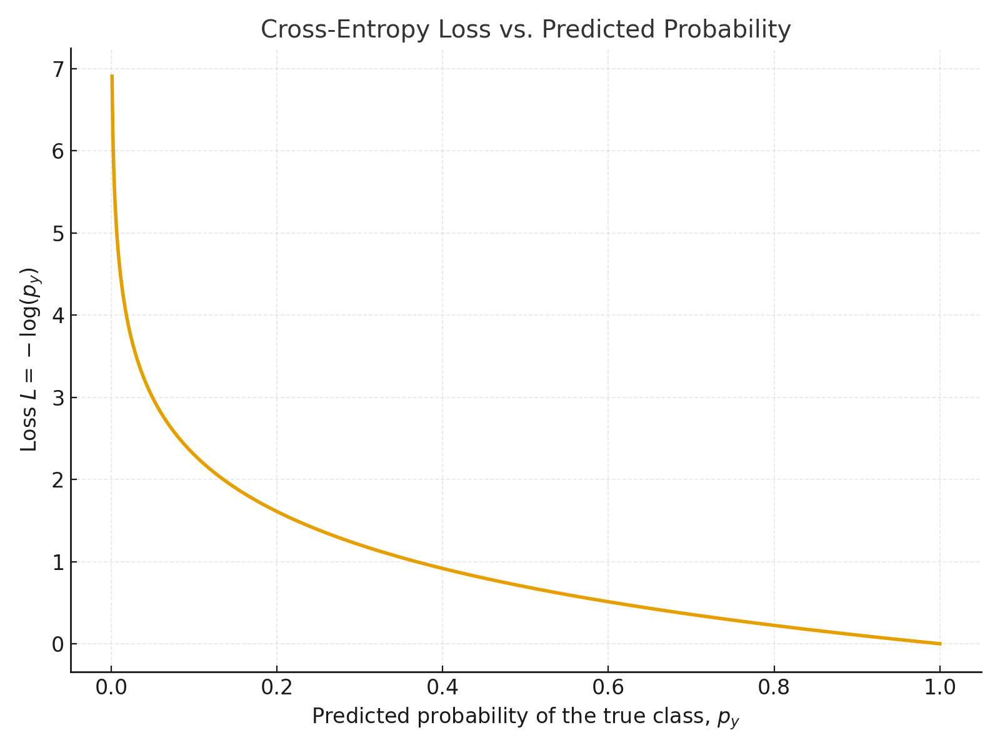

## 第二章：线性分类器 - Softmax 分类器
## 第一部分 Softmax理论讲解
### 1.1 Softmax 分类器简介

&emsp;&emsp;Softmax 分类器是线性分类器的一种扩展，广泛应用于多分类问题。与传统的二分类方法（如逻辑回归）不同，Softmax 分类器能够将输入映射到多个类别的概率分布上，而不仅仅是单一的类别标签。

### 1.2 Softmax 函数的定义

&emsp;&emsp;给定一个输入样本 $x$ 和对应的线性得分 $s_i = w_i^T x + b_i$ （其中 $w_i$ 和 $b_i$ 分别是类别 $i$ 的权重和偏置），Softmax 函数将这些得分转化为概率。对于每个类别 $i$，Softmax 输出的概率为：

$$
p_i = \frac{e^{s_i}}{\sum_{j=1}^{K} e^{s_j}}
$$

其中 $s_i$ 是类别 $i$ 的得分，$K$ 是类别的总数，分母是所有类别得分的指数之和，确保输出的概率分布的总和为 1。

#### 1.2.1 直观理解

* **指数函数**：Softmax 通过指数函数将得分转化为概率，这使得较高的得分会被放大，从而增加其对应类别的概率。
* **归一化**：通过分母的归一化操作，确保所有类别的概率之和为 1。

&emsp;&emsp;Softmax 的输出为一个概率分布，表示输入样本属于每个类别的概率。具体地，类别的概率与其对应的得分成正比，同时受到其他类别得分的影响。

<p align="center"><b>图 1：Softmax 分类器的前向计算流程</b></p>
<p align="center">
  
</p>

<p align="center" style="font-size: 14px; color: #6c757d; line-height: 1.5;">
Softmax 分类器从输入特征经过线性变换，再经过 Softmax 函数生成概率分布，最后根据最大概率输出预测类别。
</p>

### 1.3 交叉熵损失函数

&emsp;&emsp;在训练 Softmax 分类器时，我们通常使用 **交叉熵损失函数** 来评估预测概率与真实标签之间的差异。对于类别 $y$ 的真实标签，交叉熵损失函数定义为：

$$
L = -\log(p_y)
$$

其中 $p_y$ 是模型对真实类别 $y$ 的预测概率。

交叉熵损失函数的优势在于：

* 它度量了预测概率与真实标签之间的差距。
* 对于错误的预测，损失会较大，促进模型调整权重，使得模型预测的概率更接近真实标签。

<p align="center"><b>图 2：交叉熵损失与预测概率的关系</b></p>
<p align="center">
  
</p>

<p align="center" style="font-size: 14px; color: #6c757d; line-height: 1.5;">
展示了交叉熵损失函数如何随预测概率变化。在正确预测时损失较小，预测错误时损失较大。
</p>

### 1.4 Softmax 的梯度推导

&emsp;&emsp;在训练过程中，我们需要通过反向传播算法计算 Softmax 分类器的梯度，以便使用梯度下降法更新权重和偏置。

&emsp;&emsp;    对于损失函数 $L$ 关于得分 $s_i$ 的梯度，我们通过链式法则进行推导：

#### 1.4.1 对 $s_y$（真实类别）的梯度

&emsp;&emsp;首先，考虑损失函数对真实类别 $y$ 的得分 $s_y$ 的梯度：

$$
\frac{\partial L}{\partial s_y} = \frac{\partial}{\partial s_y} \left[ -\log \left(\frac{e^{s_y}}{\sum_{j=1}^{K} e^{s_j}}\right) \right]
$$

使用链式法则：

$$
\frac{\partial L}{\partial s_y} = p_y - 1
$$

这表示，当模型预测的概率 $p_y$ 越接近 1（即正确预测），损失就越小。

#### 1.4.2 对 $s_i$（非真实类别）的梯度

&emsp;&emsp;对于非真实类别 $i \neq y$，我们得到：

$$
\frac{\partial L}{\partial s_i} = p_i
$$

这说明，对于其他类别，梯度是该类别的预测概率 $p_i$。

<p align="center"><b>图 3：Softmax 输出与得分变化的关系</b></p>
<p align="center">
  
</p>

<p align="center" style="font-size: 14px; color: #6c757d; line-height: 1.5;">
展示了得分 <i>s</i><sub>1</sub> 和 <i>s</i><sub>2</sub> 如何影响 Softmax 输出的概率，帮助理解 Softmax 的梯度推导过程。
</p>


### 1.5 权重更新

&emsp;&emsp;利用上述计算的梯度，我们可以更新模型的权重 $w_i$ 和偏置 $b_i$。对于权重和偏置的更新，我们使用梯度下降法：

* 对于权重 $W_i$ 的更新：

$$
\frac{\partial L}{\partial W_i} = x (p_i - y_i)^T
$$

* 对于偏置 $b_i$ 的更新：

$$
\frac{\partial L}{\partial b_i} = p_i - y_i
$$

这些梯度用于通过梯度下降法更新模型的参数，以最小化损失函数。

### 1.6 数值稳定性问题

&emsp;&emsp;在实际计算中，直接对得分进行指数运算可能导致数值溢出。为避免这种情况，我们常常对得分进行“平移”处理，即从所有得分中减去最大得分 $\max(s)$，得到：

$$
p_i = \frac{e^{s_i - \max(s)}}{\sum_{j=1}^{K} e^{s_j - \max(s)}}
$$

这种操作可以有效避免数值溢出问题，且不会影响 Softmax 的输出结果。

### 1.7 Softmax 与线性分类器的关系

&emsp;&emsp;Softmax 分类器可以视为一种线性分类器，它通过计算每个类别的得分 \( s_i = w_i^T x + b_i \)，并通过 Softmax 函数将这些得分转化为概率，最终根据这些概率进行类别预测。

&emsp;&emsp;与 **逻辑回归** 相似，Softmax 分类器的输出也是一个概率，但逻辑回归主要用于二分类问题，而 Softmax 可以扩展到多分类问题。

#### 逻辑回归与 Softmax 分类器对比

| 特性               | 逻辑回归                                     | Softmax 分类器                              |
|--------------------|----------------------------------------------|---------------------------------------------|
| **目标任务**       | 二分类问题                                   | 多分类问题                                  |
| **输出**           | 类别 \( y \) 的概率 \( p(y) \)              | 类别 \( y_i \) 的概率 \( p_i \)             |
| **模型形式** | \( p(y=1\|x) = \frac{1}{1 + e^{-(w^T x + b)}} \) | \( p_i = \frac{e^{s_i}}{\sum_{j=1}^{K} e^{s_j}} \), 其中 \( s_i = w_i^T x + b_i \) |
| **损失函数**       | 对数损失（交叉熵）                          | 对数损失（交叉熵）                         |
| **适用范围**       | 二分类                                      | 多分类                                     |
| **输出解释**       | 预测类别 1 的概率                           | 预测每个类别的概率，并且类别概率和为 1     |
| **训练方法**       | 梯度下降                                     | 梯度下降                                   |

&emsp;&emsp;从表格中可以看出，**逻辑回归** 和 **Softmax 分类器** 都是基于线性模型的概率预测方法。唯一的区别在于，逻辑回归处理的是二分类问题，而 Softmax 分类器通过对每个类别计算得分并使用 Softmax 函数进行归一化，可以处理多分类问题。

### 1.8 小结

&emsp;&emsp;Softmax 分类器通过将线性得分转化为概率，能够有效地处理多分类问题。通过交叉熵损失函数来评估模型预测与真实标签之间的差异，训练过程利用反向传播计算梯度，更新权重和偏置。虽然 Softmax 分类器简单易懂，但对于复杂数据可能会有一定的局限性，尤其是在数据维度过高时，可能会出现“维度灾难”。此外，它对特征的尺度敏感，因此通常需要进行数据标准化处理。


## 第二部分：代码实现详解

&emsp;&emsp;在第一部分中，我们推导了 Softmax 分类器的数学原理。现在，我们将深入 `softmax_classifier.py` 和 `cifar10_utils.py`，解析如何将这些理论转化为健壮、高效且可复现的纯 NumPy 代码。我们将重点关注几个关键的工程实现，它们是从“能运行”到“跑得好”的精髓所在。

### 2.1 `SoftmaxClassifier` 类设计：一个完备的训练框架

&emsp;&emsp;与 K-NN 的“懒惰学习”不同，Softmax 分类器是一个“积极学习”的参数模型。它需要在训练阶段（`fit`）通过梯度下降来学习一个最优的权重矩阵 `W`。我们的 `SoftmaxClassifier` 类正是围绕这个核心流程设计的：

```python
class SoftmaxClassifier:
    def __init__(self, num_features, num_classes, reg_strength=1e-4):
        # 1. 初始化：W 矩阵是模型的“大脑”
        self.W = np.random.randn(num_features, num_classes) * 0.0001
        # ...

    def train(self, X_train, y_train, X_val, y_val, ...):
        # 2. 训练：通过 mini-batch 梯度下降更新 W
        # ...
        loss, grad = self._compute_loss_and_gradient(X_batch, y_batch)
        self.W -= current_lr * grad
        # ...

    def predict(self, X):
        # 3. 预测：使用学习到的 W 计算得分
        scores = X.dot(self.W)
        return np.argmax(scores, axis=1)

    def _compute_loss_and_gradient(self, X, y):
        # 4. 核心：计算损失和梯度（见下文）
        # ...
````

&emsp;&emsp;值得注意的是 `train` 方法。它不是一个简单的梯度下降循环，而是实现了一套健壮的训练策略，包括：

  * **Mini-batch 梯度下降**：在 `batch_size` 个样本上计算梯度，兼顾了效率和收敛稳定性。

  * **早停 (Early Stopping)**：通过 `patience` 参数监控验证集准确率，自动保存最佳权重 `best_W` 并防止过拟合。

  * **学习率衰减**：在训练过程中逐步降低学习率，帮助模型在后期更精细地收敛。

### 2.2 核心亮点 1：全向量化的损失与梯度

&emsp;&emsp;Softmax 计算中最大的性能瓶颈是损失和梯度的计算。如果使用 `for` 循环遍历 `N` 个样本，效率将极其低下。我们的 `_compute_loss_and_gradient` 方法利用 NumPy 实现了完全向量化的计算。

**1.前向传播 (计算概率):**

```python
# 1. 计算所有N个样本的得分 [N, D] @ [D, K] -> [N, K]
scores = X.dot(self.W)

# 2. 数值稳定（见 2.3）
scores_stable = scores - np.max(scores, axis=1, keepdims=True)

# 3. 计算概率
exp_scores = np.exp(scores_stable)
probs = exp_scores / np.sum(exp_scores, axis=1, keepdims=True)
```

**2. 损失计算 (交叉熵):**

```python
N = X.shape[0]
# 巧妙地使用 NumPy 的索引，一次性取出 N 个样本的正确类别概率
correct_class_probs = probs[np.arange(N), y]
# 计算数据损失
data_loss = -np.mean(np.log(correct_class_probs + 1e-10))
```

**3. 反向传播 (计算梯度):**

&emsp;&emsp;这是最精妙的部分。根据理论推导（1.4节），损失 L 对得分 $s$ 的梯度 $\frac{\partial L}{\partial s_i}$ 就是 $(p_i - y_i)$（$y_i$ 是one-hot编码，只在真实类别处为1）。

```python
# 1. 初始化梯度 dscores 为 p_i
dscores = probs.copy()

# 2. 在真实类别 y 处执行 p_y - 1
dscores[np.arange(N), y] -= 1

# 3. 求平均
dscores /= N

# 4. 最终权重梯度 dW = X^T · dscores
# [D, N] @ [N, K] -> [D, K]
dW = X.T.dot(dscores)
```

&emsp;&emsp;通过这几行代码，我们用两次矩阵乘法（`dot`）和几次索引操作，就完成了整个 mini-batch 的梯度计算，完全避免了 Python 循环。

### 2.3 核心亮点 2：鲁棒的工程实践

&emsp;&emsp;理论和现实之间往往隔着“工程实现”。在我们的代码中，有两处关键的工程处理，确保了模型的稳定性和正确性：

**1. 数值稳定性 (Numerical Stability)**

&emsp;&emsp;正如理论（1.6节）所述，`np.exp(scores)` 很容易因 `scores` 过大而溢出。我们通过减去最大值 `scores_max` 进行了平移，`np.exp(scores - scores_max)`。这在数学上等价，但在工程上避免了溢出，是“手搓”模型时的必备技巧。

**2. 偏置技巧 (Bias Trick) 与 L2 正则化**

&emsp;&emsp;我们没有单独处理偏置项 `b`，而是在数据预处理中（如 `cifar10_utils.py`）使用“偏置技巧”：

```python
# cifar10_utils.py
X_train_flat = np.hstack([X_train_flat, np.ones((X_train_flat.shape[0], 1))])
```

&emsp;&emsp;通过在数据 `X` 上拼接一列 `1`，偏置 `b` 被巧妙地合并成了权重矩阵 `W` 的最后一行。

&emsp;&emsp;这就带来了一个问题：L2 正则化通常只惩罚权重 `W`，而不惩罚偏置 `b`。在我们的代码中，这一处理也得到了精确的体现：

```python
# 损失：只对 W（不含最后一行偏置）求和
reg_loss = 0.5 * self.reg_strength * np.sum(self.W[:-1, :] ** 2)

# ...
# 梯度：只对 dW（不含最后一行偏置）添加正则化梯度
dW[:-1, :] += self.reg_strength * self.W[:-1, :]
```

&emsp;&emsp;通过 `W[:-1, :]` 这个切片操作，我们精确地将偏置项排除在了 L2 正则化之外，确保了算法的正确性。


## 第三部分：实验结果与分析

&emsp;&emsp;在 K-NN 章节中，我们发现基于原始像素距离的分类器在 CIFAR-10 上表现不佳 (约 35.6%)。本章的 `SoftmaxClassifier` 引入了“学习”的过程，但它能解决问题吗？我们设计了两个递进的实验来回答这个问题。

### 3.1 实验一：基于原始像素 (Pixel) 的基线模型

&emsp;&emsp;我们首先复现 K-NN 的设定，将 `SoftmaxClassifier` 训练在 3073 维的原始像素特征上。

  * **特征**: 3072 维原始像素 + 1 维偏置

  * **最佳超参数**: `lr=0.005`, `reg=0.0005`

  * **最终测试准确率**: **38.70%**

&emsp;&emsp;**分析**：38.70% 的准确率相比 K-NN (35.6%) 有了 **3.1%** 的提升。这证明了“学习”一个权重矩阵 `W` 确实比“懒惰”地计算像素距离要好。但是，这个提升是有限的。为了探究其瓶颈，我们可视化了模型学到的权重：

\<p align="center"\>\<b\>图 4：像素基线模型的权重可视化\</b\>\</p\>
\<p align="center"\>
\
\</p\>

&emsp;&emsp;上图清晰地暴露了线性模型的根本局限性：

1.  **模糊的“平均”模板**：模型试图为每个类别学习一个“平均”的样子。例如，‘horse’（马）的模板是两个头的（试图同时拟合朝左和朝右的马），‘ship’（船）的模板是蓝色的（学到了“船在水上”）。

2.  **线性不可分**：模型无法学习“形状”和“颜色”等抽象概念。它只有一个模板，无法处理同一类别下的巨大差异（例如，“白色的狗”和“黑色的狗”在像素上是完全不同的）。

 **结论**：**喂给模型“垃圾”（原始像素），模型也只能学出“垃圾”（模糊模板）**。瓶颈不在于 `SoftmaxClassifier` 模型本身，而在于数据的**特征表示**。

### 3.2 实验二：基于 HOG 特征的“降维打击”

&emsp;&emsp;为了解决像素特征的局限性，我们引入了经典的计算机视觉特征——**HOG (Histogram of Oriented Gradients)**。HOG 不关心像素的颜色，只关心物体的**轮廓和纹理**（通过计算梯度方向直方图）。它对光照变化具有很强的不变性。

&emsp;&emsp;我们创建了 `cifar10_experiment_hog.py`，使用 `scikit-image` 提取 324 维的 HOG 特征，并将其喂给了**完全相同**的 `SoftmaxClassifier`。

  * **特征**: 324 维 HOG 特征 + 1 维偏置

  * **最佳超参数**: `lr=0.005`, `reg=0.0005` (通过 `hyperparam_search_hog.py` 验证)

  * **最终测试准确率**: **53.60%**

&emsp;&emsp;**分析**：仅仅通过改变特征，我们的准确率从 38.70% **飙升至 53.60%**，暴涨了 **14.9%**！这有力地证明了**特征的质量远比模型的复杂度更重要**。

\<p align="center"\>\<b\>图 5：HOG 特征模型的训练曲线\</b\>\</p\>
\<p align="center"\>
\
\</p\>

&emsp;&emsp;观察训练曲线，我们发现训练准确率 (54.18%) 和测试准确率 (53.60%) 非常接近，说明 HOG 特征（325 维）不仅更有效，而且维度更低，让模型（参数量从 30,730 降到 3,250）几乎没有过拟合。

### 3.3 深度分析：HOG 模型错在哪里？

&emsp;&emsp;为了进一步探究 53.60% 准确率背后的细节，我们绘制了 HOG 模型的**混淆矩阵**。

\<p align="center"\>\<b\>图 6：HOG 特征模型的混淆矩阵\</b\>\</p\>
\<p align="center"\>
\
\</p\>

&emsp;&emsp;混淆矩阵的热力图（对角线越亮越好）告诉了我们丰富的信息：

1.  **“车”类王者**：模型在 ‘airplane’ (0.70), ‘automobile’ (0.75), ‘ship’ (0.70), ‘truck’ (0.64) 这几个“交通工具”类别上表现最好。这是因为 HOG **极其擅长捕捉刚性的轮廓**。

2.  **“动物”类灾难**：模型在 ‘bird’ (0.34), ‘cat’ (0.32), ‘deer’ (0.36), ‘dog’ (0.37) 这几个“动物”类别上表现最差。

3.  **核心混淆**：

      * **‘cat’ (猫)** 有 25% 的时间被错认成 **‘dog’ (狗)**。

      * **‘dog’ (狗)** 有 18% 的时间被错认成 **‘cat’ (猫)**。

      * **‘bird’ (鸟)** 经常被错认成 ‘airplane’ (飞机, 0.12) 和 ‘deer’ (鹿, 0.12)。

&emsp;&emsp;这暴露了 HOG 特征的局限性：它擅长捕捉轮廓，但当不同类别的物体（如猫和狗）具有相似的**姿态和纹理**（毛发）时，线性分类器依然会感到困惑。

\<p align="center"\>\<b\>图 7：HOG 预测结果可视化\</b\>\</p\>
\<p align="center"\>
\
\</p\>

&emsp;&emsp;上图的预测结果也印证了这一点：模型能准确识别轮廓清晰的“卡车”和“飞机”，但经常混淆姿态各异的“猫”、“狗”和“鸟”。

### 3.4 小结

&emsp;&emsp;Softmax 线性分类器本身只是一个“决策者”。它的表现**完全取决于我们喂给它什么质量的特征**。

  * 喂给它**原始像素**，它只能学到模糊的“平均模板”，准确率仅 **38.70%**。

  * 喂给它**HOG特征**，它能学到强大的“轮廓模板”，准确率飙升至 **53.60%**。

&emsp;&emsp;我们通过“手搓”特征工程（HOG），极大地提升了模型的性能。但这引出了一个终极问题：我们能不能让一个模型**自动地去“学习”这些最优特征**，而不是靠我们“手搓”？

&emsp;&emsp;这个问题的答案，就是**第三章：两层全连接神经网络**。

