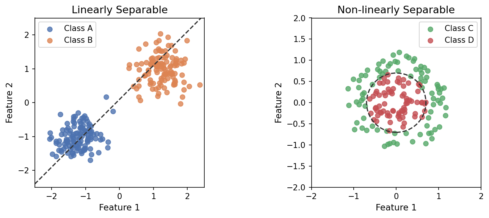
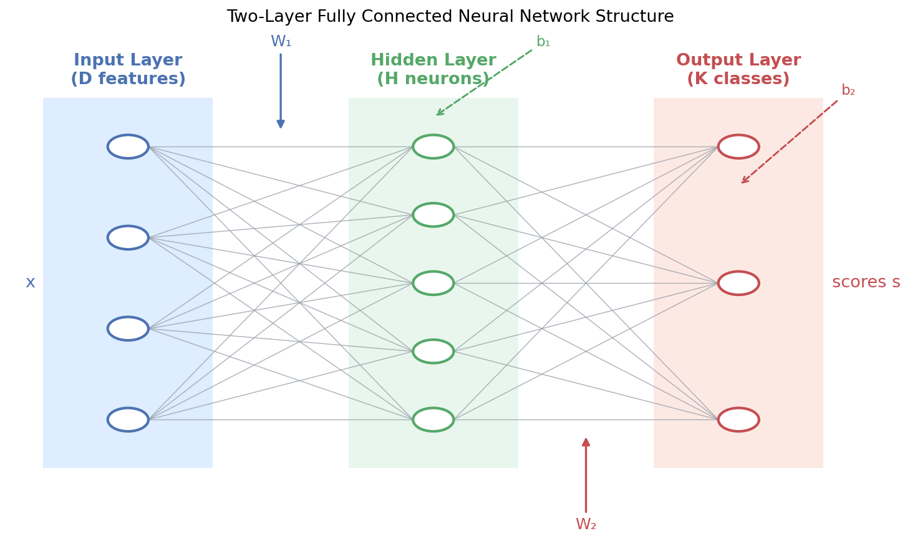
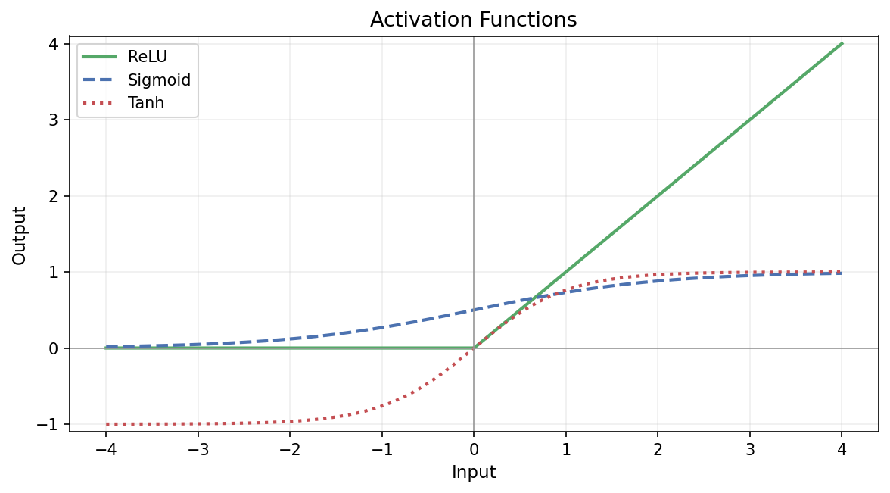
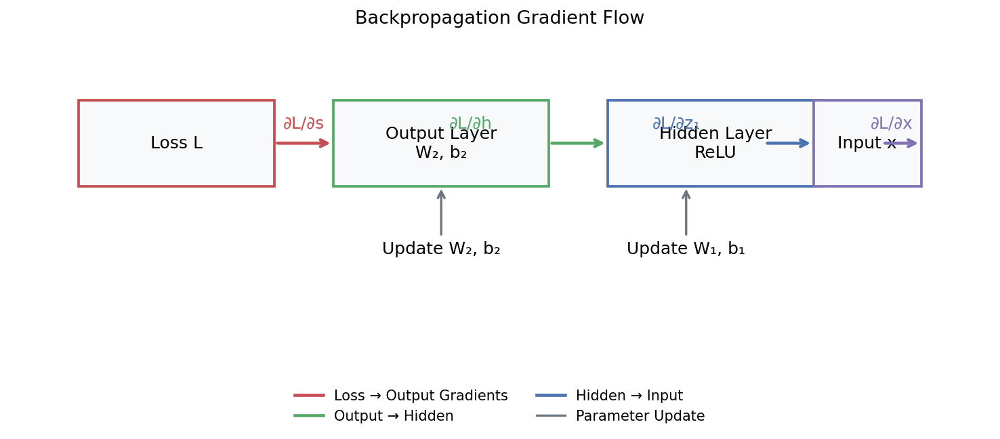
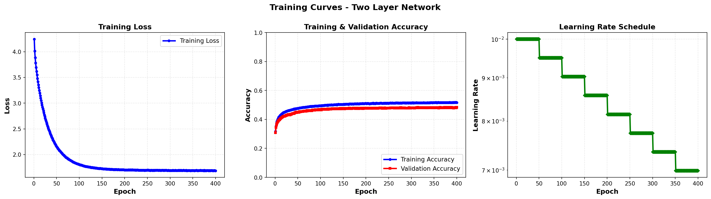
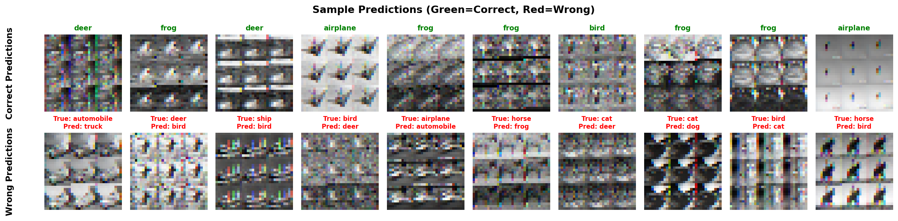

## 第三章：两层全连接神经网络

&emsp;&emsp;想象一下，我们要教电脑认识10种不同的彩色小图片（飞机、汽车、鸟、猫、鹿、狗、青蛙、马、船、卡车），这就是CIFAR-10数据集的任务。我们选择的是一个**两层全连接网络**，它就像：第一层："特征发现员"（隐藏层）- 找出图片中的各种线索。第二层："决策委员"（输出层）- 根据线索投票决定属于哪一类


**为什么选这个简单的模型？**
-  结构简单，容易理解
-  训练速度快，适合入门
-  能展示"非线性"的威力（比直线分类器更聪明）

**学完这个教程，你将掌握：**
-  数据清洗技巧：归一化、中心化
-  概率转换：Softmax如何把分数变成"像概率"的预测
-  关键技术：ReLU激活、He初始化、Dropout、L2正则化
-  结果分析：看懂训练曲线、混淆矩阵、各类别表现


### 第一部分：两层全连接神经网络理论讲解

&emsp;&emsp;在第二章中，我们通过 Softmax 分类器学会了如何"学习"一个权重矩阵 $W$，将输入特征映射到类别得分。然而，Softmax 分类器本质上仍然是一个**线性模型**，它只能学习线性决策边界。当面对复杂的非线性数据时（如 CIFAR-10 中姿态各异的猫和狗），线性模型的局限性就暴露无遗。

&emsp;&emsp;本章将介绍**两层全连接神经网络**，这是我们从线性模型迈向非线性模型的第一个重要里程碑。通过引入**隐藏层**和**非线性激活函数**，神经网络获得了学习复杂非线性映射的能力，能够自动从原始特征中提取更高层次的抽象表示。

### 1.1 从线性到非线性：为什么需要神经网络？

&emsp;&emsp;让我们先通过一个直观的例子来理解线性模型的局限性。想象一下，我们要在二维平面上分类两类数据点，它们的分布如下图所示：

<p align="center"><b>图 1：线性可分 vs 非线性可分数据</b></p>
<p align="center">
  
</p>

&emsp;&emsp;对于**线性可分**的数据（左图），一条直线就能完美地将两类数据分开，Softmax 分类器可以轻松解决。但对于**非线性可分**的数据（右图，例如 XOR 问题），无论我们如何调整权重 $W$，都无法用一条直线将它们分开。这就是线性模型的根本局限。

&emsp;&emsp;两层全连接神经网络通过以下两个关键机制突破了这一局限：

1. **隐藏层（Hidden Layer）**：在输入和输出之间插入一个中间层，允许模型学习输入特征的**非线性组合**。
2. **激活函数（Activation Function）**：在隐藏层中引入非线性函数（如 ReLU），使得整个网络能够表达复杂的非线性映射。

&emsp;&emsp;通过这两层变换，神经网络可以将原本线性不可分的数据映射到一个新的特征空间，在这个新空间中，数据变得线性可分。

### 1.2 网络结构：从输入到输出的信息流动

&emsp;&emsp;两层全连接神经网络的结构可以形象地描述为：**输入层 → 隐藏层 → 输出层**。每一层都由多个"神经元"（Neuron）组成，相邻层之间的神经元通过权重矩阵**全连接**（Fully Connected），即每个神经元都与下一层的所有神经元相连。

<p align="center"><b>图 2：两层全连接神经网络结构示意图</b></p>
<p align="center">
  
</p>

<p align="center" style="font-size: 14px; color: #6c757d; line-height: 1.5;">
两层全连接神经网络包含一个输入层（D 个神经元）、一个隐藏层（H 个神经元）和一个输出层（K 个神经元，对应 K 个类别）。
每个连接都有对应的权重，相邻层之间通过矩阵乘法进行信息传递。
</p>

&emsp;&emsp;让我们用数学语言精确地描述这个网络（**注意：此处的维度约定与我们的 `two_layer_network.py` 代码实现保持一致**）：

* **输入层**：接收一个 $N$ 个样本的 mini-batch $X \in \mathbb{R}^{N \times D}$（例如，CIFAR-10 的 $D=3072$ 维原始像素）。
* **隐藏层**：包含 $H$ 个神经元，通过权重矩阵 $W_1 \in \mathbb{R}^{D \times H}$ 和偏置向量 $b_1 \in \mathbb{R}^H$ 将输入映射到隐藏层：

$$
A_1 = \text{ReLU}(X W_1 + b_1)
$$

其中 $A_1 \in \mathbb{R}^{N \times H}$ 是隐藏层的激活值， $\text{ReLU}$ 是激活函数（见 1.4 节）。
* **输出层**：包含 $K$ 个神经元（对应 $K$ 个类别），通过权重矩阵 $W_2 \in \mathbb{R}^{H \times K}$ 和偏置向量 $b_2 \in \mathbb{R}^K$ 将隐藏层映射到类别得分：

$$
S = A_1 W_2 + b_2
$$
其中 $S \in \mathbb{R}^{N \times K}$ 是类别得分矩阵。

&emsp;&emsp;将上述过程组合起来，整个网络的前向传播可以写成一个复合函数：

$$
f(X) = \text{ReLU}(X W_1 + b_1) W_2 + b_2
$$

&emsp;&emsp;这个函数不再是线性的，因为 $\text{ReLU}$ 函数引入了非线性。正是这种非线性，使得神经网络能够学习复杂的决策边界。

### 1.3 前向传播：信息如何从输入流向输出

&emsp;&emsp;前向传播（Forward Propagation）是指输入数据从网络的第一层逐层传递到最后一层的过程。对于一个包含 $N$ 个样本的 mini-batch $X \in \mathbb{R}^{N \times D}$，前向传播可以分为三个步骤：

#### 1.3.1 输入层到隐藏层

&emsp;&emsp;我们首先计算隐藏层的**线性组合**（Linear Combination），也称为**预激活值**（Pre-activation）$Z_1$ ：

$$
Z_1 = X W_1 + b_1
$$

&emsp;&emsp;其中 $X \in \mathbb{R}^{N \times D}$, $W_1 \in \mathbb{R}^{D \times H}$, $b_1 \in \mathbb{R}^H$ (通过广播机制加到 $X W_1$ 的每一行)。 $Z_1$ 的形状是 $\mathbb{R}^{N \times H}$。

&emsp;&emsp;然后，我们将 $Z_1$ 通过**激活函数**（见 1.4 节）得到隐藏层的**激活值**（Activation） $A_1$ (在代码中也称为 `a1`)：

$$
A_1 = \text{ReLU}(Z_1) = \max(0, Z_1)
$$

&emsp;&emsp;这一步是引入非线性的关键。`max(0, ...)` 操作是逐元素进行的。

#### 1.3.2 隐藏层到输出层

&emsp;&emsp;接下来，我们将隐藏层的激活值 $A_1$ 通过第二层权重矩阵 $W_2$ 映射到类别得分：

$$
S = A_1 W_2 + b_2
$$

&emsp;&emsp;其中 $A_1 \in \mathbb{R}^{N \times H}$, $W_2 \in \mathbb{R}^{H \times K}$, $b_2 \in \mathbb{R}^K$ (广播)。 S(即 `scores`) 的形状是 $\mathbb{R}^{N \times K}$。

#### 1.3.3 输出概率分布

&emsp;&emsp;最后，我们将类别得分 $S$ 通过 Softmax 函数（见第二章）转换为概率分布 $P$：

$$
P_{ij} = \frac{e^{S_{ij}}}{\sum_{k=1}^{K} e^{S_{ik}}}
$$

&emsp;&emsp;这样，我们就得到了 $N$ 个输入样本中，每个样本属于 $K$ 个类别的概率矩阵 $P \in \mathbb{R}^{N \times K}$。

<p align="center"><b>图 3：两层全连接神经网络前向传播流程图</b></p>
<p align="center">
  
</p>

### 1.4 激活函数：引入非线性的关键

&emsp;&emsp;激活函数是神经网络中引入非线性的核心组件。如果没有激活函数，无论有多少层，整个网络仍然等价于一个线性模型。常用的激活函数包括：

#### 1.4.1 ReLU（Rectified Linear Unit）

&emsp;&emsp;ReLU 是目前最常用的激活函数，其定义为：

$$
\text{ReLU}(z) = \max(0, z) = \begin{cases}
z & \text{if } z > 0 \\
0 & \text{if } z \leq 0
\end{cases}
$$

&emsp;&emsp;ReLU 的优势在于：

  * **计算简单**：只需要一个阈值操作，计算速度极快。
  * **缓解梯度消失**：当 $z > 0$ 时，梯度恒为 1，不会像 sigmoid 或 tanh 那样在饱和区域梯度接近 0。
  * **稀疏激活**：当 $z \leq 0$ 时，神经元输出为 0，使得网络具有稀疏性，有助于特征选择。

&emsp;&emsp;ReLU 的缺点在于**"死亡 ReLU"问题**：如果某个神经元的输入始终为负，它的梯度将始终为 0，导致该神经元永远不会被更新。

#### 1.4.2 其他激活函数

  * **Sigmoid**： $\sigma(z) = \frac{1}{1 + e^{-z}}$ ，输出范围在 $(0, 1)$，常用于二分类问题的输出层，但在隐藏层中容易导致梯度消失。
  * **Tanh**： $\tanh(z) = \frac{e^z - e^{-z}}{e^z + e^{-z}}$ ，输出范围在 $(-1, 1)$，是 sigmoid 的缩放和平移版本，在隐藏层中比 sigmoid 更常用。

<p align="center"><b>图 4：常用激活函数对比</b></p>
<p align="center">
  
</p>

### 1.5 损失函数：衡量预测与真实的差距

&emsp;&emsp;与 Softmax 分类器相同，我们使用**交叉熵损失函数**来衡量预测概率分布与真实标签之间的差距。对于一个包含 $N$ 个样本的 mini-batch 和真实标签 $y \in \mathbb{R}^N$：

$$
L_{\text{data}} = -\frac{1}{N} \sum_{i=1}^{N} \log(P_{i, y_i})
$$

&emsp;&emsp;其中 $P_{i, y_i}$ 是第 $i$ 个样本对真实类别 $y_i$ 的预测概率。

&emsp;&emsp;此外，为了防止过拟合，我们还会添加 **L2 正则化项**：

$$
L_{\text{reg}} = \lambda \left( \sum (W_1^2) + \sum (W_2^2) \right)
$$

*(注：在我们的代码实现 `two_layer_network.py` 中，正则化损失为 `reg * sum(W**2)`，对应梯度为 `2 * reg * W`)*

&emsp;&emsp;总损失为：

$$
L_{\text{total}} = L_{\text{data}} + L_{\text{reg}}
$$

### 1.6 反向传播：如何计算梯度

&emsp;&emsp;反向传播（Backpropagation）是训练神经网络的核心算法。它通过**链式法则**（Chain Rule）从输出层向输入层逐层计算损失函数对每个参数的梯度，然后使用梯度下降法更新参数。

&emsp;&emsp;对于两层全连接神经网络，我们需要计算损失 $L$ 对以下参数的梯度：

* $W_2$ 和 $b_2$（输出层参数）
* $W_1$ 和 $b_1$（隐藏层参数）

&emsp;&emsp;让我们从输出层开始，逐步推导这些梯度（使用 $N$ 个样本的 mini-batch 形式）：

#### 1.6.1 输出层梯度

&emsp;&emsp;首先，我们计算损失对类别得分 $S$ 的梯度 $\mathrm{d}S$ (形状 $[N \times K]$)。这与 Softmax 分类器完全相同：

$$
\mathrm{d}S = P
$$
$$
\mathrm{d}S[i, y_i] \mathrel{-}= 1 \quad \text{(for i=1...N)}
$$
$$
\mathrm{d}S \mathrel{/}= N
$$

&emsp;&emsp;接下来，我们计算损失对输出层参数 $W_2$ 和 $b_2$ 的梯度。由于 $S = A_1 W_2 + b_2$：

$$
\mathrm{d}W_2 = A_1^T \cdot \mathrm{d}S \quad \in \mathbb{R}^{H \times K}
$$

$$
\mathrm{d}b_2 = \sum_{i=1}^{N} \mathrm{d}S_i \quad (\text{沿 N 轴求和}) \quad \in \mathbb{R}^{K}
$$

#### 1.6.2 隐藏层梯度

&emsp;&emsp;现在，我们需要将梯度从输出层传播到隐藏层。首先，计算损失对隐藏层激活值 $A_1$ 的梯度 $\mathrm{d}A_1$ (形状 $[N \times H]$)：

$$
\mathrm{d}A_1 = \mathrm{d}S \cdot W_2^T
$$

&emsp;&emsp;接下来，计算损失对隐藏层预激活值 $Z_1$ 的梯度 $\mathrm{d}Z_1$。由于 $A_1 = \text{ReLU}(Z_1)$，ReLU 的导数是 $\mathbf{1}_{Z_1 > 0}$（当 $Z_1 > 0$ 时为 1，否则为 0）：

$\mathrm{d}Z_1 = \mathrm{d}A_1 \odot \mathbf{1}_{Z_1 > 0}$
&emsp;&emsp;其中 $\odot$ 表示逐元素乘法。

&emsp;&emsp;最后，计算损失对隐藏层参数 $W_1$ 和 $b_1$ 的梯度。由于 $Z_1 = X W_1 + b_1$：

$$
\mathrm{d}W_1 = X^T \cdot \mathrm{d}Z_1 \quad \in \mathbb{R}^{D \times H}
$$

$$
\mathrm{d}b_1 = \sum_{i=1}^{N} \mathrm{d}Z_{1,i} \quad (\text{沿 N 轴求和}) \quad \in \mathbb{R}^{H}
$$

#### 1.6.3 正则化项的梯度

&emsp;&emsp;对于 L2 正则化项 $L_{\text{reg}} = \lambda (\sum W_1^2 + \sum W_2^2)$，其梯度为：

$$
\frac{\partial L_{\text{reg}}}{\partial W_1} = 2 \lambda W_1, \quad \frac{\partial L_{\text{reg}}}{\partial W_2} = 2 \lambda W_2
$$

&emsp;&emsp;将数据损失和正则化损失的梯度相加，得到总梯度：

$$
\mathrm{d}W_1^{\text{total}} = \mathrm{d}W_1 + (2 \lambda W_1)
$$

$$
\mathrm{d}W_2^{\text{total}} = \mathrm{d}W_2 + (2 \lambda W_2)
$$

&emsp;&emsp;（注意：偏置项 $b_1, b_2$ 通常不参与正则化）

<p align="center"><b>图 5：反向传播梯度流动示意图</b></p>
<p align="center">
  
</p>

### 1.7 参数初始化：为训练打好基础

&emsp;&emsp;神经网络的参数初始化对训练过程至关重要。如果权重初始化不当，可能会导致梯度消失（梯度在反向传播过程中变得极小）或梯度爆炸（梯度变得极大）。

#### 1.7.1 He 初始化 (Kaiming Initialization)

&emsp;&emsp;He 初始化是**专门为 ReLU 激活函数设计**的，也是我们代码中采用的策略。它根据每层的输入维度 $n_{\text{in}}$（即 `fan_in`）来设置权重的标准差：

$$
W \sim \mathcal{N}\left(0, \sqrt{\frac{2}{n_{\text{in}}}}\right)
$$

&emsp;&emsp;He 初始化考虑了 ReLU 会将一半的激活值置为 0 的特性，通过乘以 $\sqrt{2}$ 来保持激活值的方差稳定，有效避免了梯度消失或爆炸，让网络能够训练得更深、收敛得更快。偏置项 $b_1, b_2$ 通常初始化为 0。

### 1.8 训练策略与正则化

&emsp;&emsp;除了核心的梯度下降，我们还采用了多种策略来提升训练效果和模型的泛化能力：

* **Mini-batch 梯度下降**: 每次更新使用一小批样本（batch）的平均梯度，而不是整个训练集。这既高效，又能引入噪声，帮助模型跳出局部最优。
* **学习率衰减 (Learning Rate Decay)**: 随着训练的进行，逐渐降低学习率（例如，每 50 轮乘以 0.95）。这有助于在训练早期快速下降，在后期精细调优，避免在最优点附近震荡。
* **早停 (Early Stopping)**: 监控**验证集**的准确率。如果验证集准确率连续多轮（`patience`）不再提升，就提前停止训练，并**恢复**到历史上验证集准确率**最高**时的模型参数。这是防止过拟合最有效的手段之一。
* **L2 正则化**: 在损失函数中添加权重的平方和（ $\lambda \sum W^2$ ），惩罚过大的权重值，使模型更平滑，防止其过度依赖某些输入特征。
* **Dropout**: 在前向传播的**隐藏层**（ReLU 之后），**随机地**将一部分神经元的激活值置为 0（例如，`dropout=0.5` 表示随机丢弃 50%）。这迫使网络学习更鲁棒的冗余特征，是防止过拟合的强大技术。**注意**：Dropout 只在**训练**时使用，在**预测**（`predict`）或评估（`evaluate`）时必须关闭。


### 第二部分：代码实现详解

&emsp;&emsp;在第一部分中，我们详细推导了两层全连接神经网络的前向传播和反向传播过程。现在，我们将深入 `two_layer_network.py` 和 `cifar10_experiment.py` 中的核心代码，展示这些理论是如何转化为一个健壮、高效且可复现的实验框架的。

### 2.1 `TwoLayerNetwork` 类设计与初始化

&emsp;&emsp;`TwoLayerNetwork` 类封装了所有网络参数、前向传播、反向传播和训练逻辑。与 Softmax（第二章）不同，我们在这里**显式**地管理权重 $W_1, W_2$ 和偏置 $b_1, b_2$，这在多层网络中是更清晰、更通用的做法。

#### 1. He 权重初始化 (`_init_params`)

&emsp;&emsp;**作用**：为 ReLU 激活函数量身定制的初始化方法，用 `sqrt(2 / fan_in)` 控制权重的初始尺度，使得各层的激活与梯度不过大或过小。这样能避免“梯度爆炸/消失”，让前期训练更稳定、收敛更快。
&emsp;&emsp;**代码实现** (`two_layer_network.py`)：
```python
    def _init_params(self, weight_scale):
        D, H, C = self.input_size, self.hidden_size, self.num_classes
        
        if weight_scale is None: # 优先使用 He 初始化
            std1 = np.sqrt(2.0 / D) # He: sqrt(2 / fan_in)
            std2 = np.sqrt(2.0 / H) # He: sqrt(2 / fan_in)
        else:
            std1 = std2 = weight_scale # 兼容旧的小随机数
        
        self.params['W1'] = std1 * np.random.randn(D, H) # [D, H]
        self.params['b1'] = np.zeros(H)                 # [H]
        self.params['W2'] = std2 * np.random.randn(H, C) # [H, K]
        self.params['b2'] = np.zeros(C)                 # [K]
```

### 2.2 前向传播 (`forward`) 与 正则化

&emsp;&emsp;`forward` 函数负责计算从输入 $X$ 到最终得分 `scores` 的完整流程，并**缓存** (`self.cache`) 反向传播所需的中间变量。

```python
    def forward(self, X, train_mode=True):
        W1, b1 = self.params['W1'], self.params['b1']
        W2, b2 = self.params['W2'], self.params['b2']
        
        # 第一层: X[N, D] . W1[D, H] + b1[H] -> z1[N, H]
        z1 = X.dot(W1) + b1
        # ReLU 激活: a1[N, H]
        a1 = np.maximum(0, z1)
        
        # Dropout（仅训练时）
        dropout_mask = None
        if train_mode and self.dropout > 0:
            # 1. 创建掩码 (Inverted Dropout: 除以 (1-dropout) 保持期望值不变)
            dropout_mask = (np.random.rand(*a1.shape) > self.dropout) / (1 - self.dropout)
            # 2. 应用掩码
            a1 *= dropout_mask
        
        # 第二层: a1[N, H] . W2[H, K] + b2[K] -> z2[N, K]
        z2 = a1.dot(W2) + b2
        
        # 缓存
        self.cache = {'X': X, 'z1': z1, 'a1': a1, 'z2': z2, 'dropout_mask': dropout_mask}
        return z2 # (z2 就是 scores)
```

&emsp;&emsp;**Dropout 详解**：Dropout 是一种强大的正则化技术。在训练时 (`train_mode=True`)，我们随机“丢弃”（置零）隐藏层的一部分激活值（`a1`）。为了保证测试时（`train_mode=False`）的期望输出不变，我们在训练时对保留下来的激活值除以 `(1 - self.dropout)`，这种技巧称为 **Inverted Dropout**。这迫使网络学习冗余特征，能有效防止过拟合。

### 2.3 损失与反向传播 (`softmax_loss` 和 `backward`)

&emsp;&emsp;`softmax_loss` 函数负责计算损失（数据损失 + L2 正则化损失）和 Softmax 层的梯度 `dscores`。`backward` 函数则负责接收 `dscores`，并根据链式法则计算 `W1`, `b1`, `W2`, `b2` 的梯度。

```python
    def softmax_loss(self, scores, y):
        # ... (数值稳定的 Softmax 概率计算) ...
        probs = ...
        
        # 交叉熵损失 (含 log(0) 防护)
        epsilon = 1e-8
        data_loss = np.mean(-np.log(probs[np.arange(N), y] + epsilon))
        
        # L2正则化损失 (注意 W1**2 和 W2**2)
        reg_loss = self.reg * (np.sum(self.params['W1']**2) + np.sum(self.params['W2']**2))
        total_loss = data_loss + reg_loss
        
        # 梯度 dscores (Softmax 损失的梯度)
        dscores = probs.copy()
        dscores[np.arange(N), y] -= 1
        dscores /= N
        
        return total_loss, dscores

    def backward(self, dscores):
        # 1. 从缓存中取出中间变量
        X, z1, a1 = self.cache['X'], self.cache['z1'], self.cache['a1']
        dropout_mask = self.cache['dropout_mask']
        W2, W1 = self.params['W2'], self.params['W1']
        grads = {}
        
        # 2. 第二层梯度 (输出层)
        grads['W2'] = a1.T.dot(dscores) + 2 * self.reg * W2
        grads['b2'] = np.sum(dscores, axis=0)
        
        # 3. 传播到隐藏层 (dA1)
        da1 = dscores.dot(W2.T) # [N, H]
        
        # 4. Dropout反向传播
        if dropout_mask is not None:
            da1 *= dropout_mask / (1 - self.dropout)
        
        # 5. ReLU反向传播
        dz1 = da1.copy()
        dz1[z1 <= 0] = 0 # 梯度在 Z1 <= 0 时为 0
        
        # 6. 第一层梯度 (隐藏层)
        grads['W1'] = X.T.dot(dz1) + 2 * self.reg * W1
        grads['b1'] = np.sum(dz1, axis=0)
        
        return grads
```

&emsp;&emsp;`backward` 完美地实现了 1.6 节中的链式法则。请特别注意 `dz1[z1 <= 0] = 0` 这一行，它实现了 ReLU 激活函数的反向传播——只有在前向传播中被“激活”（即 $Z_1 > 0$）的神经元，才允许梯度反向流过。

### 2.4 实验框架与训练策略 (`cifar10_experiment.py`)

&emsp;&emsp;`cifar10_experiment.py` 脚本是我们用来组织和运行实验的“总指挥室”。它不仅仅是调用 `net.train()`，更是实现了一套完整的 MLOps 流程，包括**配置管理**、**超参数搜索**、**高级训练循环**和**结果可视化**。

#### 1\. 学习率衰减 (Learning Rate Decay)

&emsp;&emsp;训练早期用较大学习率快速逼近好区域，后期逐步减小进行“精细打磨”，减少损失震荡，提升最终泛化。

```python
        # 学习率衰减
        if epoch > 0 and epoch % lr_decay_epochs == 0:
            lr *= lr_decay_factor
```

#### 2\. 早停 (Early Stopping)

&emsp;&emsp;持续监控**验证集**准确率，若长时间未提升（耐心值 `patience`），提前停止训练，并**回滚**到“最佳模型参数”。这是防止过拟合和节省时间的利器。

```python
        # 早停检查
        if val_acc > best_val_acc:
            best_val_acc = val_acc
            best_epoch = epoch + 1
            # 深度复制最佳参数
            best_model_params = {k: v.copy() for k, v in net.params.items()}
            epochs_no_improve = 0
        else:
            epochs_no_improve += 1
        ...
        # 早停
        if epochs_no_improve >= patience:
            break
    ...
    # 恢复最优模型参数
    if best_model_params is not None:
        net.params = best_model_params
```

-----

## 第三部分 实验结果与分析

&emsp;&emsp;我们使用 `cifar10_experiment.py` 脚本，在 CIFAR-10 数据集上运行了完整的实验。

### 3.1 实验设置与数据

  * **数据划分**：训练 `40,000`，验证 `5,000`，测试 `5,000`。
  * **预处理**：归一化到 `[0,1]` → 按训练集均值中心化。**输入维度为 3072**。
  * **模型与关键超参**：输入 `3072`、隐藏层 `200`、输出 `10`、Dropout `0.5`、L2 正则 `5e-3`、He 初始化。
  * **训练策略**：初始学习率 `1e-2`，`400` 轮，每 `50` 轮衰减乘 `0.95`，早停耐心 `80`，批次 `256`。

### 3.2 训练曲线分析 (最终测试准确率: 49.84%)

<p align="center"><b>图 6：训练过程（损失 / 准确率 / 学习率）</b></p>
<p align="center">
  
</p>

根据我们的**最终实验日志**（测试准确率 **49.84%**），我们分析训练曲线：

  * **损失 (左图)**: 训练损失 (`Training Loss`) 稳步下降，表明模型在有效学习。
  * **准确率 (中图)**:
      * 训练准确率 (`Training Accuracy`) 最终达到约 **51.70%**。
      * 验证准确率 (`Validation Accuracy`) 在第 392 轮左右达到峰值 **48.54%**，随后早停机制启动（虽然日志显示跑满了400轮，但最佳值已在392轮保存）。
      * 训练准确率和验证准确率之间存在微小差距 (Gap)，表明模型存在轻微的**过拟合**，但被 Dropout (0.5) 和 L2 正则 (5e-3) 有效地控制住了。
  * **学习率 (右图)**: 学习率按照预设策略，每 50 轮阶梯式下降，保证了训练后期的稳定收敛。

  **结论**：在**原始像素**上达到 **49.84%** 的测试准确率，**远高于** Softmax 线性分类器的 **38.70%**。这强有力地证明了**两层网络的非线性（ReLU）** 确实学习到了比线性模型更强大的特征表示。

### 3.3 混淆矩阵与每类准确率分析

\<p align="center"\>\<b\>图 7: 混淆矩阵（计数与归一化）\</b\>\</p\>
\<p align="center"\>
  \
\</p\>

&emsp;&emsp;归一化的混淆矩阵（右图）显示了模型在每个真实类别上的预测分布：

  * **强项**: `automobile` (66%) 和 `ship` (65%) 表现最好。
  * **弱项**: `cat` (33%)、`bird` (34%)、`dog` (36%) 表现最差。
  * **主要混淆**:
      * `cat` (猫) 经常被误判为 `dog` (狗) (21%) 和 `deer` (鹿) (10%)。
      * `dog` (狗) 经常被误判为 `cat` (猫) (13%) 和 `bird` (鸟) (10%)。
      * `bird` (鸟) 经常被误判为 `airplane` (飞机) (16%) 和 `deer` (鹿) (11%)。
          这表明，虽然神经网络比线性模型强，但它在处理姿态、纹理相似的“动物”类别时依然非常挣扎。

<p align="center"><b>图 8：每类准确率</b></p>
<p align="center">
  
</p>

&emsp;&emsp;柱状图直观地显示了 `cat`、`bird`、`dog` 是模型的短板，而 `automobile` 和 `ship` 是长项。平均准确率约为 **49.8%**（与 49.84% 吻合）。

### 3.4 预测示例分析（正确 vs 错误）

<p align="center"><b>图 9：预测示例（上：正确，下：错误）</b></p>
<p align="center">
  
</p>

&emsp;&emsp;错误样本（下排）印证了混淆矩阵的发现：

  * 一只（True: bird）被误判为（Pred: airplane）。
  * 一只（True: dog）被误判为（Pred: cat）。
  * 一只（True: cat）被误判为（Pred: dog）。
      这些错误通常发生在背景复杂、姿态不标准或类间特征相似的图像上。

### 3.5 隐藏层权重可视化 (W1 的秘密)

<p align="center"><b>图 10：隐藏层权重可视化（Top-32）</b></p>
<p align="center">
  
</p>

&emsp;&emsp;这是**最重要**的可视化之一！它展示了隐藏层（200 个神经元）中 32 个代表性神经元的权重 `W1` (形状 `[3072, 1]`) 被 `reshape` 成 `(32, 32, 3)` 后的样子。
  与 Softmax（第二章的图 4）学到的模糊“平均模板”不同，两层网络的**第一层权重**（隐藏层）学到了更精细的**特征检测器**：

  * 很多神经元学到了**边缘检测器**（例如，水平、垂直或对角线边缘）。
  * 一些神经元学到了**颜色检测器**（例如，对特定颜色（如蓝色海洋/天空）或对比色（如红/绿）敏感）。
  * 一些模板甚至开始呈现出模糊的**物体轮廓**或**纹理**。

&emsp;&emsp;**结论**：的**基础特征**（如边缘、颜色），而第二层（`W2`）则负责将这些基础特征组合起来，做出最终的分类决策。

### 3.6 实验总结与下一步

1.  **非线性万岁**: 两层神经网络 (**49.84%**) 在原始像素上**显著优于**线性 Softmax (**38.70%**)，证明了非线性 (ReLU) 和隐藏层在自动学习特征方面的威力。
2.  **特征工程 vs. 简单网络**: 我们的 Softmax + **HOG 特征** (**53.60%**) 表现甚至**优于**这个两层神经网络（49.84%）。这说明一个**好的手工特征**有时比一个**简单的自动学习模型**更有效。
3.  **局限性**: 49.84% 的准确率仍然不高，且模型在动物类别上表现很差。这表明全连接层在处理图像时，**无法很好地利用空间结构**（它把 32x32 的图像展平成了 3072 维向量，丢失了所有空间邻近信息）。

&emsp;&emsp;这个局限性完美地引出了我们的**第四章：卷积神经网络 (CNN)**。CNN 专为处理图像这类网格数据而设计，它通过卷积核来学习**局部的、空间共享的**特征，这将是解决 CIFAR-10 问题的终极武器。

